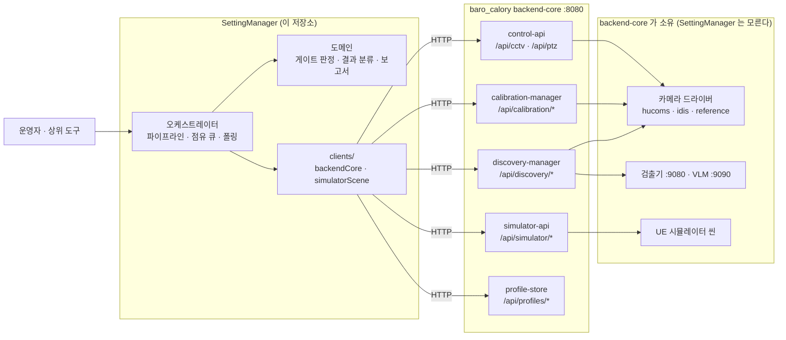
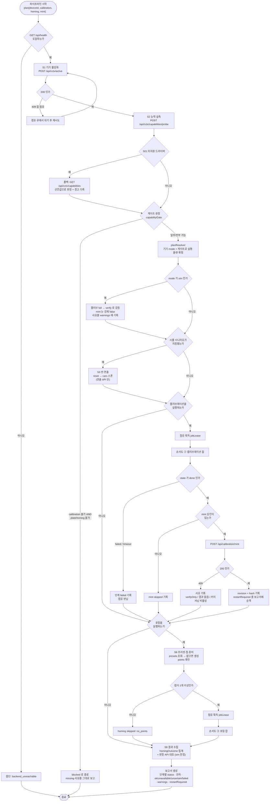
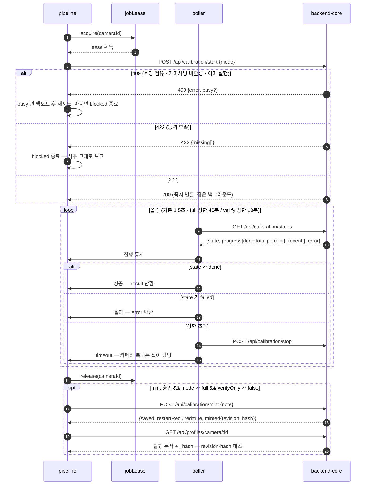
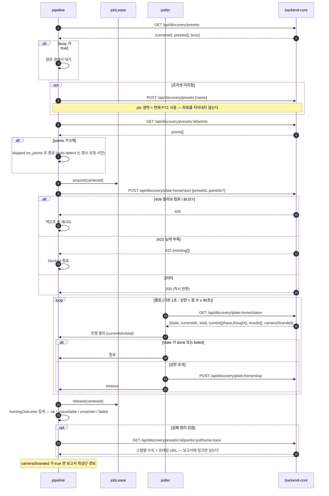
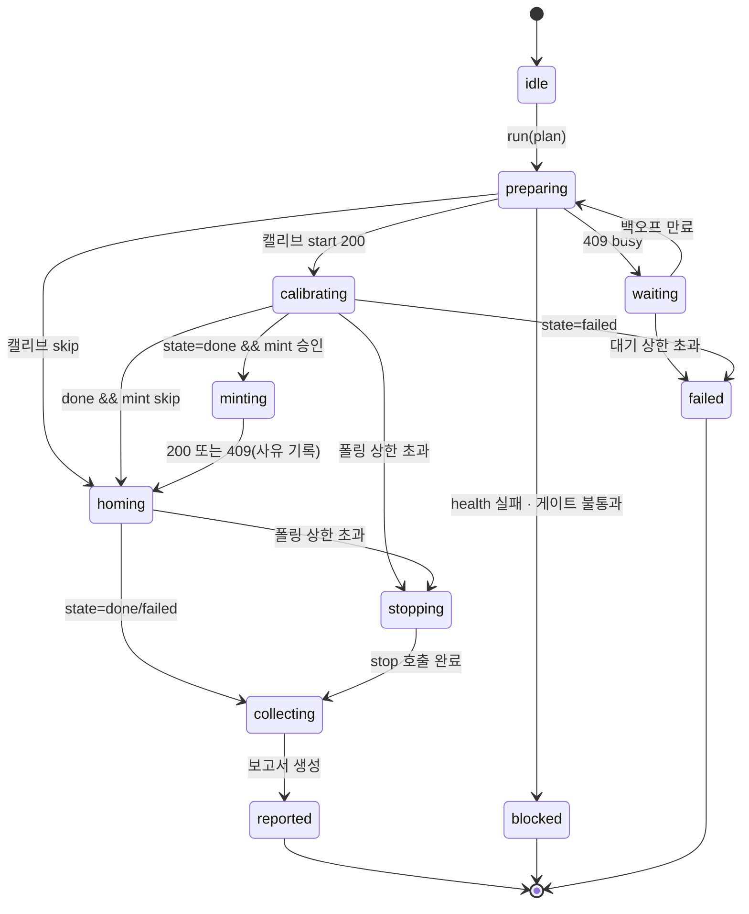
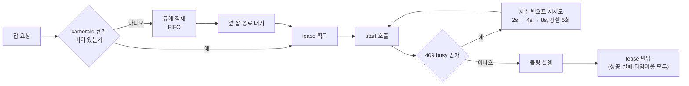

# SettingManager 설계서 · 순서도

| 항목 | 값 |
|---|---|
| 문서 | SettingManager 초기 설계서 (v0.1) |
| 작성 | 2026-07-31 15:44:48 |
| 대상 저장소 | `D:/Work/Parking3D/Agent/baro/SettingManager` |
| 분석 근거 | `D:/Work/Parking3D/Agent/baro/baro_calory` — `docs/{architecture,design,calibration,cameras,operations}.md`, `apps/backend-core/src/{control-api,simulator-api,server,calibration-manager,discovery-manager}.mjs` |
| 스택 | TypeScript(Node ESM) + vitest, 서비스 루트 `SettingMain/` |

---

## 1. 한 줄 요약

SettingManager 는 **카메라 커미셔닝 파이프라인의 오케스트레이터**다. baro_calory `backend-core` 의 REST 제어면을 통해 **기기 활성화 → 능력 실측 게이트 → (시뮬 씬 준비) → 캘리브레이션 → 프로파일 발행 → 프리셋/점 준비 → 번호판 호밍 → 결과 수집**을 하나의 재현 가능한 절차로 묶고, 그 과정에서 **카메라 단일 점유를 상위에서 보증**한다.

---

## 2. 분석 결과 — 설계에 직접 영향을 준 사실

`baro_calory/docs/` 5개 문서를 검토해 얻은 사실 중 **SettingManager 설계를 바꾸는 것**만 적는다.

### 2.1 "캘리브레이션 에이전트"·"호밍 에이전트"는 별도 프로세스가 아니다 (가장 중요)

| 사용자 표현 | 실제 구현 | 근거 |
|---|---|---|
| backend-core (카메라 제어 API) | `apps/backend-core` 프로세스, 기본 `:8080` | `docs/operations.md` §서비스와 포트 |
| backend-core (시뮬레이터 제어 API) | **같은 프로세스**의 별도 라우터 `simulator-api.mjs` (`/api/simulator/*`) | `simulator-api.mjs` 헤더 주석 |
| 캘리브레이션 에이전트 | 같은 프로세스의 `calibration-manager.mjs`, `/api/calibration/*` 로 노출 | `control-api.mjs:180~` |
| 호밍 에이전트 | 같은 프로세스의 `discovery-manager.mjs`, `/api/discovery/plate-home/*` 로 노출 | `control-api.mjs:565~` |

**함의:** 연결 대상은 네 개의 서비스가 아니라 **backend-core 인스턴스 하나**다. 따라서 SettingManager 는 4개 클라이언트를 만들지 않고 **HTTP 클라이언트 1개 + 라우트 그룹 4개**로 구성한다. (에이전트가 나중에 분리 배포되면 baseUrl 만 그룹별로 갈라진다 — 지금 그 유연성을 미리 만들지 않는다.)

### 2.2 두 에이전트는 서로 카메라를 배타 점유한다

- 캘리브 실행 중 호밍 시작 → `409 { busy: true }` (`control-api.mjs:568`)
- 호밍 실행 중 캘리브 시작 → `409 { busy: true }` (`control-api.mjs:539`)
- 이동 라우트(`isMovePath`)는 잡 점유 중 409, 활성 기기 전환도 거부 (`docs/design.md` §5 busy-guard)
- **전면 chokepoint 락은 backend 의 미구현 backlog** (`docs/design.md` §8)

**함의:** SettingManager 는 **자기 안에 직렬화 큐**를 두고, 잡을 하나씩만 발행한다. 409 를 "실패"가 아니라 "대기 신호"로 다룬다.

### 2.3 잡은 비동기다 — start 는 즉시 200, 진행은 폴링

- 캘리브: `POST /start` 즉시 200 → `GET /status` 폴링(문서 권장 1.5초) → `state=done` 후 `POST /mint`
- 호밍: `POST /plate-home/start` 즉시 200 → `GET /plate-home/status` 라이브 폴링
- 캘리브 full 스윕은 **줌 앵커 × 8 클릭, 약 20분** (`docs/architecture.md`), 호밍은 **점당 45초 예산**

**함의:** 파이프라인은 장시간 실행이다. 타임아웃·중단(`/stop`)·재개 정책이 설계의 1급 요소다.

### 2.4 능력 게이트가 잡보다 앞에 있다

`AXIS_REQUIREMENTS` 축 두 개(`calibration`, `plateHoming`)가 있고, 부족하면 잡 시작 전에 **422 + 무엇이 없는지 사람 문장**으로 거부한다. 능력은 **자칭 선언이 아니라 실측**이며 `POST /api/cctv/capabilities/probe` 가 진실이다(`docs/cameras.md` §역량 매트릭스).

**함의:** SettingManager 는 잡을 던져 보고 422 를 받는 대신, **probe 를 먼저 실행해 게이트를 스스로 판정**하고 불가하면 사유와 함께 파이프라인을 `blocked` 로 끝낸다. 카메라를 헛되이 점유하지 않는다.

### 2.5 시뮬레이터는 verify 전용, 그리고 씬 상태는 "정답"이다

- `mode: "sim"` 기기는 캘리브 `verifyOnly` → `mint` 가 **409 로 거부**된다(`control-api.mjs:203`).
- `/api/simulator/{cars,slots,project}` 는 **시험 판정 전용**이다. 호밍 알고리즘에 차량 ID·슬롯·투영값을 넣으면 시뮬레이터 정답을 보고 제어하는 것이므로 **금지**(`docs/design.md` §5).

**함의:** SettingManager 의 시뮬 계층은 **두 갈래로 물리적으로 분리**한다 — ① 씬 **연출**(차량 스폰/삭제/리셋: 잡 시작 전에만 호출) ② 씬 **판정**(cars/slots/project: 잡 종료 후 채점에만 호출). 실행 중 경로에서는 판정 API 를 호출할 수 없게 타입으로 막는다.

### 2.6 발행(mint)은 부작용이 크다

`mint` 는 ① 불변 리비전 문서 `profiles/camera/<id>/rev-NNNN.camprof.json` + `.sha256` 발행 ② **`config.json` 의 `devices[].intrinsics` 를 실제로 덮어씀** ③ 응답에 `restartRequired: true`. 또 `config.commissioning === false` 인스턴스는 start·mint 둘 다 409.

**함의:** mint 는 SettingManager 의 **명시적 승인 단계**로 둔다(기본 `mint: false`). `restartRequired` 는 보고서에 반드시 실어 올린다.

### 2.7 눈금·좌표는 기기의 것이다

줌 표현이 벤더마다 다르고(Hucoms 불투명 raw 0~65535, IDIS 배율×100), 도달범위도 기기가 선언한다. 소비자가 상수를 들면 조용히 클램프되고 **오염된 표가 발행**된다(`docs/calibration.md` §이종 기기로의 확장).

**함의:** SettingManager 는 **PTZ 상수·줌 앵커를 절대 하드코딩하지 않는다.** 프리셋 PTZ 는 `GET /api/ptz` 로 읽은 값이거나 backend 가 저장한 프리셋을 그대로 쓴다.

---

## 3. 책임 경계 — 하는 것과 하지 않는 것

### 하는 것

1. **파이프라인 오케스트레이션** — 단계 정의, 순서 보장, 게이트 판정, 진행 상태 관리
2. **점유 조정** — 잡 직렬화, 409 백오프·재시도
3. **폴링과 종결 보장** — 잡 상태 폴링, 타임아웃, `/stop` 호출, 좀비 잡 감지
4. **결과 수집과 판정** — 캘리브 잔차, 호밍 성공/실패 분류, 커미셔닝 보고서 생성
5. **시뮬 시나리오 연출**(선택) — 잡 시작 전 차량 배치, 종료 후 채점

### 하지 않는 것 (경계를 넘지 않는다)

| 하지 않음 | 이유 |
|---|---|
| 기하·광학 계산(픽셀↔PTZ, 화각, 투영) | `@baro/profile` 이 단일 소스. 두 벌로 갈라지면 반드시 어긋난다(`docs/architecture.md`) |
| 카메라 벤더 프로토콜 직접 호출 | 드라이버 계층의 몫. SettingManager 는 `/api/*` 만 안다 |
| 검출기·VLM 직접 호출 | 호밍 에이전트 내부 사슬 |
| PTZ 미세 제어 루프 | 잡이 스스로 하는 일. 밖에서 흔들면 잡이 깨진다 |
| 시뮬 정답(cars/slots/project)을 제어 입력으로 사용 | §2.5 — 명시적 금지 |
| baro_calory 저장소 파일 직접 수정 | 설정 변경은 반드시 `POST /api/cctv/config` 경유 |

---

## 4. 아키텍처

### 4.1 전체 배치도



### 4.2 모듈 구조

```
SettingMain/
├── src/
│   ├── index.ts                       진입점 (CLI: 파이프라인 1회 실행)
│   ├── config/
│   │   └── loadConfig.ts              baseUrl · 타임아웃 · 폴링 주기 · 기본 플랜
│   ├── clients/                       ← 유일한 외부 I/O 지점 (모킹 지점)
│   │   ├── httpClient.ts              fetch 래퍼: 타임아웃 · 상태코드 → 도메인 오류 매핑
│   │   ├── backendCoreClient.ts       /api/cctv · /api/ptz · /api/profiles
│   │   ├── calibrationClient.ts       /api/calibration/*
│   │   ├── homingClient.ts            /api/discovery/*
│   │   └── simulatorSceneClient.ts    /api/simulator/*  (연출/판정 분리)
│   ├── domain/                        ← 순수 로직, 외부 I/O 없음
│   │   ├── types.ts                   도메인 타입
│   │   ├── capabilityGate.ts          axes → 실행 가능 여부 판정
│   │   ├── planResolver.ts            기기 mode + 게이트 → 실행 플랜 확정 (sim 강등 등)
│   │   ├── homingOutcome.ts           lprStatus 문자열 파싱·집계
│   │   └── report.ts                  커미셔닝 보고서 생성
│   ├── orchestrator/
│   │   ├── pipeline.ts                단계 실행기 (상태 기계)
│   │   ├── jobLease.ts                카메라 점유 큐 (직렬화)
│   │   └── poller.ts                  폴링 + 타임아웃 + 종결 보장
│   └── util/
│       └── clock.ts                   시간 주입 (테스트 결정성)
└── test/                              *.test.ts
Docs/                                  yyyyMMdd_hhmmss_*.md 한글 문서
```

**의존 방향은 한 방향이다:** `orchestrator → domain`, `orchestrator → clients`. `domain` 은 아무것도 import 하지 않는다(순수). 이것이 유닛 테스트가 목 프레임워크 없이 서는 이유다.

---

## 5. 외부 계약표 (SettingManager 가 실제로 부르는 것만)

`{BASE}` = backend-core 루트. nginx 뒤면 `http://host/barocalory`, 직결이면 `http://host:8080`.

### 5.1 기기·능력

| # | 메서드 · 경로 | 용도 | 주요 응답 / 오류 |
|---|---|---|---|
| 1 | `GET {BASE}/api/health` | 도달성 확인 | `{ ok, version, ptz }` |
| 2 | `GET {BASE}/api/cctv/config` | 기기 목록·`mode`·`intrinsics` 확인 | — |
| 3 | `POST {BASE}/api/cctv/active` | 활성 기기 무중단 전환 | 잡 점유 중 거부 |
| 4 | `GET {BASE}/api/cctv/capabilities` | 선언 능력 + 축 게이트 | `{ cameraId, declared, axes }` |
| 5 | `POST {BASE}/api/cctv/capabilities/probe` | **실측** 능력 + 축 게이트 | `{ cameraId, measured, axes }` · `501` 미지원 드라이버 |
| 6 | `GET {BASE}/api/ptz` | 현재 PTZ(+`hfovDeg`) | 광학 미선언 시 화각 없음 |

`axes` 키는 `calibration`, `plateHoming` 두 개이고 각각 `{ supported, missing[], requires[] }`.

### 5.2 캘리브레이션 에이전트

| # | 메서드 · 경로 | 용도 | 주요 응답 / 오류 |
|---|---|---|---|
| 7 | `POST {BASE}/api/calibration/start` `{mode:"full"\|"verify"}` | 잡 시작(즉시 반환) | `409` 커미셔닝 비활성·호밍 점유·이미 실행 / `422` 능력 부족 / `501` 미지원 |
| 8 | `GET {BASE}/api/calibration/status` | 진행 폴링 | `{ state, mode, deviceId, verifyOnly, progress{done,total,percent}, result, error, recent[] }` |
| 9 | `POST {BASE}/api/calibration/stop` | 중단 | — |
| 10 | `POST {BASE}/api/calibration/mint` `{note?}` | 발행 + 적용 | `{ saved, restartRequired:true, minted }` / `409` 커미셔닝 비활성·verifyOnly·결과 없음 |
| 11 | `GET {BASE}/api/profiles/camera/:id[@N]` | 발행본 확인 | 문서 + `_hash` |
| 12 | `GET {BASE}/api/profiles/camera/:id/conformance` | 검증 예제 대조 | `{ cases[] }` |

> **`full` 과 `verify` 의 `residualPx` 는 정반대 의미다** — full 은 보정 전 오차(문제의 크기), verify 는 보정 후 남은 오차. 보고서에서 절대 한 칸에 섞지 않는다(`docs/calibration.md` §검증은 별도 패스여야 한다).

### 5.3 호밍 에이전트

| # | 메서드 · 경로 | 용도 | 주요 응답 / 오류 |
|---|---|---|---|
| 13 | `GET {BASE}/api/discovery/presets` | 프리셋 목록 + busy | `{ cameraId, presets, busy }` |
| 14 | `POST {BASE}/api/discovery/presets` `{name, ptz?}` | 현재 구도를 프리셋으로 | `ptz` 생략 시 현재 PTZ 사용 |
| 15 | `POST {BASE}/api/discovery/presets/:id/goto` | 구도 복귀 | — |
| 16 | `GET/POST {BASE}/api/discovery/presets/:id/points` | 점 조회/추가 | — |
| 17 | `POST {BASE}/api/discovery/presets/:id/auto-detect` | VLM 후보 일괄 추가(선택) | 재현성 낮음 — 1차 후보용 |
| 18 | `POST {BASE}/api/discovery/plate-home/start` `{presetId, pointIds?, …}` | 호밍 잡 시작 | `409` 캘리브 점유·BUSY / `422` 능력 부족 / `404` 프리셋 없음 |
| 19 | `GET {BASE}/api/discovery/plate-home/status` | 진행 폴링 | `{ cameraId, state, presetId, total, currentIdx, current, results[], targetPx, cameraStranded }` |
| 20 | `POST {BASE}/api/discovery/plate-home/stop` | 중단 | `{ stopped }` |
| 21 | `GET {BASE}/api/discovery/presets/:id/points/:pid/home-trace` | 실패 원인 추적 | 스텝별 수치 + 프레임 URL |

호밍 튜닝 파라미터(`targetPx` 160, `startZoom` 8000, `zStep` 1500, `maxZoom` 16384, `maxSteps` 10, `minOkPx` 90)는 backend 기본값이다. **SettingManager 는 사용자가 명시할 때만 실어 보낸다** — 기본값 복제는 backend 가 값을 바꿔도 따라가지 않는 조용한 드리프트를 만든다.

### 5.4 시뮬레이터 (mode=sim 일 때만)

| # | 메서드 · 경로 | 분류 | 호출 시점 |
|---|---|---|---|
| 22 | `POST {BASE}/api/simulator/reset` | **연출** | 잡 시작 전만 |
| 23 | `POST {BASE}/api/simulator/cars` `{slotId, carType, color, plate}` | **연출** | 잡 시작 전만 |
| 24 | `PATCH/DELETE {BASE}/api/simulator/cars/:id` | **연출** | 잡 시작 전만 |
| 25 | `GET {BASE}/api/simulator/catalog` | **연출** 보조 | 시나리오 구성 시 |
| 26 | `GET {BASE}/api/simulator/slots` · `/cars` | **판정** | 잡 종료 후만 |
| 27 | `POST {BASE}/api/simulator/project` | **판정** | 잡 종료 후만 · `501`(UE 미연결) |

---

## 6. 순서도 ① — 커미셔닝 파이프라인 (메인)



**게이트가 파이프라인 앞에 있는 이유**: 능력이 없는 기기에서 잡을 시작하면 카메라를 수십 분 점유한 뒤 실패한다. 시작 버튼을 누른 순간 "absolutePosition 이 없습니다"라고 답하는 편이 낫다(`docs/cameras.md` §정책).

---

## 7. 순서도 ② — 캘리브레이션 잡 시퀀스



**폴링 상한의 근거**: full 스윕은 실측 약 20분(`docs/architecture.md` §캘리브레이션 에이전트). 상한을 그 2배로 잡아 정상 변동은 흡수하고 좀비 잡은 끊는다. **상한을 넘기면 반드시 `/stop` 을 부른다** — 부르지 않으면 카메라가 고배율로 잡힌 채 남는다.

---

## 8. 순서도 ③ — 호밍 잡 시퀀스



**`cameraStranded` 를 경보로 올리는 이유**: 카메라가 클로즈업 자세로 남았다는 뜻이다. 다음 잡의 와이드 구도가 어긋나고, 운영 화면이 엉뚱한 곳을 본다. 조용히 넘기면 원인을 짚기 어렵다.

---

## 9. 순서도 ④ — 파이프라인 상태 기계



**failed 와 blocked 는 다르다.** `blocked` 는 "이 기기로는 원리적으로 안 된다"(능력 부족·커미셔닝 비활성)이고 재시도해도 같다. `failed` 는 "이번에 안 됐다"(잡 오류·타임아웃)이고 재시도 가치가 있다. 한 상태로 뭉치면 운영자가 무엇을 해야 하는지 알 수 없다.

---

## 10. 점유(lease) 조정 설계

backend 의 전면 chokepoint 락은 미구현이다(`docs/design.md` §8 backlog). SettingManager 는 그것을 **대신 구현하지 않고**, 자기가 발행하는 잡만 직렬화한다 — 밖에서 다른 조작자가 카메라를 움직이는 것은 막을 수 없고, 막을 수 있는 척하면 안 된다.



**규칙 세 가지**

1. lease 반납은 `finally` 에서만 한다. 어떤 경로로 빠져나가도 반납된다.
2. 409 백오프 상한(5회)을 넘기면 `failed` 로 끝낸다 — 무한 대기는 파이프라인을 좀비로 만든다.
3. **lease 는 프로세스 내 보증일 뿐이다.** SettingManager 를 두 개 띄우면 깨진다. 이것은 문서화된 한계이지 버그가 아니며, 필요해지면 backend 의 chokepoint lease 가 답이다.

---

## 11. 오류·상태코드 처리 정책

| 코드 | 의미 | SettingManager 동작 |
|---|---|---|
| `200` | 성공 | 진행 |
| `400` | 요청 오류(파라미터) | `failed` — 재시도 금지. 플랜 오류이므로 그대로 보고 |
| `404` | 프리셋/점 없음 | 준비 단계로 되돌아가 생성 시도, 없으면 `skipped` |
| `409` + `busy:true` | 다른 잡이 점유 | 백오프 재시도 (§10) |
| `409` (커미셔닝 비활성) | 이 인스턴스는 발행 불가 | `blocked` — 재시도 금지, 담당 인스턴스 안내 |
| `409` (verifyOnly / 결과 없음) | mint 조건 미충족 | mint 단계만 `skipped`, 파이프라인은 계속 |
| `422` | 능력 부족 | `blocked` — `missing[]` 을 사람 문장 그대로 보고 |
| `501` | 기기/드라이버 미지원 | 해당 단계 `skipped` + 경고. probe 501 은 선언값 폴백 |
| `502` | 상류 장애(스트림·검출기) | 1회 재시도 후 `failed` |
| 타임아웃 | 응답 없음 | `/stop` 호출 후 `failed` |

**501 을 재시도하지 않는 이유**: 501 은 "이 기기는 그것을 하지 않는다"는 **확정 답**이다(`docs/architecture.md` §프리뷰 경로). 일시 장애로 보고 재시도하면 아무 일도 일어나지 않는 대기만 늘어난다.

---

## 12. 도메인 타입 (초안)

```ts
// src/domain/types.ts — 외부 I/O 없음
export type DeviceMode = 'real' | 'sim';
export type AxisName = 'calibration' | 'plateHoming';
export type CalibrationMode = 'full' | 'verify';
export type JobState = 'idle' | 'running' | 'done' | 'failed' | 'stopped';

export interface AxisGate {
  supported: boolean;
  missing: string[];      // 예: ['pixelCentering']
  requires?: string[];
}

export interface CapabilityReport {
  cameraId: string;
  source: 'probed' | 'declared';   // probe 501 폴백 여부를 잃지 않는다
  axes: Record<AxisName, AxisGate>;
}

/** 사용자가 요청한 것 */
export interface CommissioningPlan {
  deviceId: string;
  calibration: CalibrationMode | 'skip';
  mint: boolean;                    // 기본 false — 발행은 명시 승인
  homing: { presetId?: string; presetName?: string; pointIds?: string[] } | 'skip';
  scenario?: SimScenario;           // mode=sim 일 때만 유효
}

/** 게이트·기기 mode 를 반영해 실제로 실행할 것 */
export interface ResolvedPlan extends CommissioningPlan {
  deviceMode: DeviceMode;
  warnings: string[];               // 예: 'sim 기기이므로 full → verify 로 강등'
}

export type StepId =
  | 'health' | 'activate' | 'probe' | 'scene'
  | 'calibrate' | 'mint' | 'preparePreset' | 'homing' | 'collect';

export type StepStatus = 'ok' | 'skipped' | 'blocked' | 'failed';

export interface StepResult {
  id: StepId;
  status: StepStatus;
  reason?: string;                  // blocked/skipped/failed 의 사람 문장
  startedAt: string;
  endedAt: string;
}

/** 호밍 점 결과 — backend 의 lprStatus 문자열을 파싱한 형태 */
export type HomingStatusKind = 'ok' | 'unavailable' | 'uncertain' | 'failed';
export interface HomingOutcome {
  pointId: string;
  kind: HomingStatusKind;
  code?: string;                    // 예: 'plate_not_visible', 'target_ambiguous'
}

export interface CommissioningReport {
  plan: ResolvedPlan;
  steps: StepResult[];
  capability: CapabilityReport;
  calibration?: {
    mode: CalibrationMode;
    /** full 이면 '보정 전 오차', verify 면 '보정 후 남은 오차' — 의미가 반대라 섞지 않는다 */
    residualMeaning: 'before' | 'after';
    residualPx: number | null;
  };
  profile?: { revision: number; hash: string };
  homing?: { total: number; ok: number; unavailable: number; uncertain: number; failed: number };
  cameraStranded: boolean;
  restartRequired: boolean;
  warnings: string[];
}
```

---

## 13. 검증 계획 (CLAUDE.md 규칙 2·3 — 유닛 테스트 필수)

성공 기준을 **검증 가능한 형태**로 못 박는다. 각 항목은 `SettingMain/test/*.test.ts` 1개 이상에 대응한다.

| # | 검증 대상 | 성공 기준 (테스트가 통과해야 하는 것) |
|---|---|---|
| V1 | `capabilityGate` | `axes.calibration.supported=false` 인 응답 → 잡을 **시작하지 않고** `blocked` + `missing` 원문 보존 |
| V2 | `planResolver` — sim 강등 | `mode='sim'` + `calibration='full'` → `verify` 로 강등, `mint=false`, `warnings` 1건 |
| V3 | `planResolver` — real | `mode='real'` → 플랜 그대로 통과 |
| V4 | `jobLease` 직렬화 | 잡 2개 동시 요청 → 두 번째 start 호출이 첫 번째 release **이후에** 발생 |
| V5 | `jobLease` 반납 보장 | 잡이 throw 해도 lease 가 반납됨 (다음 잡이 진행 가능) |
| V6 | 409 백오프 | 409+`busy` 4회 후 200 → 성공. 6회 연속 409 → `failed` |
| V7 | `poller` 종결 | `done`·`failed`·상한 초과 세 경로 모두에서 폴링 루프가 **반드시 종료**되고, 상한 초과 시 `/stop` 이 호출됨 |
| V8 | `homingOutcome` 파싱 | `'ok'`·`'unavailable:plate_not_visible'`·`'uncertain:vlm_inconclusive'`·`'failed:detector_error'` → 올바른 kind/code 분해 |
| V9 | mint 가드 | `verifyOnly=true` 상태에서 mint 를 **호출하지 않음**. 409 응답 시 파이프라인은 계속 진행되고 단계만 `skipped` |
| V10 | 시뮬 판정 API 격리 | 잡 실행 구간에서 `/api/simulator/{cars,slots,project}` 가 **호출되지 않음** (스파이로 확인) |
| V11 | 상태코드 매핑 | 400/404/409/422/501/502/타임아웃 각각이 §11 표대로 분류됨 |
| V12 | 보고서 | `residualMeaning` 이 mode 에 따라 `before`/`after` 로 정확히 갈림 |

**모킹 원칙**: 모든 모킹 응답은 위 §5 계약표 또는 실제 소스(`control-api.mjs` 등)에 근거하며, 테스트 주석에 **근거 파일 경로와 라인**을 남긴다. 상상해서 만든 모킹은 통과해도 아무것도 증명하지 못한다.

**실환경 확인(CLAUDE.md 규칙 3)**: 유닛 테스트 통과 후, backend-core 를 `pnpm backend:reference`(무카메라 기준기)로 띄워 **실카메라 없이** 파이프라인 1회를 끝까지 돌린다. 기준기는 계약의 정본 구현이므로 이것이 통과하면 계약 해석이 맞다.

---

## 14. 구현 단계 계획

| 단계 | 산출물 | 검증 |
|---|---|---|
| P0 부트스트랩 | `SettingMain/{package.json,tsconfig.json,vitest.config.ts}` + 스모크 테스트 | `npm run typecheck` · `npm run test` 실제 통과 |
| P1 계약 계층 | `clients/httpClient.ts` + `backendCoreClient.ts` + 도메인 타입 | V11 · health/capabilities 모킹 테스트 |
| P2 도메인 순수 로직 | `capabilityGate` · `planResolver` · `homingOutcome` | V1·V2·V3·V8 |
| P3 실행 인프라 | `jobLease` · `poller` | V4·V5·V6·V7 |
| P4 캘리브 경로 | `calibrationClient` + 파이프라인 S4·S5 | V9·V12 + 기준기 실주행(verify) |
| P5 호밍 경로 | `homingClient` + 파이프라인 S6 | 호밍 상태 폴링 + 결과 집계 |
| P6 시뮬 경로 | `simulatorSceneClient`(연출/판정 분리) | V10 |
| P7 보고서·진입점 | `report.ts` · `index.ts` CLI | 전체 파이프라인 1회 실주행 |

각 단계는 **독립적으로 검증 가능**하다. P4 까지만 해도 캘리브레이션 오케스트레이션은 제품으로 쓸 수 있다.

---

## 15. 영향도 분석

### 15.1 이 저장소

현재 `SettingManager` 는 코드가 없다(`SettingMain/`·`Docs/` 빈 디렉토리, `.claude/` 하네스만 존재). 따라서 **기존 코드에 대한 회귀 위험은 없다.** 이 설계는 P0 부트스트랩부터 시작하는 그린필드다.

### 15.2 baro_calory (외부 의존)

| 영향 | 내용 | 완화 |
|---|---|---|
| **읽기** | health·config·capabilities·status·profiles 조회 | 부작용 없음 |
| **카메라 물리 이동** | 캘리브 스윕(수십 분)·호밍(점당 45초)이 **실제 카메라를 돌린다** | 운영 시간대 확인. `mode=sim`·기준기로 먼저 검증 |
| **`config.json` 쓰기** | `mint` 가 `devices[].intrinsics` 를 덮어씀 | 기본 `mint:false`, 명시 승인 필수. `restartRequired` 보고서 승격 |
| **저장소 파일 생성** | `profiles/camera/<id>/rev-NNNN` 이 **git 안**에 추가됨 | 발행 후 revision·hash 를 보고. 커밋은 사람이 판단 |
| **씬 변경** | 시뮬 차량 스폰/리셋이 시뮬 상태를 바꿈 | 시나리오 명시 시에만. `mode=sim` 기기에서만 허용 |
| **동시 실행 충돌** | 웹 콘솔·다른 SettingManager 인스턴스가 같은 카메라를 조작 | lease 는 프로세스 내 보증뿐 — §10 규칙 3 의 문서화된 한계 |

**baro_calory 코드는 한 줄도 수정하지 않는다.** 모든 상호작용은 이미 존재하는 REST 계약을 통한다.

### 15.3 형제 프로젝트

`AgentVLA/ParkAgent/SettingAgent` 와는 스택 규약(TS ESM + vitest)만 공유하고 런타임 의존은 없다. 다만 SettingAgent 의 **cam/preset/slot 인덱스가 1-based** 라는 규약이 있으므로, 나중에 연동한다면 baro_calory 의 문자열 id 체계와 섞이지 않게 경계에서 변환해야 한다(현 설계 범위 밖).

---

## 16. 명시적 가정 · 확인 필요 (CLAUDE.md 규칙 1)

설계를 세우기 위해 아래를 가정했다. **틀리면 해당 부분만 바뀐다.**

| # | 가정 | 틀렸을 때 영향 |
|---|---|---|
| A1 | 연결 대상은 backend-core **인스턴스 1개**이고, 캘리브·호밍은 그 안의 라우트다(§2.1 근거) | 에이전트가 분리 배포돼 있다면 clients 를 baseUrl 별로 분리 — 구조는 유지 |
| A2 | SettingManager 는 **1차로 라이브러리 + CLI**다. 자체 REST 서버는 넣지 않는다 | REST 노출이 필요하면 P7 뒤에 `src/api/` 를 얹는다. 도메인·오케스트레이터는 그대로 재사용 |
| A3 | 서비스 루트는 `SettingMain/` (저장소에 미리 있는 유일한 디렉토리) | 다른 배치를 원하면 경로만 변경 |
| A4 | 한글 문서는 `Docs/`(대문자, 실재하는 디렉토리)에 둔다. 스택 스킬은 `docs/` 라고 적혀 있어 **불일치** | 한쪽으로 통일 필요 — 이 문서는 실재하는 `Docs/` 를 따랐다 |
| A5 | 파이프라인은 **단일 카메라 1회 실행**이 기본 단위다. 여러 카메라 순회는 이 단위를 반복하는 상위 루프 | 다중 카메라 동시 실행이 필요하면 lease 를 카메라별로 분리(이미 키가 cameraId라 구조는 준비돼 있음) |

**질문 (답에 따라 설계가 달라지는 것)**

1. **Q1 — 발행(mint) 권한**: SettingManager 가 mint 를 자동 실행해도 되는가, 아니면 항상 사람 승인을 거치는가? 현 설계는 **기본 false + 명시 승인**이다. `config.json` 을 덮어쓰고 git 에 문서를 남기는 동작이라 보수적으로 잡았다.
2. **Q2 — 실행 인터페이스**: CLI 1회 실행으로 충분한가, 아니면 상위 시스템이 호출할 **REST 서버**가 필요한가? (A2 관련)
3. **Q3 — 시뮬 시나리오 범위**: 시뮬 씬 연출(차량 스폰/변이)까지 SettingManager 의 책임인가, 아니면 호밍 검증만 하고 씬은 밖에서 준비하는가? 전자면 P6 이 커지고, 후자면 §5.4 연출 API 가 통째로 빠진다.
4. **Q4 — 대상 기기**: 첫 구현의 검증 대상은 무엇인가? 기준기(`reference`) → UE 시뮬(`mode=sim`, verify 전용) → 실기(`cam-001`/`cam-idis-02`) 순서를 권한다. 기준기가 계약의 정본이라 여기서 통과하면 계약 해석이 맞다는 뜻이다.

---

## 부록 A. 참고 문서 색인

| 주제 | 문서 |
|---|---|
| 계층·주입 이음매·에이전트 개요 | `baro_calory/docs/architecture.md` |
| 조준 기하·호밍 파이프라인 상세·미구현 backlog | `baro_calory/docs/design.md` |
| 캘리브레이션 방법론·두 곡선의 분리·측정의 함정 | `baro_calory/docs/calibration.md` |
| 벤더 역량 매트릭스·좌표 규약·정책 | `baro_calory/docs/cameras.md` |
| 배포·포트·설정 키·트러블슈팅 | `baro_calory/docs/operations.md` |
| 발행 문서 스키마 | `baro_calory/spec/baro.camera-profile.v1.schema.json` |
