# 카메라 사용 — 개념도 · 순서도

| 항목 | 값 |
|---|---|
| 문서 | SettingManager 에서 카메라가 어떻게 쓰이는가 (개념도 · 흐름도) |
| 작성 | 2026-07-31 20:00:35 |
| 대상 | 구현된 사실(as-built)만 적는다. 미구현은 §10 에 따로 표시 |
| 관련 | [설계서](20260731_154448_SettingManager_설계서.md) · [1차 구현](20260731_162952_SettingManager_구현_및_웹클라이언트.md) · [시뮬 연동·결함수정](20260731_195049_시뮬레이터_연동_및_결함수정.md) |

---

## 1. 한 줄 요약

카메라는 **두 개의 독립된 평면**으로 쓰인다 — **제어 평면**(PTZ 명령·좌표 읽기)과 **영상 평면**(스트림·스냅샷).
두 평면은 서로 다른 주소·다른 프로토콜을 쓰며, **같은 카메라를 가리키는지 아무도 자동으로 보장하지 않는다.**
이 문서의 절반은 그 사실에서 나온다.

---

## 2. 개념도 — 전체 배치

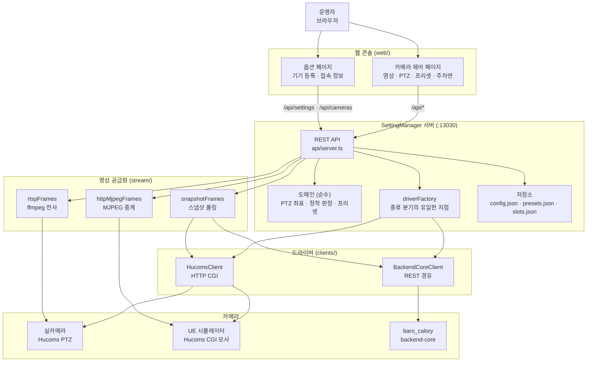

**브라우저에는 계산이 없다.** 화면은 서버가 낸 값을 그릴 뿐이고, 유일한 예외는 step 입력(도 → raw)의 ×100 한 줄이다.
계산을 클라이언트에 두면 부르는 쪽마다 따로 두게 되고, 그 순간 모델이 두 벌로 갈라진다.

---

## 3. 두 평면 — 제어와 영상은 별개다

이 구분이 이 문서에서 가장 중요하다. **실제로 사고가 났던 지점**이다.

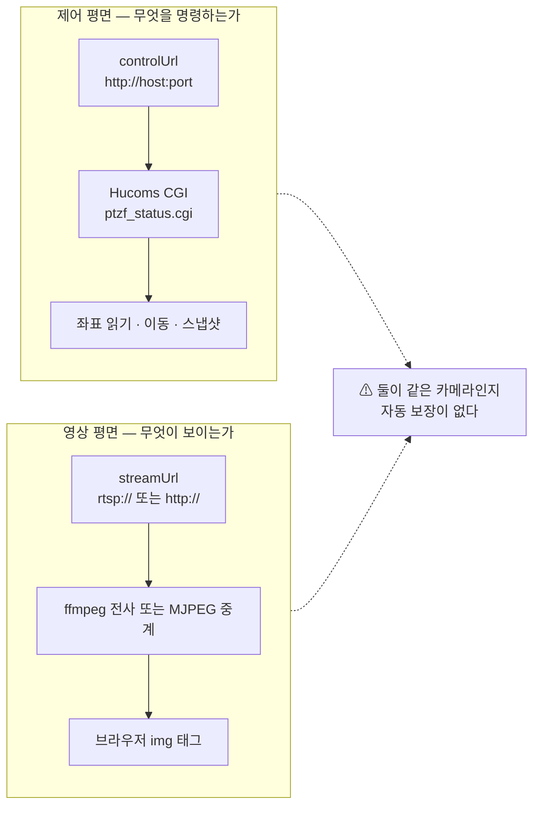

**어긋나면 어떻게 보이는가**: PTZ 숫자는 정상적으로 바뀌는데 **그림이 절대 안 바뀐다.**
운영자에게는 "버튼이 동작하지 않는다"로 보이고, 통신 로그에는 아무 오류도 남지 않는다.

실제 사례(2026-07-31): 제어 `8083` / 영상 `8091` 로 설정되어, **8083 번 카메라를 조종하면서 8081 번 화면**을 보고 있었다.
증명 — 8081 번을 움직이자 8091 스트림의 프레임이 바뀌었다.

**대응**: 옵션 페이지가 `영상 = 제어 + 10` 규칙을 벗어나면 경고한다(§8).

---

## 4. 카메라 종류(kind) — 프로토콜이지 실물/시뮬 구분이 아니다

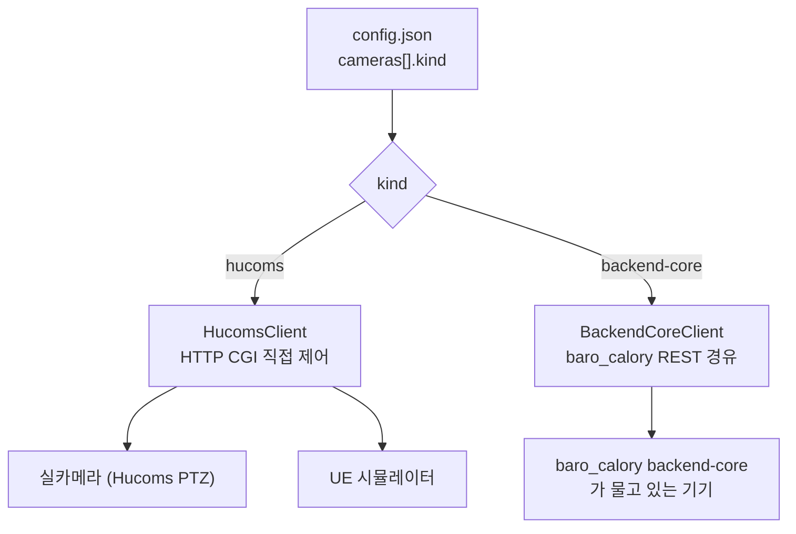

| kind | 뜻 | 해당 기기 |
|---|---|---|
| `hucoms` | Hucoms HTTP CGI 로 **직접** 제어 | 실카메라 · **UE 시뮬레이터** |
| `backend-core` | baro_calory 의 `/api/ptz` 를 **경유** | backend-core 가 관리하는 기기 |

> **UE 시뮬레이터는 `hucoms` 다.** 별도 프로토콜이 아니라 Hucoms CGI 를 그대로 모사한다.
> 실측 확인: `192.168.0.22:8083/cgi-bin/control/ptzf_status.cgi?action=getptzfpos` → `panpos = 296` 정상 응답.
> 근거: `baro_calory/docs/cameras.md` §시뮬레이터 — "별도 프로토콜이 아니라 Hucoms CGI 를 그대로 모사".

**RPC 는 PTZ 와 무관하다.** baro_calory 의 RPC(`/scene/*`)는 **씬 편집**(차량 스폰·삭제·주차면·번호판) 평면이고,
`scene-control-client.mjs` 스스로 "카메라 PTZ(Hucoms CGI)와 별개의 관심사"라고 명시한다. 이 저장소는 아직 씬 편집을 구현하지 않았다.

---

## 5. 영상 경로 — 스킴이 경로를 가른다

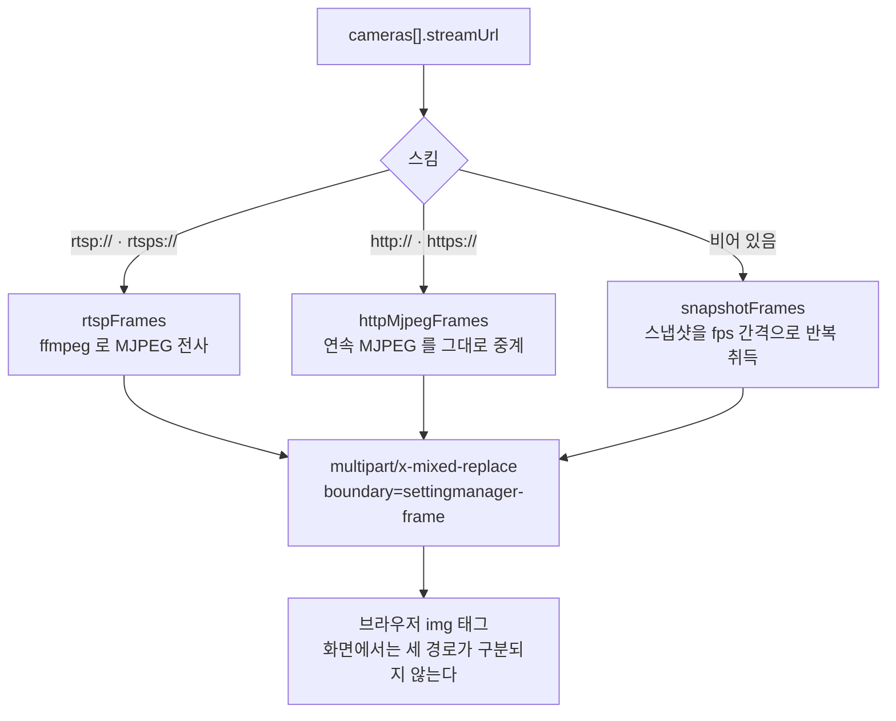

| 경로 | 쓰는 기기 | 특징 |
|---|---|---|
| `rtsp-ffmpeg` | 실카메라 | ffmpeg 필요. 카메라 타임스탬프를 믿지 않도록 `-use_wallclock_as_timestamps 1` + `-fps_mode vfr` 을 짝으로 넣는다 |
| `http-mjpeg` | UE 시뮬 직결 포트 | ffmpeg 불필요. 지연·중복 프레임 없음. **multipart 헤더를 파싱하지 않고** JPEG SOI/EOI 로 끊어 boundary 이름과 무관하게 동작 |
| `snapshot-poll` | 영상 URL 이 없는 기기 | 가장 정직한 폴백. 프레임률은 `streaming.fps` |

---

## 6. 좌표 규약

계약 좌표는 **Hucoms 논리 좌표계**다. 어느 종류의 기기든 API 표면에서는 이 좌표만 쓴다.

| 축 | 범위 | 단위 | 범위 밖 처리 |
|---|---|---|---|
| `pan` | 0 ~ 35999 | 0.01° | **감긴다**(원) — 36000 → 0 |
| `tilt` | −2000 ~ 9000 | 0.01° | **잘린다** + `limited` 로 보고 |
| `zoom` | 0 ~ 65535 | **불투명 raw** | **잘린다** + `limited` 로 보고 |

**줌은 배율·화각으로 환산하지 않는다.** 환산에는 기기별 실측 화각표(`zoomHfov`)가 필요하고 그 표는 캘리브레이션의 산출물이다.
모르는 값을 지어내지 않기 위해 화면은 줌을 raw 로만 보여준다.

**보내기 전에 자른다.** 기기는 범위 밖 요청에 성공이라 답하며 조용히 다른 데로 간다(baro_calory 실측).
잘린 축은 응답의 `limited` 에 실어 숨기지 않는다 — 착지가 어긋났다는 유일한 신호다.

---

## 7. 순서도

### 7.1 전체 여정 — 기기 등록에서 사용까지

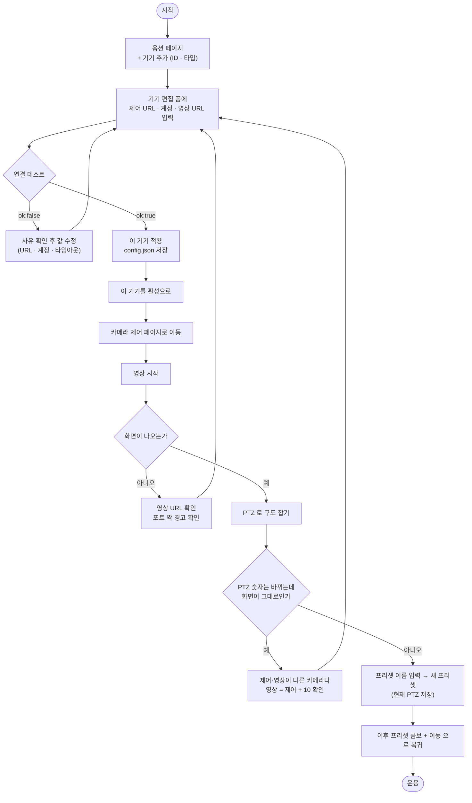

### 7.2 카메라 선택·전환

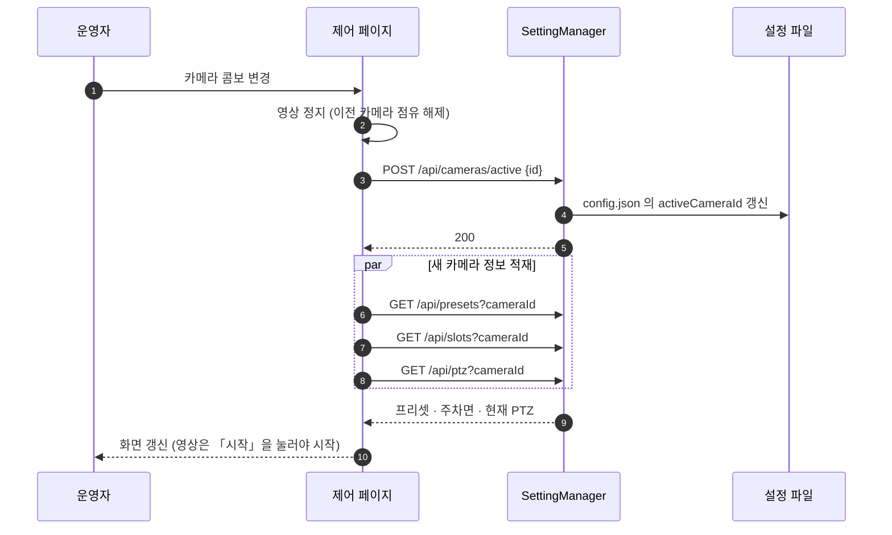

**영상은 카메라를 바꿔도 자동으로 켜지지 않는다.** 페이지를 여는 행위나 기기를 고르는 행위가 곧 카메라 점유가 되면 안 된다.

### 7.3 영상 시작 · 정지

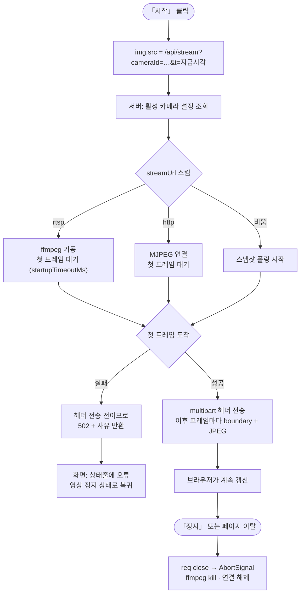

**첫 프레임 전 실패는 정직한 상태코드를 줄 수 있다**(아직 헤더를 안 보냈으므로 502 + 사유).
첫 프레임 이후 끊기면 스트림을 닫는 것 말고 할 수 있는 게 없다.

### 7.4 PTZ 이동 — 정착(settle) 대기가 핵심

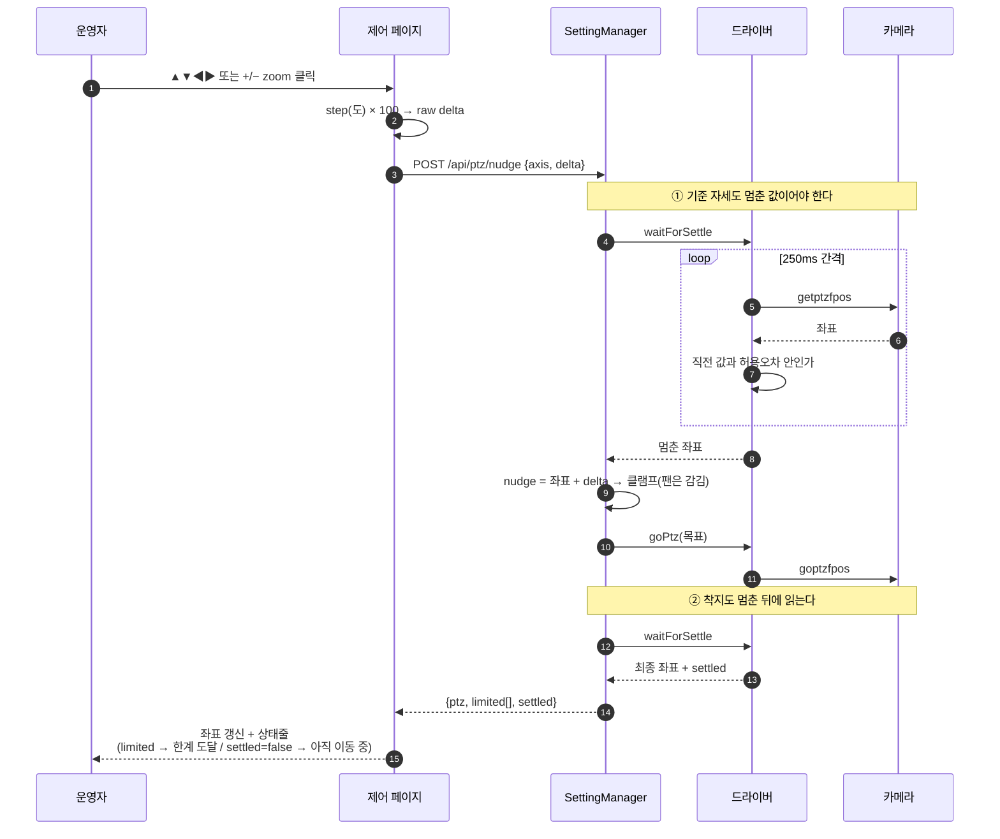

**왜 두 번 기다리는가.** 카메라는 "이동 완료" 신호를 주지 않는다.
- **착지를 안 기다리면** 화면에 이동 중간값이 뜬다.
- **기준을 안 기다리면** 중간값에 델타를 더하게 되어 **목표가 매번 뒤로 밀린다** → "눌러도 안 움직인다".

실측(UE 시뮬): pan 1296 → 목표 1496 명령 → **직후 읽기 1446** → 2초 뒤 1496.

**정착 판정 규칙**

| 항목 | 값 |
|---|---|
| 폴링 간격 | 250ms |
| 허용오차 | pan·tilt 10cd(0.1°) · zoom 10 raw |
| 판정 | 연속 두 번 읽은 값이 허용오차 안 |
| 팬 비교 | **순환 거리** `min(d, 36000−d)` — 없으면 0/36000 심 근처에서 영원히 안 멈춘다 |
| 상한 | 10초. 초과 시 **던지지 않고** `settled:false` 로 알린다 |

### 7.5 절대 좌표 이동

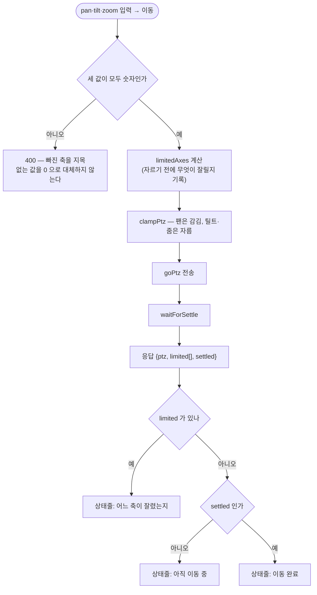

### 7.6 프리셋 — 저장 · 이동 · 삭제

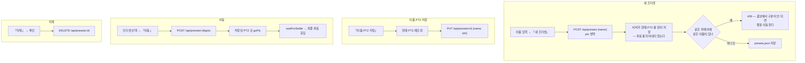

프리셋은 **카메라별**이다. 카메라마다 좌표계가 별개이므로 다른 카메라에서는 같은 이름을 써도 된다.
**기기를 삭제하면 그 기기의 프리셋도 함께 지워진다** — 없는 기기를 가리키는 프리셋을 남기면, 같은 ID 로 다른 기기를 등록하는 순간 남의 좌표로 이동하는 프리셋이 되살아난다.

### 7.7 연결 테스트

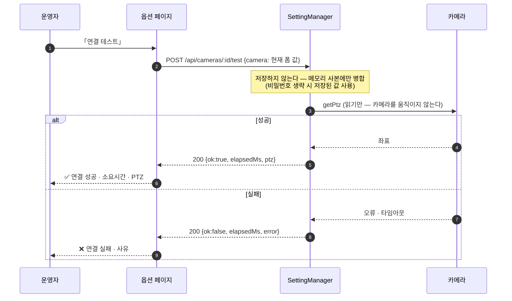

**연결 실패는 요청의 오류가 아니라 시험의 결과다.** 그래서 HTTP 는 200 이고 `ok` 로 가른다.
「적용」 전에 시험할 수 있어야 URL·계정을 고치는 중에도 쓸모가 있다.

### 7.8 주차면 조회

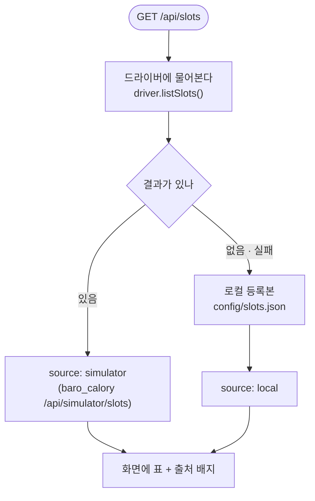

| 기기 | 출처 |
|---|---|
| `backend-core` 종류 | 시뮬 씬이 진실의 출처 — backend-core 경유 조회 |
| `hucoms` 종류 | 답할 곳이 없다 → `config/slots.json` 의 수동 등록본 |
| 어느 쪽도 없음 | **빈 목록**. 지어내지 않는다 |

---

## 8. UE 시뮬레이터 — 포트 짝 (반드시 지킬 것)

시뮬레이터는 카메라 여러 대를 포트로 구분하고, **제어와 영상이 1:1 짝**이다.

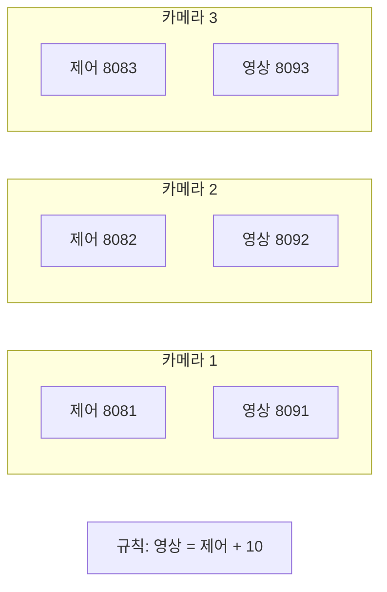

| 제어 | 영상 | 2026-07-31 실측 |
|---|---|---|
| 8081 | 8091 | 둘 다 기동 ✅ |
| 8082 | 8092 | 둘 다 기동 ✅ |
| 8083 | 8093 | 제어만 기동 — **영상 없음** |
| 8084 | 8094 | 제어만 기동 — **영상 없음** |

옵션 페이지는 이 규칙을 벗어나면 경고한다:
> ⚠ 제어 8083 의 영상 포트는 8093 입니다 — 8091 는 다른 카메라의 영상일 수 있습니다.

**`cgi-bin/image/mjpeg.cgi` 는 스트림이 아니다.** 실측상 8초에 1프레임이고 `content-length` 가 한 장 크기로 실린다 — 영상용으로 쓰면 안 된다. 연속 영상은 직결 포트(809x)뿐이다.

---

## 9. 오류·상태 처리 요약

| 상황 | 응답 | 화면 |
|---|---|---|
| 축 값 누락 | `400` + 어느 축인지 | 상태줄 오류 |
| 알 수 없는 축 | `400` | 상태줄 오류 |
| 등록되지 않은 카메라 | `404` | 상태줄 오류 |
| 중복 기기 ID · 마지막 1대 삭제 · 프리셋 이름 중복 | `409` | 상태줄 오류 |
| 카메라 통신 실패 · 타임아웃 | `502` + 사유(비밀번호 마스킹) | 상태줄 오류 |
| 기기가 그 기능을 하지 않음 | `501` (확정 답 — 재시도 안 함) | 해당 기능만 비활성 |
| 도달범위에서 잘림 | `200` + `limited[]` | "◯ 축이 한계에 닿았습니다" |
| 10초 안에 안 멈춤 | `200` + `settled:false` | "아직 이동 중입니다" |
| 연결 테스트 실패 | `200` + `ok:false` | ❌ + 사유 |
| 본문이 UTF-8 이 아님 | `400` | 상태줄 오류 |

**조용히 실패하는 경로는 없다.** 모든 오류는 화면 왼쪽 아래 상태줄로 나온다.

---

## 10. 경계 — 하지 않는 것 · 아직 없는 것

### 하지 않는 것 (설계 판단)

| 항목 | 이유 |
|---|---|
| 줌 raw → 배율·화각 환산 | 기기별 실측 화각표가 필요하고 그건 캘리브레이션 산출물이다 |
| 기하·광학 계산(픽셀↔PTZ, 투영) | `@baro/profile` 이 단일 소스. 두 벌로 갈라지면 반드시 어긋난다 |
| 카메라 벤더 프로토콜을 화면에서 직접 호출 | 드라이버 계층의 몫 |
| 장비 내장 프리셋(1~255) | 자체 프리셋과 섞으면 어느 쪽이 정본인지 모호해진다 |
| PTZ 를 RPC 로 전환 | 시뮬도 PTZ 는 Hucoms CGI 다. RPC 는 씬 편집 평면 |

### 아직 없는 것 (미구현)

| 항목 | 영향 |
|---|---|
| **카메라 점유 lease** | 여러 탭·다른 도구가 같은 카메라를 동시에 움직이면 서로 덮어쓴다 |
| **인증** | 현재 `0.0.0.0` 바인드라 사내망의 누구나 카메라를 움직일 수 있다 |
| **시뮬 씬 제어(`/scene/*` RPC)** | 주차면·차량 배치를 backend-core 없이 직접 다룰 수 없다 |
| **캘리브레이션·호밍 오케스트레이션** | 설계서의 본체. 아직 카메라 제어면만 있다 |

---

## 11. 한눈에 보는 규칙 6가지

1. **제어와 영상은 별개 평면이다.** 같은 카메라를 가리키는지 사람이 확인해야 한다 (시뮬은 `영상 = 제어 + 10`).
2. **카메라는 "이동 완료"를 알려주지 않는다.** 명령 직후 읽은 값은 중간값이다 — 반드시 정착을 기다린다.
3. **보내기 전에 자르고, 잘린 축은 알린다.** 기기는 범위 밖 요청에도 성공이라 답한다.
4. **모르는 값은 지어내지 않는다.** 줌 화각·주차면·좌표 — 근거가 없으면 비워 둔다.
5. **영상은 「시작」을 눌러야 시작한다.** 페이지를 여는 행위가 카메라 점유가 되면 안 된다.
6. **비밀번호는 화면으로 돌아오지 않는다.** 빈 값은 "변경 없음"이다.
