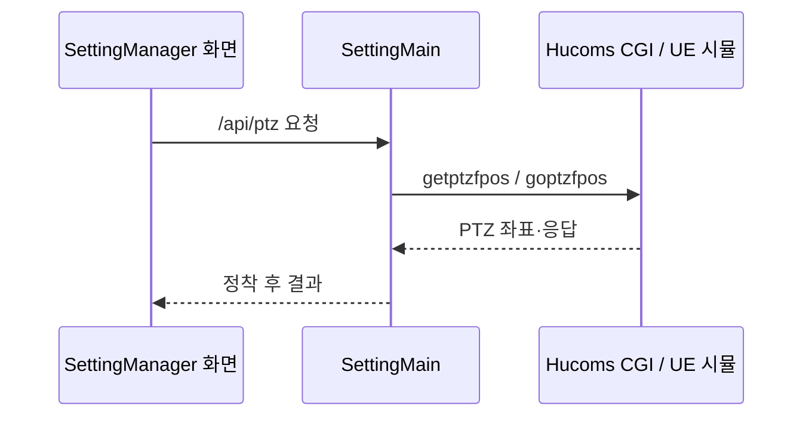
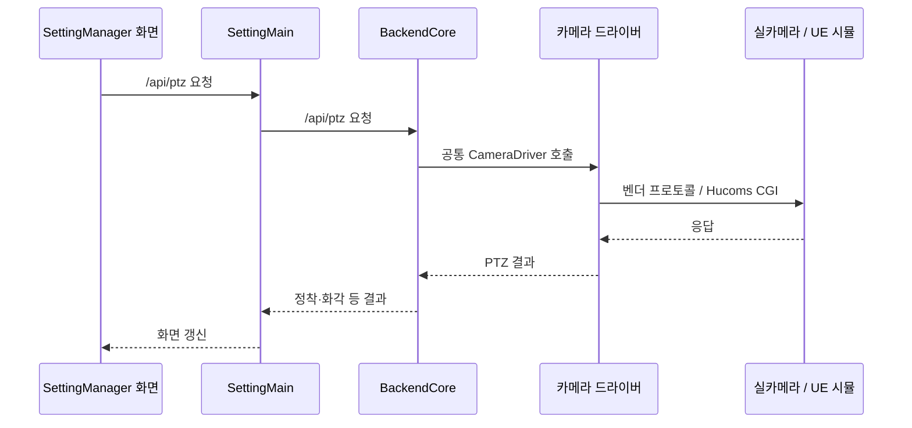
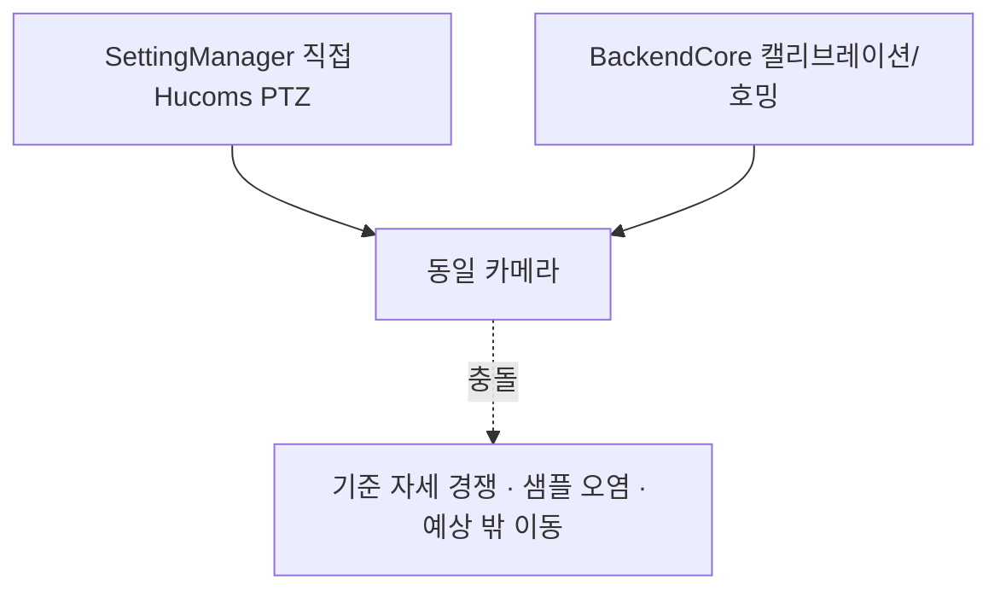

# 카메라 직접 제어와 BackendCore 제어 의사결정

| 항목 | 내용 |
|---|---|
| 작성 시각 | 2026-07-31 23:36:11 (KST) |
| 대상 | SettingManager의 카메라·UE 시뮬레이터·캘리브레이션·센터라이징 제어 경계 |
| 결론 | 단순 수동 PTZ만이면 직접 제어가 가능하지만, 캘리브레이션·센터라이징·호밍까지 운영할 계획이면 **BackendCore를 단일 카메라 제어 책임자**로 둔다. |

---

## 1. 질문에 대한 답

### 1.1 BackendCore 없이 직접 제어할 수 있는가

**가능하다.** SettingManager가 필요한 라이브러리와 오케스트레이션을 직접 보유하면 된다.

| 대상 기능 | 직접 제어 가능 여부 | 직접 구현 시 필요한 책임 |
|---|---|---|
| 실카메라 PTZ·스냅샷 | 가능 | Hucoms/IDIS 등 벤더 프로토콜 호출, 인증·타임아웃·오류 처리 |
| UE 시뮬레이터 PTZ | 가능 | Hucoms CGI 호출. 시뮬 PTZ도 별도 RPC가 아니라 Hucoms 제어 평면이다. |
| UE 영상 | 가능 | MJPEG/RTSP 연결·중계·연결 해제 관리 |
| UE 씬 편집 | 가능 | `/scene/*` JSON REST 계약을 직접 사용. 주차면·차량·번호판 관리이며 PTZ와 별개다. |
| 클릭 센터라이징 | 가능 | 픽셀→PTZ 델타 환산, 화각표, 도달범위 클램프, 정착 대기 구현 |
| 소프트웨어 센터라이징 | 가능 | `@baro/cctv-client`의 증강 로직과 `@baro/profile`의 기하/화각표를 통합 |
| 캘리브레이션 | 가능 | 스윕, 정착 대기, 스냅샷/착지 측정, 샘플 품질 게이트, 중단 복귀, 결과 발행을 구현 |
| 번호판 호밍·VLA 자동 순회 | 가능 | 카메라 점유, 자동 이동, 탐지·재조준·실패 복구를 구현 |

따라서 기술적 의존성 때문에 BackendCore가 반드시 필요한 것은 아니다. 하지만 BackendCore가 이미 위 고난도 책임의 상당 부분을 구현하고 있으므로, 이를 제외하고 같은 기능을 운영하려면 SettingManager에 동등한 제어 계층을 새로 만들어야 한다.

### 1.2 BackendCore 경유와 직접 제어 중 무엇이 좋은가

기능 범위에 따라 다르지만, **현재처럼 캘리브레이션·센터라이징까지 고려하는 구성에서는 BackendCore 경유가 더 적합하다.**

| 상황 | 권장 | 근거 |
|---|---|---|
| PTZ 방향키, 좌표 조회, 영상 보기, 자체 프리셋만 필요 | 직접 제어 가능 | 구성 단순, 중간 서비스 의존 없음 |
| 클릭 센터라이징이 필요 | BackendCore 경유 권장 | 기기별 화각·게인·도달범위 처리가 이미 있다 |
| 실카메라 캘리브레이션이 필요 | BackendCore 경유 권장 | 긴 스윕과 품질 검증, 결과 프로파일 발행이 구현돼 있다 |
| 번호판 호밍/VLA 자동 순회가 필요 | BackendCore 경유 권장 | 카메라 점유와 자동 이동 오케스트레이션이 필요하다 |
| 여러 화면·도구가 한 카메라를 공유 | BackendCore 경유 권장 | 작업 중 수동 PTZ를 막는 busy guard와 카메라 잠금 경로가 있다 |
| 외부 서비스 최소화가 최우선이며 고급 기능을 전혀 쓰지 않음 | 직접 제어 가능 | 운영 대상과 장애 지점이 줄어든다 |

## 2. 현재 구성의 사실

현재 SettingManager의 활성 카메라 `simulator-1`은 `SettingMain/config/config.json`에서 `kind: "hucoms"`로 등록되어 있다. 따라서 다음 경로를 쓴다.

이 경로에는 BackendCore가 없다. `SettingMain/src/clients/driverFactory.ts`는 카메라 `kind`가 `backend-core`일 때에만 `BackendCoreClient`를 선택한다.

BackendCore 경유로 전환하면 경로는 다음과 같다.

## 3. BackendCore를 선택할 때 얻는 것

BackendCore는 단순 HTTP 프록시가 아니다. 다음을 서버 측에서 함께 수행한다.

| 기능 | BackendCore 근거 경로 | 직접 제어만 할 때 빠질 수 있는 보호/기능 |
|---|---|---|
| 통합 PTZ API | `apps/backend-core/src/control-api.mjs` | 벤더 차이를 API 소비자에게 노출하게 됨 |
| 정착 대기 | `packages/cctv-client/src/ptz-settle.mjs` | 이동 중 좌표를 기준으로 다음 명령을 만드는 문제 |
| 기기 능력 판정 | `packages/cctv-client/src/capabilities.mjs` | 미지원 카메라에서 장시간 작업이 뒤늦게 실패 |
| 하드웨어 센터링 | `hucoms-camera-client.mjs` | 벤더별 클릭 조준 호출을 직접 관리해야 함 |
| 소프트웨어 센터링 | `software-centering.mjs` | 절대 PTZ만 있는 기기에서 클릭 센터링을 새로 구현해야 함 |
| 가상 PTZ | `virtual-ptz.mjs` | 고정식 카메라의 크롭 기반 PTZ 계약을 별도로 구현해야 함 |
| 캘리브레이션 잡 | `calibration-manager.mjs` | 스윕·샘플 품질·중단·home 복귀 구현 필요 |
| 기하/해법 | `packages/profile/src/calibration.mjs` | 줌별 HFOV·센터링 게인 산출을 중복 구현해야 함 |
| 프로파일 발행 | `profile-store.mjs` | 카메라별 보정 결과의 리비전·무결성 관리 필요 |
| 시뮬 씬 편집 | `simulator-api.mjs`, `scene-control-client.mjs` | UE `/scene/*` 계약을 자체적으로 보존·검증해야 함 |

## 4. 직접 제어를 선택할 때의 장점과 비용

### 장점

- 네트워크 홉과 운영 프로세스가 하나 줄어든다.
- 단순 PTZ·영상 기능만 필요하면 설정과 장애 분석이 간단하다.
- SettingManager가 사용자 경험과 제어 정책을 완전히 직접 결정할 수 있다.

### 비용과 위험

- BackendCore에 있는 드라이버 추상화, 정착 대기, 역량 게이트, 화각/게인 처리, 잠금, 복구를 중복 구현하게 된다.
- 카메라 보정 결과의 정본 위치가 BackendCore 프로파일과 SettingManager 설정으로 갈라질 수 있다.
- 캘리브레이션·호밍 도중 다른 화면에서 직접 PTZ를 보내면 샘플과 기준 좌표가 오염될 수 있다.
- UE 시뮬레이터 PTZ와 `/scene/*` 편집 API를 혼동해 잘못된 제어 경로를 설계할 위험이 있다.

## 5. 가장 피해야 할 구조

**같은 카메라를 SettingManager가 직접 제어하면서 BackendCore도 동시에 캘리브레이션·호밍하는 이중 제어 구조**는 피한다.

BackendCore의 busy guard나 camera lock은 BackendCore 요청 안에서만 의미가 있다. SettingManager가 Hucoms CGI로 직접 명령을 보내면 BackendCore가 그 이동을 알 수 없으므로 잠금을 우회한다.

## 6. 권장 구조

### 권장안: BackendCore를 카메라 제어 정본으로 둔다

| 계층 | 책임 |
|---|---|
| SettingManager | 화면, 사용자 설정, 업무 흐름, 자체 프리셋 UX, BackendCore API 호출 |
| BackendCore | 카메라 드라이버, PTZ/영상/센터링, 캘리브레이션, 호밍, 기기 점유, 카메라 프로파일 |
| 카메라·UE 시뮬 | Hucoms 등 실제 벤더/시뮬 프로토콜과 UE 씬 API 제공 |

이 구조에서는 SettingManager가 카메라를 직접 움직이지 않고, PTZ도 BackendCore의 `/api/ptz` 또는 `/api/ptz/nudge`로 보낸다. 그러면 센터라이징·캘리브레이션 도입 후에도 제어 경로가 갈라지지 않는다.

### 직접 제어를 유지해도 되는 범위

다음 조건을 모두 만족하면 현재의 직접 Hucoms 제어를 유지할 수 있다.

1. 사람의 단순 수동 PTZ와 영상 확인만 한다.
2. BackendCore의 캘리브레이션·센터라이징·호밍을 같은 카메라에 쓰지 않는다.
3. 기기별 화각·센터링 보정 프로파일을 별도로 운영할 필요가 없다.
4. 카메라 동시 점유가 운영상 문제가 되지 않거나, 별도 잠금 정책을 구현한다.

## 7. 단계적 전환 제안

1. **즉시**: 현재 `hucoms` 직접 제어는 유지한다. 단, BackendCore 자동 작업을 같은 카메라에서 동시에 실행하지 않는다.
2. **센터라이징 또는 캘리브레이션 도입 전**: 대상 카메라의 제어 책임을 BackendCore 한 곳으로 전환한다.
3. **SettingManager 연동**: `kind: "backend-core"` 설정과 `BackendCoreClient`를 사용해 SettingManager의 기존 화면/API가 BackendCore를 호출하게 한다.
4. **정본 확정**: 카메라 프로파일(`zoomHfov`, `centeringGain`)과 카메라 점유 정책의 정본을 BackendCore로 명시한다.
5. **추가 검증**: UE PTZ·영상·`/scene/*`를 각각 별도 경로로 통합 테스트하고, 캘리브레이션 중 수동 PTZ가 거부되는지 확인한다.

## 8. 최종 의사결정

현재의 단순 제어 요구만 놓고 보면 직접 제어는 충분히 합리적이다. 그러나 질문에 포함된 **시뮬레이터·캘리브레이션·센터라이징**까지 실제 운영 범위라면, 기존 구현을 재복제하기보다 **BackendCore를 카메라 제어의 단일 권한자**로 두는 것이 안전성과 유지보수성에서 우세하다.

특히 두 제어 경로를 병행하지 않고, 카메라별로 어느 서버가 제어 권한을 가지는지 명확히 하나로 정해야 한다.
