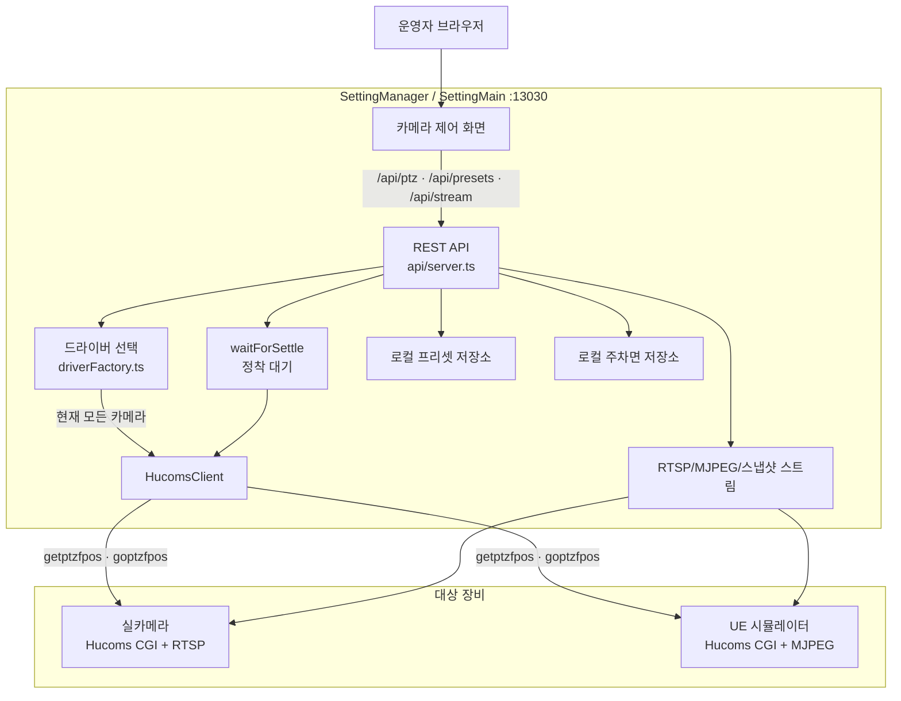
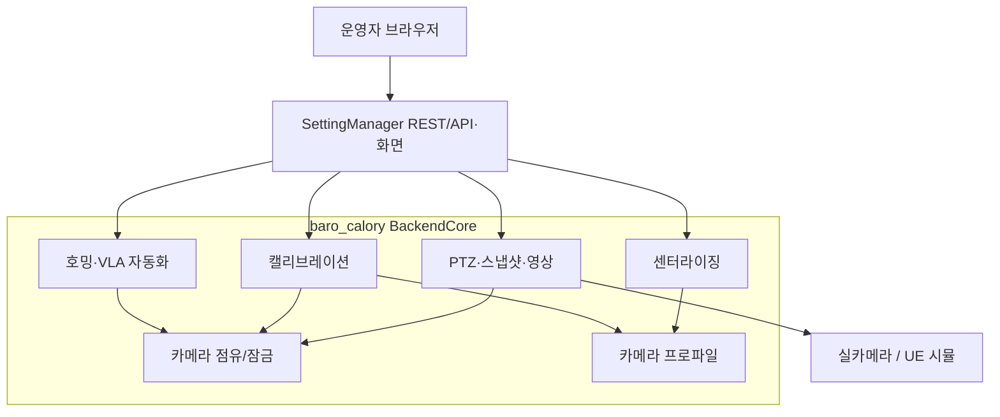

# 현재 카메라 제어 구조와 BackendCore 연동 상태

| 항목 | 내용 |
|---|---|
| 작성 시각 | 2026-07-31 23:57:26 (KST) |
| 확인 대상 | `SettingMain/config/config.json`, `SettingMain/src/` |
| 확인 방법 | 현재 설정, 드라이버 분기, REST 라우트, 구현된 클라이언트 소스의 정적 교차 확인 |
| 핵심 결론 | **현재 SettingManager는 BackendCore를 통해 캘리브레이션·센터라이징·호밍·카메라 제어를 사용하지 않는다.** 활성 카메라를 포함한 모든 등록 카메라가 Hucoms 직접 제어다. |

---

## 1. 결론

현재 프로젝트의 실제 실행 구조는 다음과 같다.

- 카메라 제어: **SettingMain → Hucoms CGI 직접 호출**
- UE 시뮬레이터 PTZ: **SettingMain → UE 시뮬레이터의 Hucoms CGI 직접 호출**
- 영상: **SettingMain → RTSP 또는 UE 시뮬레이터 MJPEG 직접 연결**
- 프리셋: **SettingManager 로컬 저장소(`config/presets.json`)**
- 주차면: Hucoms 카메라에서는 **로컬 `config/slots.json`** 사용
- 정착 대기: **SettingManager 자체 `waitForSettle` 구현**
- 캘리브레이션·센터라이징·호밍: **SettingManager에는 API/오케스트레이션이 구현되어 있지 않음**

BackendCore를 호출할 수 있는 `BackendCoreClient`는 존재하지만, 이는 선택 가능한 드라이버일 뿐이다. 현재 설정에서 어떤 카메라도 `kind: "backend-core"`가 아니므로 실제로 선택되지 않는다.

## 2. 현재 설정 판정

`SettingMain/config/config.json`을 기준으로 활성 카메라는 `simulator-1`이며, 등록된 카메라 3대는 모두 `kind: "hucoms"`다.

| 카메라 구분 | 종류(`kind`) | 현재 제어 경로 |
|---|---|---|
| 실카메라 1 | `hucoms` | SettingMain → 실카메라 Hucoms HTTP CGI |
| 실카메라 2 | `hucoms` | SettingMain → 실카메라 Hucoms HTTP CGI |
| 활성 UE 시뮬레이터 | `hucoms` | SettingMain → UE 시뮬레이터 Hucoms HTTP CGI |

따라서 설정에 있는 `simulator.baseUrl`은 BackendCore용 기본 URL 후보일 뿐, 현재 활성 카메라의 제어 경로를 의미하지 않는다.

## 3. 현재 실제 구조도



이 구조도에 BackendCore가 없는 이유는 현재 `driverFactory.ts`의 `backend-core` 분기가 선택되지 않기 때문이다.

## 4. 기능별 실제 경유 여부

| 기능 | 현재 SettingManager 구현 | BackendCore 경유 여부 | 근거 |
|---|---|---|---|
| 현재 PTZ 조회 | `GET /api/ptz` → `driver.getPtz()` | 아니오 | 현재 드라이버는 `HucomsClient` |
| 절대 PTZ 이동 | `POST /api/ptz/absolute` → `driver.goPtz()` → 정착 대기 | 아니오 | `HucomsClient`가 `goptzfpos` 호출 |
| 상대 PTZ 이동 | `POST /api/ptz/nudge` → 현재값+델타 → 정착 대기 | 아니오 | SettingMain 도메인 및 `waitForSettle` |
| 카메라 영상 | `/api/stream` → RTSP/MJPEG/스냅샷 | 아니오 | stream 모듈이 URL 스킴에 따라 직접 연결 |
| 프리셋 | `/api/presets` | 아니오 | `presetStore.ts`의 로컬 파일 저장 |
| 주차면 | `/api/slots` | 현재는 아니오 | Hucoms 드라이버는 빈 목록 → 로컬 `slots.json` 폴백 |
| 캘리브레이션 | 미구현 | 아니오 | `/api/calibration/*` 라우트와 매니저 없음 |
| 클릭 센터라이징 | 미구현 | 아니오 | `/api/center` 라우트와 기하/게인 처리 없음 |
| 번호판 호밍 | 미구현 | 아니오 | `/api/discovery/*` 라우트와 호밍 잡 없음 |
| UE 씬 편집 | 미구현 | 아니오 | `/scene/*` 클라이언트 없음 |

## 5. 구현돼 있으나 현재 사용되지 않는 BackendCore 연동 경로

`SettingMain/src/clients/backendCoreClient.ts`는 BackendCore REST API의 일부를 호출할 수 있다.

| BackendCore API | SettingManager 클라이언트 메서드 | 현재 사용 여부 |
|---|---|---|
| `GET /api/ptz` | `getPtz()` | `backend-core` 카메라일 때만 사용 |
| `POST /api/ptz` | `goPtz()` | `backend-core` 카메라일 때만 사용 |
| `GET /api/snapshot` | `getSnapshot()` | `backend-core` 카메라일 때만 사용 |
| `GET /api/simulator/slots` | `listSlots()` | `backend-core` 카메라일 때만 사용 |

`driverFactory.ts`의 선택 규칙은 다음과 같다.

```mermaid
flowchart TD
    CAM[카메라 설정 cameras[].kind] --> KIND{kind}
    KIND -->|hucoms| H[HucomsClient<br/>카메라/시뮬 직접 제어]
    KIND -->|backend-core| B[BackendCoreClient<br/>BackendCore REST 경유]

    H --> CGI[Hucoms CGI]
    B --> BC[baro_calory BackendCore]
    BC --> DRV[BackendCore CameraDriver]
    DRV --> DEVICE[실카메라 또는 UE 시뮬]
```

현재는 모든 경로가 왼쪽 `hucoms` 분기로 흐른다. `backend-core` 분기는 구현·테스트되어 있지만, 운영 설정에는 선택된 카메라가 없다.

## 6. BackendCore의 고급 기능과 현재 공백

BackendCore에는 다음 기능이 구현되어 있으나 SettingManager의 현재 API 표면은 이를 호출하지 않는다.

| BackendCore 기능 | BackendCore 대표 API | SettingManager 상태 |
|---|---|---|
| 캘리브레이션 스윕/검증/발행 | `/api/calibration/start`, `/status`, `/stop`, `/mint` | 미연동·미구현 |
| 하드웨어/소프트웨어 센터라이징 | `/api/center`, `/api/center-box` | 미연동·미구현 |
| 번호판 호밍·탐색 | `/api/discovery/plate-home/*`, `/api/discovery/*` | 미연동·미구현 |
| VLA 자동 순회 | `/api/vla/tour` | 미연동·미구현 |
| UE 씬 편집 | `/api/simulator/*` 및 내부 `/scene/*` | 주차면 조회 일부만 BackendCore 드라이버에서 지원, 그 외 미구현 |
| 카메라 프로파일 | `/api/profiles/*` | 미연동·미구현 |

특히 `BackendCoreClient`는 현 시점에 PTZ·스냅샷·주차면만 감싼 최소 클라이언트다. 캘리브레이션, 센터라이징, 호밍 API의 프록시/화면/상태 처리는 없다.

## 7. 향후 BackendCore 중심 구조로 전환할 때의 모습

BackendCore를 카메라 제어 정본으로 채택하려면, 대상 카메라를 `kind: "backend-core"`로 등록하고 SettingManager가 고급 API도 명시적으로 호출하도록 확장해야 한다.



이 전환은 단순히 `kind`만 바꾸는 것으로 끝나지 않는다. 현재 `BackendCoreClient`에 없는 캘리브레이션·센터라이징·호밍 API 계약, 화면 상태, 작업 진행률, 오류 처리 및 카메라 점유 정책을 SettingManager에 추가해야 한다.

## 8. 최종 판정

현재 프로젝트는 **BackendCore를 이용할 수 있도록 확장 지점을 만들어 둔 직접 제어 구조**다. 그러나 실제 운영 설정과 기능 구현을 기준으로 보면 BackendCore를 통해 캘리브레이션, 센터라이징, 호밍, PTZ 제어를 수행하는 구조는 아니다.

현재 BackendCore를 경유하는 기능은 없다. BackendCore 경유를 사용하려면 카메라 설정을 `backend-core`로 바꾸어 PTZ·스냅샷·주차면부터 전환할 수 있으며, 고급 기능까지 쓰려면 별도 연동 구현이 필요하다.

## 9. 근거 파일

- `SettingMain/config/config.json` — 활성 카메라와 모든 등록 카메라의 `kind`
- `SettingMain/src/clients/driverFactory.ts` — `hucoms`/`backend-core` 드라이버 분기
- `SettingMain/src/clients/hucomsClient.ts` — 직접 Hucoms CGI 제어
- `SettingMain/src/clients/backendCoreClient.ts` — 준비된 BackendCore 최소 클라이언트
- `SettingMain/src/api/server.ts` — 현재 제공 REST API와 PTZ·스트림·프리셋·주차면 처리
- `SettingMain/src/clients/waitForSettle.ts` — SettingManager 자체 정착 대기
- `D:\Work3\Hermes\dev\Projects\Baro\baro_calory\apps\backend-core\src\control-api.mjs` — BackendCore 고급 API의 실제 제공 지점
