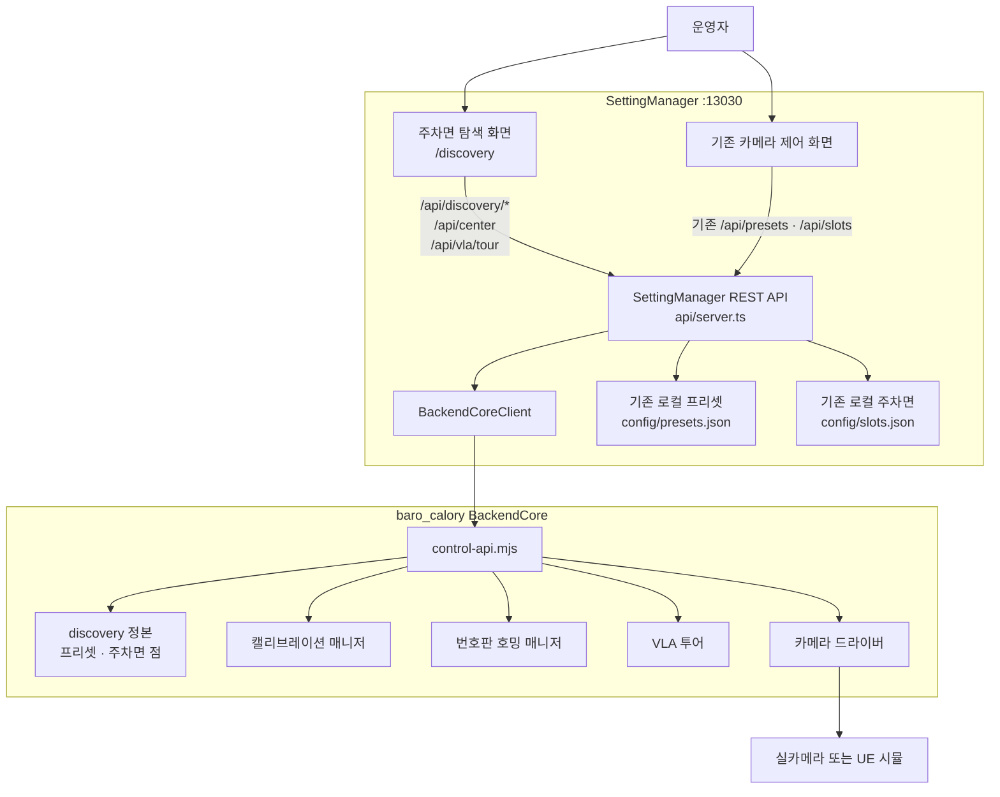
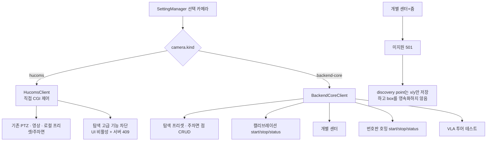
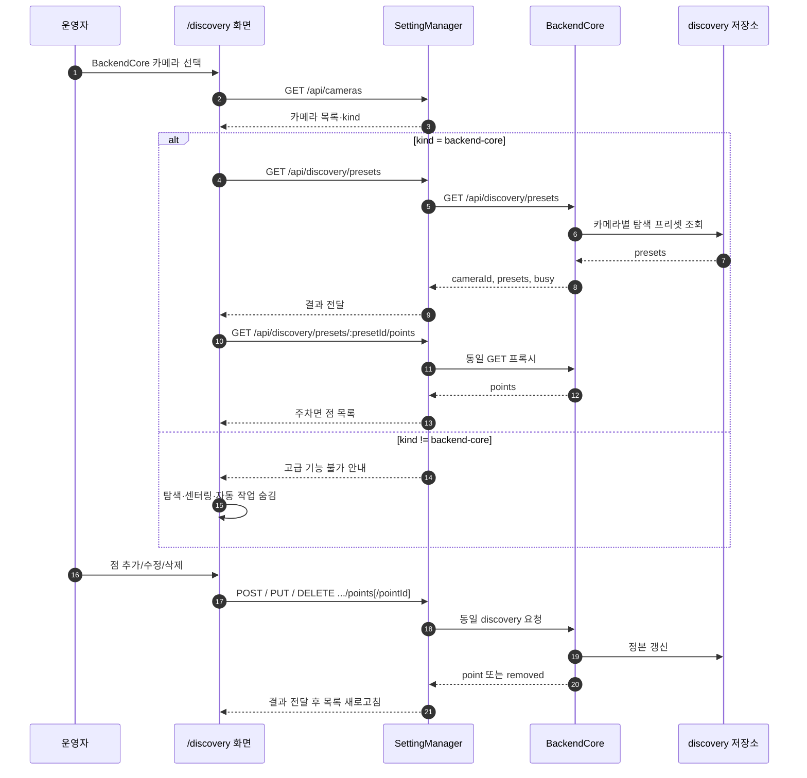
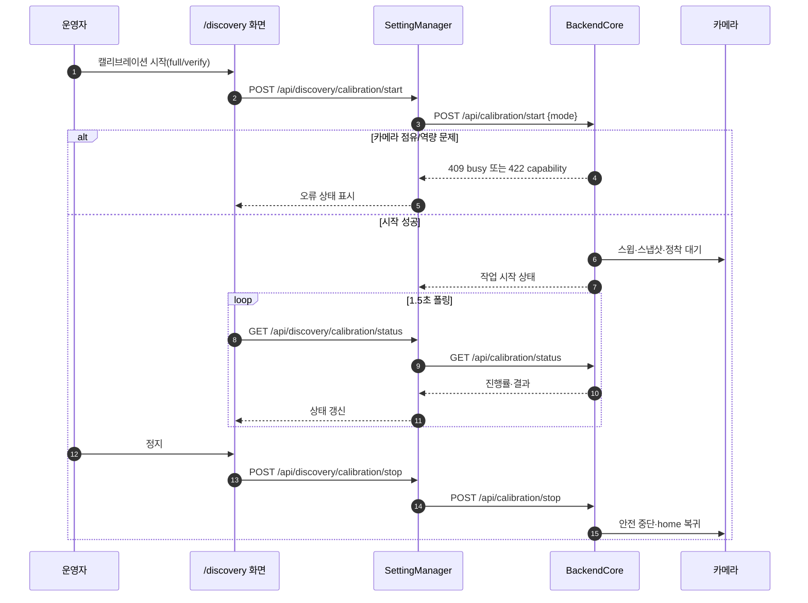
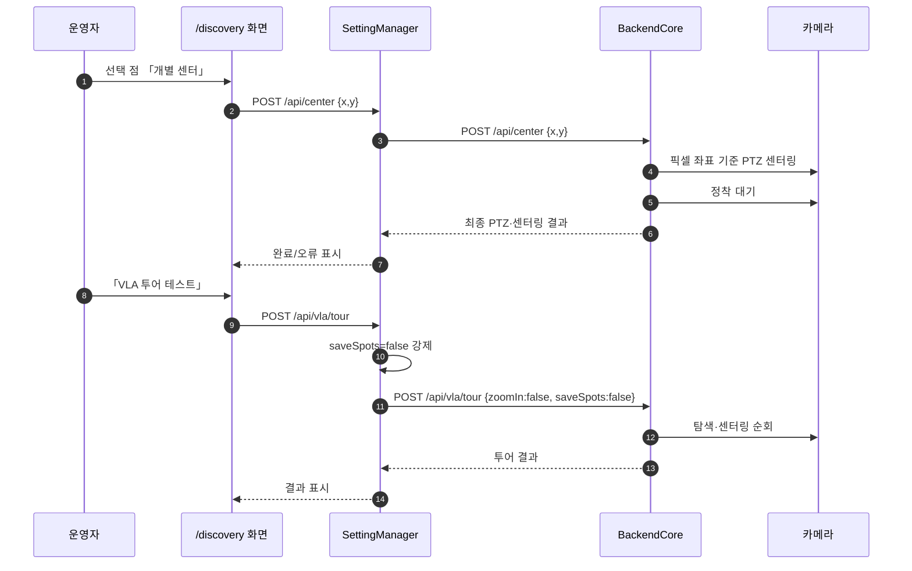

# SettingManager · BackendCore 연동 개념도 · 순서도 · 관계도

| 항목 | 내용 |
|---|---|
| 작성 시각 | 2026-08-01 10:09:57 (KST) |
| 기준 | 현재 `SettingMain` 구현과 `baro_calory` BackendCore API 계약 |
| 대상 | 주차면 탐색 페이지(`/discovery`)의 BackendCore 연동 |

---

## 1. 한 줄 요약

SettingManager는 화면과 자체 REST API를 제공하고, 선택 카메라가 `kind: "backend-core"`일 때만 탐색 프리셋·주차면 점·캘리브레이션·센터링·호밍·투어 요청을 BackendCore에 프록시한다. 탐색 데이터의 정본은 SettingManager 로컬 파일이 아니라 **BackendCore discovery 데이터**다.

현재 설정의 활성 카메라는 `hucoms`이므로 탐색 페이지는 고급 작업을 비활성화하고, 서버도 요청을 `409`로 차단한다.

## 2. 개념도 — 제어 평면과 데이터 정본

### 정본 구분

| 데이터/기능 | 정본 | 이유 |
|---|---|---|
| 기존 카메라 제어 화면의 자체 프리셋 | SettingManager `config/presets.json` | 기존 기능의 계약을 유지한다. |
| 기존 로컬 주차면 | SettingManager `config/slots.json` | Hucoms 직접 카메라에는 씬 주차면 출처가 없을 수 있다. |
| 탐색 프리셋·탐색 주차면 점 | BackendCore discovery | 카메라별 탐색·호밍 작업의 입력이므로 BackendCore가 정본이다. |
| 캘리브레이션·센터링·호밍·투어 | BackendCore | 카메라 점유·정착·역량 확인·프로파일을 BackendCore가 관리한다. |

## 3. 관계도 — 선택 카메라에 따른 분기

`개별 센터+줌`은 BackendCore의 `/api/center-box` 자체는 존재하지만, 현재 탐색 주차면 점에 필요한 box 좌표가 저장되지 않는다. 그래서 화면에서 비활성화하고 SettingManager도 `501`로 명시 거부한다. 없는 좌표를 추정해 카메라를 움직이지 않는다.

## 4. 순서도 — 탐색 프리셋과 주차면 점 조회·수정

추가 요청은 선택된 기존 점이 있어도 항상 collection 경로 `POST .../points`를 사용한다. 수정·삭제만 `.../points/:pointId`를 사용한다.

## 5. 순서도 — 캘리브레이션과 자동 작업

번호판 호밍도 같은 방식으로 `/api/discovery/plate-home/start·status·stop`을 사용한다. 선택한 탐색 프리셋과 선택 점 ID를 넘겨 해당 점만 처리할 수 있으며, 캘리브레이션과 호밍은 서로 동시에 시작할 수 없다.

## 6. 순서도 — 개별 센터와 투어링 테스트

센터링·프리셋 이동·호밍·캘리브레이션·투어는 실제 카메라를 움직일 수 있다. BackendCore의 `409 busy`, `422 capability`, `501 unsupported`은 SettingManager가 성공으로 바꾸지 않고 화면에 오류로 표시한다.

## 7. 구현 경로

| 계층 | 경로 | 책임 |
|---|---|---|
| 탐색 UI | `SettingMain/web/discovery.html`, `discovery.js` | 선택·CRUD·상태 폴링·오류 표시 |
| SettingManager API | `SettingMain/src/api/server.ts` | 입력 검증, backend-core kind 게이트, BackendCore 프록시 |
| BackendCore 클라이언트 | `SettingMain/src/clients/backendCoreClient.ts` | URL 조립, timeout, HTTP 오류 변환 |
| BackendCore 정본 | `baro_calory/apps/backend-core/src/control-api.mjs` | discovery·calibration·center·homing·tour 실제 구현 |

## 8. 운영 확인 사항

1. SettingManager에 `kind: "backend-core"` 카메라를 등록하고 그 URL이 실행 중인 BackendCore를 가리켜야 고급 영역이 활성화된다.
2. BackendCore 내부 active device와 SettingManager의 선택 카메라는 자동 동기화되지 않는다. 화면의 BackendCore 응답 `cameraId`를 확인해야 한다.
3. 실제 카메라 이동이 필요한 버튼은 운영 승인과 카메라 점유 상태를 확인한 뒤 실행한다.
4. 현재 QA는 `hucoms` 카메라에서 409 차단과 정적 화면 제공까지 확인했다. 실제 BackendCore 카메라 응답과 이동형 API는 별도 환경에서 검증해야 한다.
