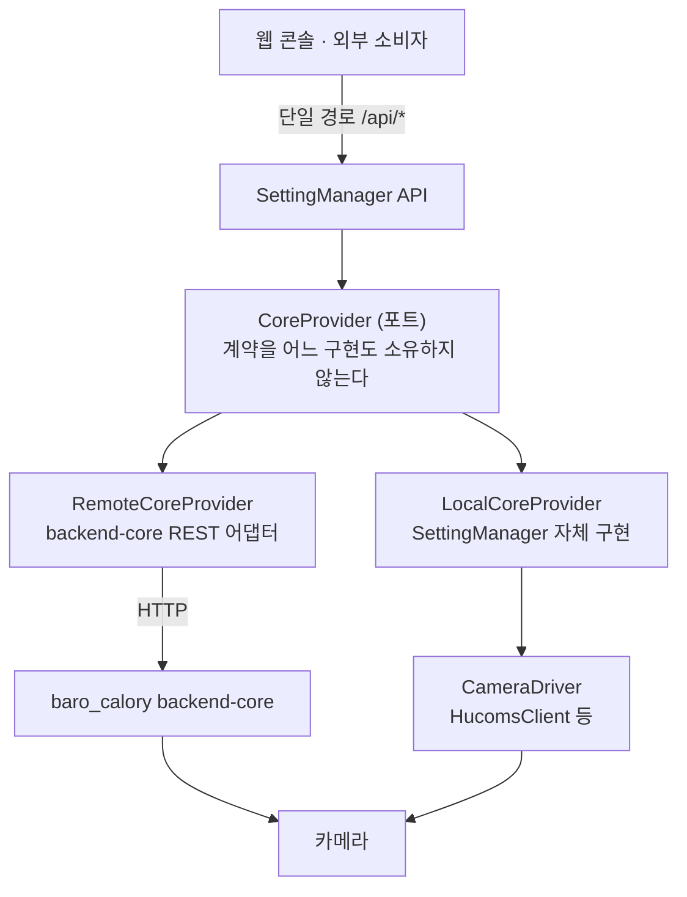
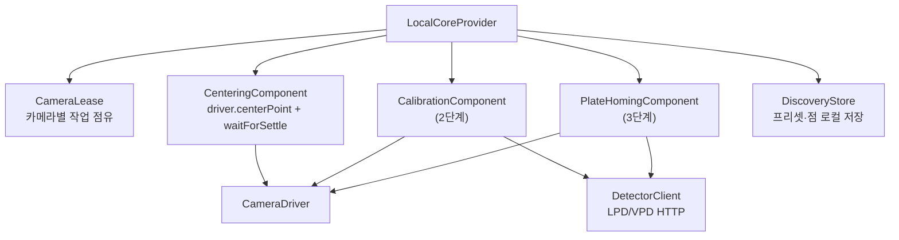
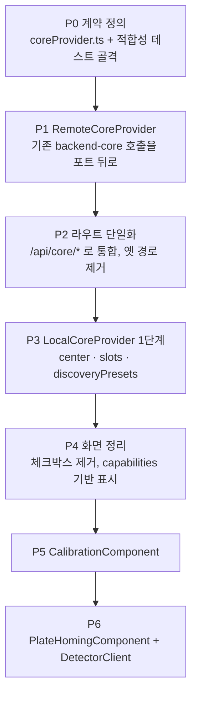

# BackendCore 대체 컴포넌트 설계서

| 항목 | 값 |
|---|---|
| 문서 | backend-core 를 대체하는 자체 코어(LocalCore) 설계 — **양방향 교체 가능** |
| 작성 | 2026-08-03 14:15:28 |
| 짝 문서 | [전체 구조 정리](20260803_141528_전체구조_정리.md) |
| 상태 | **설계(미구현)**. 기존 `independentCameraCore/` 는 폐기 대상이다(§8) |
| 조사 근거 | `SettingMain/src/**` 실측(2026-08-03), `_workspace/STATUS.md`, `_workspace/01_architect_plan.md`, `baro_calory/apps/backend-core/**` |

---

## 1. 요약

backend-core 가 제공하던 기능을 SettingManager 안에서 직접 수행하는 **LocalCore** 를 만든다.
핵심은 기능 이식이 아니라 **계약을 어느 쪽도 소유하지 않게 만드는 것**이다.

> **하나의 포트, 두 개의 구현.**
> `CoreProvider` 라는 계약을 두고 `RemoteCore`(backend-core 어댑터)와 `LocalCore`(자체 구현)가 **똑같이** 그 계약을 채운다.
> 어느 쪽이 붙어 있는지는 **설정 한 줄**이고, 화면과 API 경로는 **바뀌지 않는다.**

이 구조라야 "backend-core → LocalCore" 도, "LocalCore → backend-core" 도 성립한다.

---

## 2. 왜 다시 만드는가 — 현재 구조의 문제

현재 코드는 **같은 일(센터링)을 하는 경로가 셋**이다.

| # | 경로 | 실제 동작 | 위치 |
|---|---|---|---|
| 1 | `POST /api/ptz/center` | `driver.centerPoint()` 직접 | `server.ts:296` |
| 2 | `POST /api/independent-core/cameras/:id/center` | `IndependentCameraCore.center()` | `server.ts:72` |
| 3 | `POST /api/center?useBackendCore=1` | backend-core 프록시 | `server.ts:445` |

그리고 **화면이 어느 경로를 쓸지 스스로 고른다.**

```js
// web/discovery.js:97 — 현재 코드
const path = useBackendCore ? '/api/center'
                            : `/api/independent-core/cameras/${cameraId}/center`;
```

여기서 세 가지가 동시에 깨진다.

1. **규칙이 복제된다.** 좌표 검증·정착 대기·점유 처리를 경로마다 따로 두게 되고, 복제본은 반드시 갈라진다.
2. **화면이 구현을 안다.** 체크박스 하나가 URL·요청 본문·성공 메시지를 전부 바꾼다. 구현을 바꾸면 화면도 바꿔야 한다.
3. **교체가 성립하지 않는다.** `useBackendCore` 는 **질의 파라미터**다. 설정이 아니라 요청마다 달라지는 값이라, "지금 이 시스템은 무엇으로 도는가"라는 질문에 답할 곳이 없다.

`/api/discovery/*` 는 더 노골적이다 — 체크박스를 안 켜면 **409 로 거절**한다.

```js
// server.ts:415
if (!useBackendCore) throw new HttpError(409, '주차면 탐색 화면의 BackendCore 사용 체크박스를 켜세요');
```

기능의 가용 여부가 **UI 체크박스**에 매달려 있다. 이것은 능력 게이트가 아니라 우회 장치다.

> **판단**: 부분 수정으로는 정리되지 않는다. 계약을 먼저 세우고, 두 구현을 그 아래로 밀어 넣는다.

---

## 3. 목표 · 비목표

### 목표

1. **단일 제어면** — 기능 하나에 경로 하나. 어느 구현이 답하든 URL·요청·응답 모양이 같다.
2. **양방향 교체** — 설정 한 줄로 `remote ↔ local` 을 바꾸며, 화면·API 소비자는 코드를 고치지 않는다.
3. **정직한 미지원** — LocalCore 가 아직 못 하는 것은 **501 확정 답**이다. 조용히 backend-core 로 흘려보내지 않는다.
4. **계약의 정본은 테스트** — 두 구현이 같은 **적합성 테스트**를 통과해야 한다(§7).

### 비목표

- backend-core 저장소(`baro_calory`) 수정 — **참조만** 한다.
- backend-core 를 없애는 것. 두 구현은 **공존**하며 선택 가능해야 한다.
- 캘리브레이션 수식·검출 모델의 재발명 — 알고리즘은 baro_calory 를 근거로 이식하되, 이 문서의 범위는 **경계 설계**다.

---

## 4. 계약 — `CoreProvider` 포트

driver 계층(`CameraDriver`: PTZ·스냅샷)과는 **다른 층**이다. driver 는 "기기를 어떻게 두드리는가", CoreProvider 는 "카메라로 무슨 일을 하는가"다.



### 4.1 포트 정의 (초안)

```ts
// src/core/coreProvider.ts — 계약. 구현을 import 하지 않는다.

export type CoreCapabilityName =
  | 'center' | 'centerBox'
  | 'discoveryPresets' | 'discoveryPoints'
  | 'calibration' | 'plateHoming' | 'slots' | 'vlaTour';

export interface CoreCapabilities {
  /** 지금 붙어 있는 구현의 이름. 진단·표시용이며 소비자가 분기해서는 안 된다. */
  provider: 'remote' | 'local';
  cameraId: string;
  /** 능력별 지원 여부와, 못 하면 그 사유(사람 문장). */
  supported: Record<CoreCapabilityName, { ok: boolean; reason?: string }>;
  busy: boolean;
}

export interface CenterResult { point: CenterPoint; ptz: PtzView; settled: boolean; }
export interface JobStatus {
  state: 'idle' | 'running' | 'done' | 'failed' | 'stopped';
  progress?: { done: number; total: number; percent: number };
  message?: string; error?: string;
  result?: unknown;
}

export interface CoreProvider {
  readonly name: 'remote' | 'local';

  capabilities(ctx: CoreContext): Promise<CoreCapabilities>;

  center(ctx: CoreContext, point: CenterPoint): Promise<CenterResult>;
  centerBox(ctx: CoreContext, box: CenterBox): Promise<CenterResult>;

  listSlots(ctx: CoreContext): Promise<Slot[]>;

  discoveryPresets: DiscoveryPresetPort;
  calibration: JobPort<CalibrationStartOptions>;
  plateHoming: JobPort<PlateHomingStartOptions>;
}

/** 시작 → 폴링 → 중단. 캘리브레이션·호밍이 같은 모양이다. */
export interface JobPort<TStart> {
  start(ctx: CoreContext, options: TStart): Promise<JobStatus>;
  status(ctx: CoreContext): Promise<JobStatus>;
  stop(ctx: CoreContext): Promise<JobStatus>;
}

/** 요청 1건의 실행 맥락. 카메라와 그 드라이버를 함께 넘긴다. */
export interface CoreContext {
  camera: CameraConfig;
  driver: CameraDriver;
  signal?: AbortSignal;
}
```

### 4.2 미지원의 표현 — `CoreUnsupportedError`

```ts
export class CoreUnsupportedError extends Error {
  readonly statusCode = 501;   // 확정 답 — 소비자는 재시도하지 않는다
  constructor(readonly capability: CoreCapabilityName, reason: string) { super(reason); }
}
```

**501 은 "이 구현은 그것을 하지 않는다"는 확정 답이다.** 일시 장애(502)와 구분해야 소비자가 재시도 여부를 판단할 수 있다.
근거: `baro_calory/docs/architecture.md` §프리뷰 경로 — 501 을 일시 장애로 보고 재시도하면 아무 일도 일어나지 않는 대기만 늘어난다.

### 4.3 절대 하지 않는 것 — 조용한 폴백

LocalCore 가 못 하는 기능을 **RemoteCore 로 몰래 넘기지 않는다.**

- 넘기면 "지금 무엇이 답했는가"를 아무도 모른다. 카메라를 실제로 움직이는 잡에서 이것은 추적 불가능한 실패가 된다.
- 대신 **capabilities 가 미리 말한다.** 화면은 못 하는 버튼을 비활성으로 그리고, 사유를 툴팁으로 보여준다.

---

## 5. 두 구현

### 5.1 `RemoteCoreProvider` — backend-core 어댑터

현재 `BackendCoreClient` 의 **에이전트 기능 부분**이 여기로 옮겨 온다(driver 부분은 남는다 — §5.3).

| 포트 메서드 | backend-core 엔드포인트 | 근거 |
|---|---|---|
| `center` | `POST /api/center` | `backendCoreClient.ts:118` |
| `centerBox` | `POST /api/center-box` | 같은 메서드 `withBox=true` |
| `listSlots` | `GET /api/simulator/slots` | `:69` |
| `discoveryPresets.*` | `/api/discovery/presets…` | `:85, :98, :102, :106, :110` |
| `calibration.*` | `/api/calibration/{start,status,stop}` | `:114` |
| `plateHoming.*` | `/api/discovery/plate-home/{…}` | `:122` |
| `capabilities` | `GET /api/cctv/capabilities` (+ `POST …/probe`) | baro_calory `control-api.mjs:138` |

**능력 판정은 backend-core 에 묻는다.** 자체 선언이 아니라 그쪽 `axes` 응답을 그대로 옮긴다.

### 5.2 `LocalCoreProvider` — 자체 구현



| 컴포넌트 | 책임 | 구현 단계 |
|---|---|---|
| `CameraLease` | 카메라별 배타 점유. 다른 카메라는 서로 막지 않는다 | 1 |
| `CenteringComponent` | `driver.centerPoint()` → `waitForSettle()` → 최종 좌표 | 1 |
| `DiscoveryStore` | 프리셋·점을 카메라별로 원자적 저장 | 1 |
| `CalibrationComponent` | 줌 앵커 스윕 · 프레임 정합 · 곡선 산출 | 2 |
| `PlateHomingComponent` | 점별 조준·줌인·번호판 확정·안전 복귀 | 3 |
| `DetectorClient` | LPD/VPD HTTP 계약 | 2~3 |

**단계마다 capabilities 가 정직하게 줄어든다.** 1단계 LocalCore 는 `center`·`slots`·`discoveryPresets` 만 `ok:true` 이고 나머지는 사유와 함께 `false` 다.

> `Sub/lpd_api`, `Sub/vpd_api` 가 이 저장소에 들어와 있다 — DetectorClient 의 실제 계약은 **그 소스에서 확인**하고 추측하지 않는다.

### 5.3 driver 계층은 건드리지 않는다

`CameraDriver`(PTZ·스냅샷·centerPoint)는 **두 provider 아래에 그대로 남는다.**

- `HucomsClient` — 실카메라·UE 시뮬 직접 제어
- `BackendCoreClient` 의 driver 부분 — backend-core 가 물고 있는 기기

즉 **provider 교체와 driver 교체는 독립 축**이다. LocalCore + Hucoms driver 가 기본 조합이고, RemoteCore + backend-core driver 가 기존 조합이다.

---

## 6. 교체 메커니즘

### 6.1 설정이 정한다 — 질의 파라미터가 아니다

```json
{
  "core": {
    "provider": "local",
    "remote": { "baseUrl": "http://127.0.0.1:8080" },
    "perCamera": { "sim-cam-03": "remote" }
  }
}
```

| 규칙 | 내용 |
|---|---|
| 전역 기본 | `core.provider` |
| 기기별 재정의 | `core.perCamera[cameraId]` — 있으면 우선 |
| 변경 시점 | 옵션 페이지에서 저장 → **다음 요청부터 적용**(재기동 불필요) |
| 잡 실행 중 변경 | **거부(409)**. 잡을 시작한 구현이 그 잡을 끝내야 한다 |

**`useBackendCore` 질의 파라미터는 폐기한다.** 요청마다 달라지는 값으로 구현을 고르면 "지금 무엇으로 도는가"에 답할 수 없다.

### 6.2 조립 지점은 하나

```ts
// src/core/providerFactory.ts — 구현 분기가 있는 유일한 지점
export function createCoreProvider(camera: CameraConfig, config: AppConfig, deps: CoreDeps): CoreProvider {
  const name = config.core.perCamera?.[camera.id] ?? config.core.provider;
  return name === 'remote'
    ? new RemoteCoreProvider({ baseUrl: config.core.remote.baseUrl, timeoutMs: camera.timeoutMs, fetchImpl: deps.fetchImpl })
    : new LocalCoreProvider({ leases: deps.leases, stores: deps.stores, settleOptions: deps.settleOptions });
}
```

라우트 핸들러에는 `if (provider === …)` 가 **없다.** 포트 표면만 호출한다.

### 6.3 화면은 provider 이름을 모른다

```
현재                                     목표
─────────────────────────────────────    ─────────────────────────────────────
체크박스 useBackendCore                   GET /api/core/capabilities
  → URL 을 바꾼다                           → 못 하는 버튼을 비활성 + 사유 표시
  → 요청 본문을 바꾼다                       요청 경로·본문은 항상 같다
  → 성공 메시지를 바꾼다                     응답의 provider 는 진단 표시용
```

옵션 페이지에는 **구현 선택 UI** 가 생긴다(설정 변경). 제어·탐색 화면에서는 사라진다.

---

## 7. 적합성 테스트 — 계약의 정본

**양방향 교체가 말뿐이 되지 않게 하는 유일한 장치다.**

```ts
// test/coreProviderConformance.ts — 두 구현이 공유하는 시나리오
export function runCoreProviderConformance(
  name: string,
  makeProvider: () => Promise<{ provider: CoreProvider; ctx: CoreContext }>,
) {
  describe(`${name} — CoreProvider 적합성`, () => {
    it('capabilities 는 모든 능력 키를 빠짐없이 답한다', …);
    it('지원하지 않는 능력은 501 CoreUnsupportedError 로 거절한다', …);
    it('center 는 정착 후 좌표와 settled 를 돌려준다', …);
    it('center 는 1920×1080 밖 좌표를 400 으로 거절한다', …);
    it('같은 카메라의 두 번째 잡 시작은 409 다', …);
    it('다른 카메라의 잡은 서로 막지 않는다', …);
    it('잡이 실패해도 점유가 반납된다', …);
    it('status 는 start 전에 idle 이다', …);
    it('stop 은 실행 중이 아니어도 오류가 아니다', …);
  });
}
```

```ts
// test/localCore.test.ts
runCoreProviderConformance('LocalCore', () => makeLocal());
// test/remoteCore.test.ts  — backend-core 응답은 fixture 로 고정
runCoreProviderConformance('RemoteCore', () => makeRemoteWithStubbedFetch());
```

| 규칙 | 이유 |
|---|---|
| 적합성 파일은 **구현을 import 하지 않는다** | 계약이 구현에 오염되면 교체 검증이 무의미해진다 |
| 미지원 능력은 **건너뛰지 않고** 501 을 확인한다 | "안 함"과 "조용히 성공"을 구분해야 한다 |
| RemoteCore 의 fixture 는 **실제 backend-core 응답**에서 뜬다 | 상상해서 만든 모킹은 통과해도 아무것도 증명하지 못한다 |

---

## 8. 기존 대체용 코드 — 전량 제거

| 대상 | 처분 | 사유 |
|---|---|---|
| `src/independentCameraCore/independentCameraCore.ts` | **삭제** | LocalCoreProvider 로 대체 |
| `src/independentCameraCore/centeringComponent.ts` | **삭제 후 재작성** | 포트 계약(`CoreContext`) 기준으로 다시 쓴다 |
| `src/independentCameraCore/cameraLease.ts` | **이동·유지** | 로직은 타당하다 → `src/core/local/cameraLease.ts` |
| `server.ts` 의 `/api/independent-core/*` 라우트 | **삭제** | 단일 제어면 위반 |
| `server.ts` 의 `useBackendCore` 질의 파라미터 게이트 | **삭제** | 설정으로 대체 |
| `web/discovery.js` 의 `backendCorePath()`·경로 분기 | **삭제** | 화면은 구현을 몰라야 한다 |
| `web/discovery.html` 의 BackendCore 체크박스 | **삭제** | 옵션 페이지의 설정으로 이동 |
| `POST /api/ptz/center` | **통합** | `POST /api/core/center` 하나로 합친다 |

**`cameraLease.ts` 만 살린다.** 25줄이고 "카메라별 배타, 다른 카메라는 안 막음, 반납 보장"이라는 판단이 이미 옳다. 나머지는 계약 없이 만들어진 것이라 재작성이 맞다.

---

## 9. 이행 계획

각 단계는 **독립적으로 검증 가능**하고, 끝난 시점에 시스템이 동작한다.



| 단계 | 산출물 | 완료 기준(검증 가능) |
|---|---|---|
| **P0** | `src/core/coreProvider.ts`, `test/coreProviderConformance.ts` | 적합성 스위트가 존재하고, 빈 구현에 대해 **실패**한다(스위트가 실제로 판정한다는 증거) |
| **P1** | `src/core/remote/remoteCoreProvider.ts` | RemoteCore 가 적합성 통과. **기존 화면 동작 무변화** |
| **P2** | `/api/core/*` 단일 라우트, 옛 경로 삭제 | 옛 경로 404. 새 경로로 기존 시나리오 전부 통과 |
| **P3** | `src/core/local/**` (lease·centering·discoveryStore) | LocalCore 가 적합성 통과. 미지원 능력은 501 |
| **P4** | `web/**` 정리 | 화면 코드에 `provider`·`useBackendCore` 분기가 **0건**(grep 으로 확인) |
| **P5** | `calibrationComponent.ts` | fixture 기반 solver 단위 테스트 + 취소·복귀·점유 반납 |
| **P6** | `plateHomingComponent.ts`, `detectorClient.ts` | detector fixture, 대상 모호 시 fail-closed, 실패에도 와이드 복귀 |

**P2 가 분기점이다.** 여기까지 하면 구조가 정리되고, P3 이후는 LocalCore 의 능력이 늘어나는 일만 남는다.

---

## 10. 라우트 — 목표 표면

| 메서드 · 경로 | 포트 메서드 | 비고 |
|---|---|---|
| `GET /api/core/capabilities` | `capabilities` | 화면이 버튼 활성/비활성을 정하는 유일한 근거 |
| `POST /api/core/center` | `center` | 옛 `/api/ptz/center`·`/api/center`·`/api/independent-core/**/center` 를 대체 |
| `POST /api/core/center-box` | `centerBox` | |
| `GET /api/core/slots` | `listSlots` | 옛 `/api/slots` |
| `GET·POST /api/core/discovery/presets` | `discoveryPresets` | |
| `PUT·DELETE /api/core/discovery/presets/:id` | | |
| `POST /api/core/discovery/presets/:id/goto` | | |
| `GET·POST·PUT·DELETE /api/core/discovery/presets/:id/points[/:pid]` | | |
| `POST·GET·POST /api/core/calibration/{start,status,stop}` | `calibration` | |
| `POST·GET·POST /api/core/plate-homing/{start,status,stop}` | `plateHoming` | |

**PTZ·영상·설정·프리셋(로컬)은 코어 밖이다** — `/api/ptz/*`, `/api/stream`, `/api/snapshot`, `/api/settings`, `/api/cameras`, `/api/presets` 는 그대로 둔다. 이들은 provider 와 무관한 SettingManager 고유 기능이다.

---

## 11. 검증 기준 (CLAUDE.md 규칙 2·3)

| # | 성공 기준 |
|---|---|
| V1 | 적합성 스위트를 두 구현이 **동일하게** 통과한다 |
| V2 | `core.provider` 를 바꾸면 **화면 코드 변경 없이** 동작 주체가 바뀐다 (응답 `provider` 필드로 확인) |
| V3 | 기기별 재정의가 전역 설정을 이긴다 |
| V4 | LocalCore 미지원 능력이 **501** 이고, 조용한 폴백이 **일어나지 않는다**(RemoteCore 스파이 호출 0회) |
| V5 | 잡 실행 중 provider 변경이 **409** 로 거부된다 |
| V6 | 같은 카메라 잡 중복은 409, 다른 카메라는 병행 |
| V7 | 잡이 throw 해도 점유가 반납된다 |
| V8 | 화면 코드에 provider 분기가 0건 |
| V9 | 옛 경로(`/api/independent-core/*`, `useBackendCore`)가 **존재하지 않는다** |
| V10 | 실기 확인: LocalCore 로 UE 시뮬 센터링, RemoteCore 로 같은 동작 — 둘 다 화면이 실제로 움직인다 |

---

## 12. 위험 · 확인 필요

| # | 항목 | 판단 |
|---|---|---|
| R1 | **캘리브레이션 알고리즘 이식 난이도** | baro_calory 는 `@baro/profile`(솔버)·`frame-match`(ZNCC, sharp 의존)에 기대고 있다. TypeScript 이식은 P5 의 대부분을 차지한다. 이식 대신 **RemoteCore 로만 지원**하는 선택지도 유효하다 — 능력 게이트가 이미 그 경우를 표현한다 |
| R2 | **Detector(LPD/VPD) 운영 주소·인증** | `Sub/lpd_api`·`Sub/vpd_api` 소스가 저장소에 있으므로 **거기서 확인**한다. 추측 금지 |
| R3 | **잡 상태 영속** | backend-core 는 in-memory MVP 다. LocalCore 도 같게 갈지, 파일로 남길지 결정 필요 |
| R4 | **provider 전환 중 잡 상태** | RemoteCore 가 돌리던 잡을 LocalCore 가 이어받을 수 없다. §6.1 의 409 규칙으로 닫았다 |
| R5 | **카메라 동시 조작** | lease 는 프로세스 내 보증뿐이다. 다른 도구·다른 인스턴스는 막지 못한다 — 문서화된 한계 |

### 마스터께 확인이 필요한 결정 3가지

1. **캘리브레이션·호밍을 LocalCore 에 정말 이식할 것인가**, 아니면 그 둘은 RemoteCore 전용으로 두고 LocalCore 는 센터링·탐색까지만 담당할 것인가? (R1 — P5·P6 의 비용이 여기서 갈린다)
2. **provider 기본값**을 `local` 로 할 것인가 `remote` 로 할 것인가?
3. **기기별 재정의**가 실제로 필요한가? 전역 하나로 충분하면 §6.1 의 `perCamera` 를 빼고 더 단순하게 간다.

---

## 13. 부록 — 현재 소비 중인 backend-core 표면 (이식 대상 전량)

`src/clients/backendCoreClient.ts` 실측(2026-08-03).

| 메서드 | 엔드포인트 | 줄 |
|---|---|---|
| `getPtz` | `GET /api/ptz` | 37 |
| `goPtz` | `POST /api/ptz` | 48 |
| `centerPoint` | `POST /api/center` | 60 |
| `getSnapshot` | `GET /api/snapshot` | 64 |
| `listSlots` | `GET /api/simulator/slots` | 69 |
| `discovery` | `/api/discovery/presets…` | 85·98·102·106 |
| `discoveryPoints` | `/api/discovery/presets/:id/points` | 109 |
| `calibration` | `/api/calibration/{start,stop,status}` | 114 |
| `center` | `/api/center` · `/api/center-box` | 118 |
| `plateHome` | `/api/discovery/plate-home/{…}` | 122 |
| `vlaTour` | `/api/vla/tour` | 126 |

앞의 다섯(driver 표면)은 `CameraDriver` 로 남고, 뒤의 여섯이 `CoreProvider` 로 올라간다.
