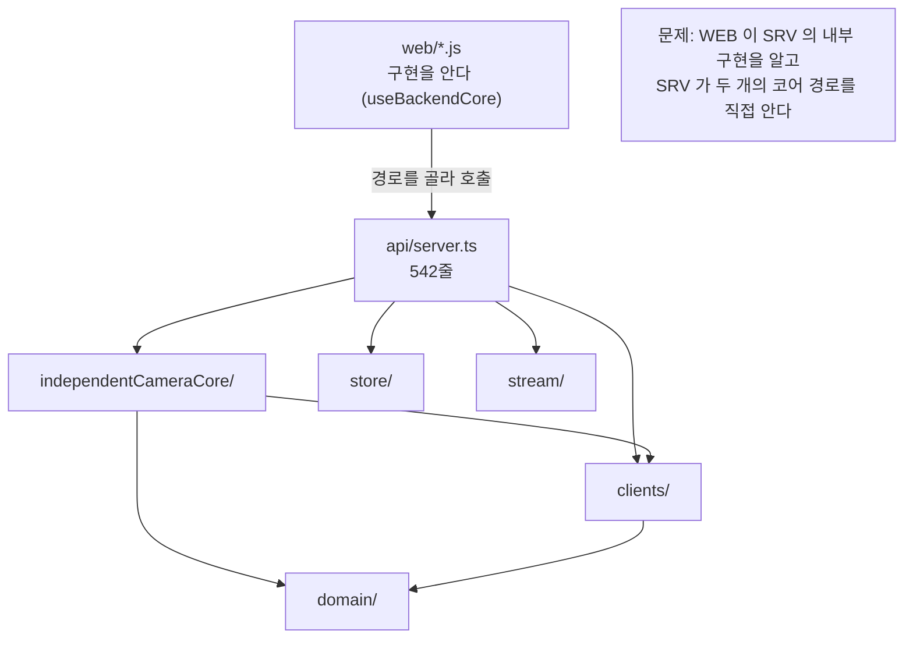
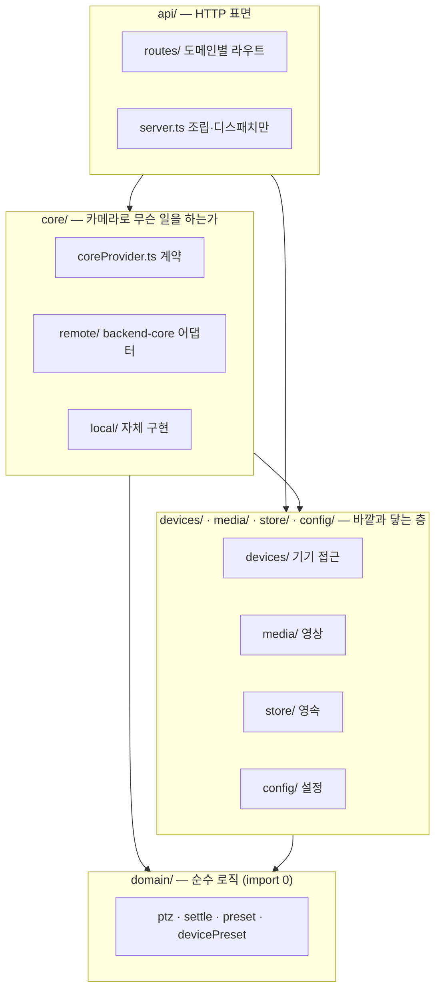

# SettingManager 전체 구조 정리

| 항목 | 값 |
|---|---|
| 문서 | 현재 구조 실측 · 문제 진단 · 목표 구조 · 이행 순서 |
| 작성 | 2026-08-03 14:15:28 |
| 짝 문서 | [BackendCore 대체 컴포넌트 설계서](20260803_141528_BackendCore_대체컴포넌트_설계서.md) |
| 근거 | `SettingMain/src/**` · `web/**` · `test/**` 실측(2026-08-03), `_workspace/STATUS.md`, `_workspace/01_architect_plan.md` |

---

## 1. 왜 지금 정리하는가

기능은 늘었는데 **층이 흐려졌다.** 구체적으로 세 가지가 동시에 일어났다.

1. **같은 일을 하는 경로가 셋**이 되었다(센터링).
2. **화면이 구현을 안다** — 체크박스가 URL 을 바꾼다.
3. **`server.ts` 하나가 542줄**로, 라우팅·조립·검증·프록시를 전부 떠안고 있다.

이 상태에서 기능을 더 붙이면 분기가 곱해진다. **계약을 세우고 층을 다시 긋는 것**이 지금 해야 할 일이다.

> `_workspace/STATUS.md` 의 6단계 계획(현재 5/6 진행 중)은 **이 정리로 대체된다.**
> 그 계획은 `/api/independent-core/*` 라는 **두 번째 API 표면**을 전제로 하는데, 그 전제 자체가 문제의 원인이다.
> 이미 만든 것 중 살릴 것은 §6 에 명시했다.

---

## 2. 현재 구조 (as-is, 실측)

### 2.1 파일 배치

```text
SettingMain/
├── src/
│   ├── index.ts
│   ├── api/                       ← HTTP
│   │   ├── server.ts              542줄 · 라우팅+조립+검증+프록시
│   │   ├── httpUtil.ts
│   │   └── staticFiles.ts
│   ├── clients/                   ← 기기 접근 + 실행 보조가 섞임
│   │   ├── cameraDriver.ts        계약
│   │   ├── hucomsClient.ts
│   │   ├── hucomsText.ts
│   │   ├── backendCoreClient.ts   driver + 에이전트 파사드 (이중 역할)
│   │   ├── hyucomsDirectPresetClient.ts
│   │   ├── driverFactory.ts
│   │   └── waitForSettle.ts       ← 드라이버가 아니라 실행 보조
│   ├── config/                    ← 설정 (정규화는 순수)
│   ├── domain/                    ← 순수 로직
│   │   ├── ptz.ts · settle.ts · preset.ts · devicePresetRegistry.ts
│   ├── independentCameraCore/     ← backend-core 대치 시도 (계약 없음)
│   │   ├── cameraLease.ts
│   │   ├── centeringComponent.ts
│   │   └── independentCameraCore.ts
│   ├── store/                     ← 영속
│   └── stream/                    ← 영상
├── web/                           index · discovery · options + 모듈
├── test/                          16개 파일
└── config/                        config.json · slots.json · device-preset-registry.json
```

### 2.2 라우트 (실측 23개)

| 분류 | 경로 | 처리 주체 |
|---|---|---|
| 상태 | `/api/health` | 자체 |
| 설정 | `/api/settings` · `/api/cameras` · `/api/cameras/active` | 자체 |
| 장비 프리셋 | `/api/device-preset-capability` | 자체 (`hyucomsDirectPresetClient`) |
| PTZ | `/api/ptz` · `/api/ptz/absolute` · `/api/ptz/nudge` · **`/api/ptz/center`** | 자체 (driver 직접) |
| 프리셋 | `/api/presets` | 자체 (로컬 저장소) |
| 주차면 | `/api/slots` | driver 또는 로컬 |
| 영상 | `/api/snapshot` · `/api/stream` | 자체 |
| **독립 코어** | **`/api/independent-core/cameras/:id/{capabilities,center}`** | `independentCameraCore` |
| **backend-core 프록시** | **`/api/center`** · `/api/center-box` · `/api/discovery/**` · `/api/vla/tour` | `BackendCoreClient` (**`?useBackendCore=1` 필수**) |

**굵게 표시한 셋이 모두 "클릭한 점을 화면 중앙으로"** 다.

### 2.3 층과 의존 방향 (현재)



---

## 3. 진단 — 구조 문제 6건

| # | 문제 | 증거 | 결과 |
|---|---|---|---|
| **S1** | **센터링 경로 3중화** | `server.ts:296` · `:72` · `:445` | 좌표 검증·정착·점유 규칙이 세 벌. 복제본은 반드시 갈라진다 |
| **S2** | **화면이 구현을 안다** | `discovery.js:97` — 체크박스로 URL 분기 | 구현을 바꾸면 화면도 바꿔야 한다. 교체가 성립하지 않는다 |
| **S3** | **기능 가용성이 질의 파라미터에 매달림** | `server.ts:415` — `?useBackendCore=1` 없으면 409 | "지금 무엇으로 도는가"에 답할 곳이 없다 |
| **S4** | **`BackendCoreClient` 이중 역할** | `backendCoreClient.ts` — driver 5개 + 에이전트 6개 메서드 | 층이 다른 두 책임이 한 클래스에 있다 |
| **S5** | **`server.ts` 542줄 단일 파일** | 라우팅·조립·본문 검증·프록시 전환이 한 함수 | 라우트를 더할수록 분기가 곱해진다 |
| **S6** | **`independentCameraCore` 에 계약이 없다** | 포트 정의 없이 클래스만 존재 | backend-core 와 "같은 것"임을 검증할 방법이 없다 |

### 부수 문제 (작지만 고칠 것)

| 항목 | 내용 |
|---|---|
| 명칭 불일치 | `hyucomsDirectPresetClient` — 나머지는 전부 `hucoms`. **`hucoms` 로 통일** |
| 층 혼재 | `waitForSettle.ts` 가 `clients/` 에 있다. 드라이버가 아니라 **실행 보조**다 |
| 디렉토리 이름 | `clients/` 는 "무엇의 클라이언트인지" 말하지 않는다 → `devices/` |

---

## 4. 목표 구조 (to-be)

### 4.1 층



**의존 방향은 위에서 아래로만.** 역방향과 같은 층 간 순환은 금지한다.

| 층 | 규칙 |
|---|---|
| `domain/` | **아무것도 import 하지 않는다.** 외부 I/O·타이머·파일 없음. 테스트가 목 없이 선다 |
| `devices/` `media/` `store/` `config/` | 바깥(HTTP·프로세스·파일)과 닿는 유일한 층. **모킹 지점** |
| `core/` | 계약(`coreProvider.ts`)과 두 구현. 계약 파일은 구현을 import 하지 않는다 |
| `api/` | 요청 해석·응답 직렬화·조립. **비즈니스 판단을 넣지 않는다** |

### 4.2 디렉토리 배치

```text
SettingMain/src/
├── index.ts                         기동·조립
│
├── domain/                          순수 (변경 없음)
│   ├── ptz.ts
│   ├── settle.ts
│   ├── preset.ts
│   └── devicePresetRegistry.ts
│
├── config/                          설정 (변경 없음)
│   ├── types.ts · normalize.ts · configStore.ts
│
├── devices/                         ← 구 clients/
│   ├── cameraDriver.ts              기기 계약
│   ├── driverFactory.ts             종류 분기의 유일한 지점
│   ├── waitForSettle.ts             실행 보조 (여기로 이동)
│   ├── hucoms/
│   │   ├── hucomsClient.ts
│   │   ├── hucomsText.ts
│   │   └── hucomsPresetClient.ts    ← hyucoms… 개명
│   └── backendCore/
│       └── backendCoreDriver.ts     ← driver 표면만 남긴다
│
├── core/                            ★ 신규
│   ├── coreProvider.ts              포트 계약 (구현 import 금지)
│   ├── providerFactory.ts           구현 분기의 유일한 지점
│   ├── remote/
│   │   └── remoteCoreProvider.ts    ← backendCoreClient 의 에이전트 부분
│   └── local/
│       ├── localCoreProvider.ts
│       ├── cameraLease.ts           ← independentCameraCore 에서 이동 (유일 생존)
│       ├── centeringComponent.ts    재작성
│       ├── calibrationComponent.ts  (P5)
│       ├── plateHomingComponent.ts  (P6)
│       └── detectorClient.ts        (P6)
│
├── media/                           ← 구 stream/
│   ├── frameSource.ts · httpMjpeg.ts · jpegFrames.ts · rtspUrl.ts
│
├── store/                           영속 (변경 없음)
│   ├── presetStore.ts · slotStore.ts · devicePresetRegistryStore.ts
│
└── api/
    ├── server.ts                    조립 + 디스패치만
    ├── httpUtil.ts · staticFiles.ts
    └── routes/
        ├── healthRoutes.ts
        ├── settingsRoutes.ts        설정·기기 CRUD
        ├── cameraRoutes.ts          PTZ·프리셋·장비프리셋
        ├── mediaRoutes.ts           스냅샷·스트림
        └── coreRoutes.ts            /api/core/* — 포트 표면만 호출
```

### 4.3 as-is → to-be 대응

| 현재 | 이후 | 처분 |
|---|---|---|
| `clients/cameraDriver.ts` | `devices/cameraDriver.ts` | 이동 |
| `clients/hucomsClient.ts` · `hucomsText.ts` | `devices/hucoms/` | 이동 |
| `clients/hyucomsDirectPresetClient.ts` | `devices/hucoms/hucomsPresetClient.ts` | 이동 + **개명** |
| `clients/driverFactory.ts` | `devices/driverFactory.ts` | 이동 |
| `clients/waitForSettle.ts` | `devices/waitForSettle.ts` | 이동 |
| `clients/backendCoreClient.ts` | `devices/backendCore/backendCoreDriver.ts` **+** `core/remote/remoteCoreProvider.ts` | **분할** |
| `independentCameraCore/cameraLease.ts` | `core/local/cameraLease.ts` | 이동 (유지) |
| `independentCameraCore/centeringComponent.ts` | `core/local/centeringComponent.ts` | **재작성** |
| `independentCameraCore/independentCameraCore.ts` | — | **삭제** |
| `stream/**` | `media/**` | 이동 |
| `api/server.ts` (542줄) | `api/server.ts` + `api/routes/**` | **분할** |

### 4.4 라우트 정리

| 현재 | 이후 | 사유 |
|---|---|---|
| `POST /api/ptz/center` | `POST /api/core/center` | 3중 경로 통합 |
| `POST /api/independent-core/cameras/:id/center` | 〃 | 〃 |
| `POST /api/center?useBackendCore=1` | 〃 | 〃 |
| `GET /api/independent-core/cameras/:id/capabilities` | `GET /api/core/capabilities` | 구현 이름이 경로에 없어야 한다 |
| `/api/center-box?useBackendCore=1` | `POST /api/core/center-box` | 질의 파라미터 게이트 제거 |
| `/api/discovery/**?useBackendCore=1` | `/api/core/discovery/**` | 〃 |
| `/api/discovery/calibration/*` | `/api/core/calibration/*` | 캘리브레이션은 탐색의 하위가 아니다 |
| `/api/discovery/plate-home/*` | `/api/core/plate-homing/*` | 명칭 통일 |
| `/api/vla/tour` | `/api/core/vla/tour` 또는 **제거** | 소비자 확인 필요(§8 Q3) |
| `/api/slots` | `/api/core/slots` | 주차면은 코어의 소관 |
| `/api/health` · `/api/settings` · `/api/cameras*` · `/api/ptz*` · `/api/presets*` · `/api/snapshot` · `/api/stream` · `/api/device-preset-capability` | **그대로** | provider 와 무관한 SettingManager 고유 기능 |

---

## 5. 화면(web/) 정리

| 현재 | 이후 |
|---|---|
| `discovery.js` 가 `useBackendCore` 로 경로·본문·메시지 분기 | 분기 **0건**. 항상 `/api/core/*` |
| `discovery.html` 의 BackendCore 체크박스 | **삭제** → 옵션 페이지의 「코어 구현」 설정으로 이동 |
| 능력 표시가 체크박스 상태에서 파생 | `GET /api/core/capabilities` 응답으로 버튼 활성/비활성 + 사유 툴팁 |
| `backendCorePath()` 헬퍼 | **삭제** |

**옵션 페이지에 새로 생기는 것**: 「코어 구현」 선택(자체 / backend-core 경유) + backend-core URL + 현재 능력 요약.

---

## 6. `independentCameraCore` — 무엇을 살리고 무엇을 버리는가

| 파일 | 줄 | 처분 | 사유 |
|---|---|---|---|
| `cameraLease.ts` | 25 | **살린다** | 판단이 옳다 — 카메라별 배타, 다른 카메라 비간섭, `try/finally` 반납 보장 |
| `centeringComponent.ts` | 24 | **재작성** | 로직은 맞지만 `CoreContext` 계약 없이 `(cameraId, driver)` 를 따로 받는다. 포트에 맞춰 다시 쓴다 |
| `independentCameraCore.ts` | 30 | **삭제** | `capability()` 가 `calibration: false` 를 **타입으로 못박아** 확장 불가. 능력은 구현 단계에 따라 변해야 한다 |

`_workspace/STATUS.md` 의 4단계(독립 REST API·Discovery 연결)에서 만든 **라우트와 UI 배선은 전부 되돌린다.** 기능이 아니라 표면이 잘못되었기 때문이다.

---

## 7. 이행 순서

**구조 이동과 기능 추가를 섞지 않는다.** 섞으면 회귀가 났을 때 원인이 이동인지 기능인지 알 수 없다.

| 단계 | 내용 | 검증 |
|---|---|---|
| **M0** | 현재 상태 전체 테스트 통과 확인 · 커밋 | 기준선 확보 |
| **M1** | **순수 이동**: `clients/`→`devices/`, `stream/`→`media/`, `hyucoms`→`hucoms` 개명 | 테스트 전건 통과(내용 변경 0). import 경로만 바뀐다 |
| **M2** | `api/routes/**` 분할 | 라우트 동작 무변화. `server.ts` 200줄 이하 |
| **M3** | `core/coreProvider.ts` 계약 + 적합성 스위트 골격 | 빈 구현에서 **실패**(스위트가 판정한다는 증거) |
| **M4** | `backendCoreClient` 분할 → `backendCoreDriver` + `remoteCoreProvider` | RemoteCore 적합성 통과. 화면 동작 무변화 |
| **M5** | `/api/core/*` 단일 라우트 도입, 옛 경로 삭제 | 옛 경로 404. 기존 시나리오 전부 통과 |
| **M6** | `independentCameraCore` 제거 + `core/local/` 1단계 | LocalCore 적합성 통과. 미지원은 501 |
| **M7** | 화면 정리 (체크박스 제거, capabilities 기반) | `grep -r "useBackendCore\|independent-core" web/ src/` → **0건** |
| **M8~** | Calibration · PlateHoming 컴포넌트 | 설계서 §9 P5·P6 |

**M1·M2 는 순수 리팩터링**이다. 여기서 테스트가 깨지면 이동이 잘못된 것이므로 즉시 되돌린다.
**M5 가 분기점**이다. 여기까지 오면 구조는 정리되고, 이후는 LocalCore 능력이 늘어나는 일만 남는다.

---

## 8. 영향도 분석

### 8.1 이 저장소

| 대상 | 영향 |
|---|---|
| `src/**` 전체 | import 경로가 광범위하게 바뀐다(M1). **내용 변경은 없다** |
| `test/**` 16개 | import 경로 수정 필요. 테스트 **내용**은 M6 전까지 그대로 |
| `web/discovery.*` | 체크박스·경로 분기 제거(M7) |
| `web/options.*` | 「코어 구현」 설정 추가(M7) |
| `config/config.json` | `core` 블록 추가. 기존 필드는 그대로 |
| `_workspace/**` | STATUS·plan 을 이 문서 기준으로 갱신 |

### 8.2 외부

| 대상 | 영향 |
|---|---|
| `baro_calory` | **코드 변경 없음.** RemoteCore 가 소비하는 REST 계약은 그대로 |
| UE 시뮬레이터 · 실카메라 | 제어 방식 변경 없음(driver 층 유지) |
| `Sub/lpd_api` · `Sub/vpd_api` | M8 이후 DetectorClient 가 소비. 지금은 영향 없음 |
| SettingAgent | 무관 |

### 8.3 위험

| # | 위험 | 완화 |
|---|---|---|
| 1 | M1 의 대량 import 변경이 회귀를 숨긴다 | **내용 변경 0** 원칙 + 단계 끝마다 전체 테스트 |
| 2 | M5 에서 옛 경로를 쓰던 외부 소비자가 깨진다 | 현재 소비자는 이 저장소의 `web/` 뿐임을 확인했다. 외부 소비자가 있으면 알려주셔야 한다 |
| 3 | 이행 중 기능 추가 요청이 섞인다 | M1·M2 구간에는 기능을 넣지 않는다 |
| 4 | 진행 중이던 5단계(Calibration) 작업 손실 | 아직 컴포넌트 파일이 없으므로 손실 없음(실측 확인) |

---

## 9. 마스터께 확인이 필요한 것

| # | 질문 | 왜 필요한가 |
|---|---|---|
| **Q1** | 캘리브레이션·호밍을 **LocalCore 에 이식**할 것인가, RemoteCore 전용으로 둘 것인가? | M8 이후 비용이 여기서 갈린다. 이식은 `@baro/profile` 솔버·ZNCC 정합의 TypeScript 재구현이 필요하다 |
| **Q2** | 코어 구현 **기본값**을 `local` 로 할 것인가 `remote` 로 할 것인가? | 설정 기본값과 화면 초기 상태가 정해진다 |
| **Q3** | `/api/vla/tour` 를 **유지**할 것인가? | 현재 이 저장소 화면에 소비자가 보이지 않는다. 안 쓰면 정리 대상이다 |
| **Q4** | 이행을 **한 번에** 진행할까, M1·M2(순수 정리)만 먼저 하고 확인받을까? | M1·M2 만 해도 구조가 크게 좋아지고 위험이 낮다 |

---

## 10. 한눈에 보는 규칙 5가지

1. **기능 하나에 경로 하나.** 구현이 달라도 URL·요청·응답은 같다.
2. **화면은 구현을 모른다.** 무엇을 할 수 있는지는 `capabilities` 가 답하고, 누가 했는지는 진단용으로만 싣는다.
3. **계약은 어느 구현도 소유하지 않는다.** 정본은 **적합성 테스트**다.
4. **미지원은 501 확정 답.** 조용한 폴백은 없다.
5. **의존은 위에서 아래로만.** `domain/` 은 아무것도 import 하지 않는다.
