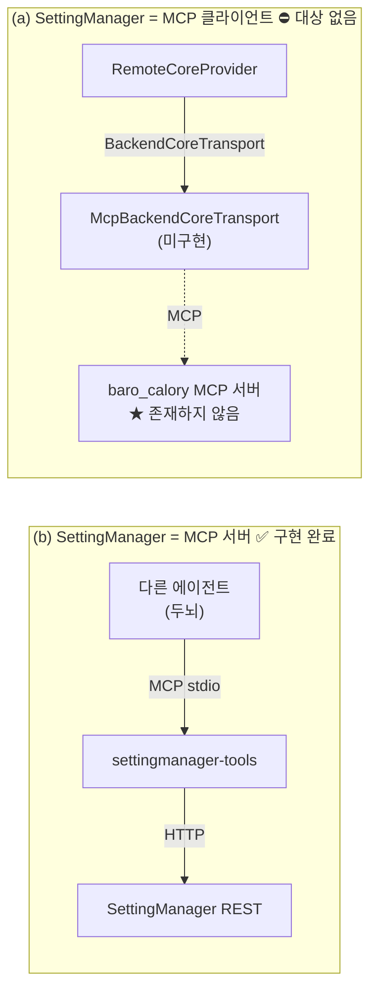

# MCP 양방향 연동 — 설계와 (b) 구현 결과

| 항목 | 값 |
|---|---|
| 문서 | MCP 두 방향의 설계, (b) 서버 구현 결과, (a) 의 막힌 지점 |
| 작성 | 2026-08-03 15:24:42 |
| 선행 | [BackendCore 대체 컴포넌트 설계서](20260803_141528_BackendCore_대체컴포넌트_설계서.md) · [M3~M7 2차 결과](20260803_151129_구조정리_M3M7_2차결과.md) |
| 검증 | typecheck 통과 · **292/292 통과** · 실 stdio JSON-RPC 스모크 7항목 |

---

## 1. 두 방향은 서로 반대다

마스터 요구: **(a)** MCP 를 통해 backend-core 호출 · **(b)** 다른 에이전트가 MCP 로 SettingManager 호출.



- **(b)** 는 SettingManager 가 **서버**다 — 능력을 내놓는다.
- **(a)** 는 SettingManager 가 **클라이언트**다 — 남의 능력을 쓴다.

전송 계층은 M4 에서 이미 `BackendCoreTransport` 인터페이스로 뽑아 두었으므로 (a) 는
**어댑터 한 개**만 추가하면 된다. 문제는 그 어댑터가 붙을 상대다(§4).

---

## 2. (b) 구현 — SettingManager MCP 서버

### 2.1 왜 자기 HTTP 를 다시 부르는가

도구는 인프로세스 서비스를 직접 부르지 않고 **SettingManager 자신의 REST 를 호출**한다.

이유는 하나다. 본문 검증·능력 게이트·오류 매핑은 이미 라우트가 소유하고 있고,
MCP 가 그것을 우회하면 **같은 규칙이 두 곳에 생겨 반드시 갈라진다.**
이 저장소가 방금 센터링 3중 경로로 겪은 실패가 정확히 그것이다.

형제 프로젝트도 같은 판단을 했다 — `SettingAgent/src/mcp/server.ts` 의 `setting_rpc` 는
자기 자신의 13020 을 부른다.

### 2.2 도구가 둘뿐인 이유

| 도구 | 역할 |
|---|---|
| `settingmanager_catalog` | 경로 목록 + 플래그. **호출 전에 먼저 읽으라**고 설명에 박아 두었다 |
| `settingmanager_call` | `{ method, path, body?, confirm? }` 범용 호출 |

라우트마다 도구를 등록하면 라우트가 늘 때마다 MCP 파일을 고쳐야 한다.
자기 설명적 카탈로그 + 범용 호출이면 **이 파일은 바뀌지 않는다.**

### 2.3 안전 — 카메라를 실수로 돌리지 않게

이 도구의 가장 큰 위험은 두뇌가 **운영 카메라를 실수로 움직이는 것**이다.

| 장치 | 동작 |
|---|---|
| `movesCamera` 게이트 | `confirm:true` 없이는 **거절하고 요청 자체를 보내지 않는다** (실측 확인) |
| 카탈로그 밖 경로 | 거절 — 도구가 임의 요청 통로가 되면 안 된다 |
| 오류 status 보존 | 501(재시도 무의미) · 409(재시도 가능) · 422(기기 한계) 를 뭉개지 않는다 |
| 바이너리 | 스냅샷은 대화에 싣지 않고 **크기만** 답한다 |

현재 카탈로그 **40 경로 중 10 건**이 `movesCamera: true` 다.

### 2.4 카탈로그 드리프트 방지

손으로 관리하는 목록은 반드시 낡는다. `test/mcpServer.test.ts` 가
**라우트 소스를 스캔해** 고정 경로가 카탈로그에 빠졌는지 잡는다.

```ts
for (const match of source.matchAll(/pathname === '(\/api\/[^']+)'/g)) declared.add(match[1]);
const missing = [...declared].filter((path) => !ROUTE_CATALOG.some((e) => e.path === path));
expect(missing).toEqual(['/api/stream']);   // 무한 스트림만 의도적 제외
```

`/api/stream` 은 끝나지 않는 multipart 라 MCP 대화에 실을 수 없어 **의도적으로 뺐고**,
그 사실이 테스트에 명시돼 있다.

### 2.5 파일 배치

```text
SettingMain/src/mcp/
├── routeCatalog.ts   경로 카탈로그 + 템플릿 매칭 (SDK 무관)
├── tools.ts          도구 알맹이 (SDK 무관 — 테스트가 여기를 부른다)
└── server.ts         MCP 등록·stdio 기동 (얇은 계층)
```

`tools.ts` 를 분리한 이유: 처음에는 테스트가 SDK 내부(`_registeredTools`)를 뒤졌고
SDK 1.30 에서 깨졌다. **내부 구조에 기대는 테스트는 라이브러리가 바뀌면 무너진다.**

---

## 3. 검증

### 3.1 테스트 292/292 (280 → +12)

| 검증 | 내용 |
|---|---|
| 카탈로그 드리프트 | 라우트 소스 스캔 대조 |
| 템플릿 매칭 | `:id` 는 슬래시를 넘지 않는다 (`/api/presets/a/b` 는 안 맞는다) |
| 이동 플래그 | 이동 경로 8종이 표시돼 있고, 읽기(`GET /api/ptz`·capabilities)는 표시돼 있지 않다 |
| confirm 게이트 | 없으면 **fetch 자체가 호출되지 않는다** |
| 카탈로그 밖 | 거절 + fetch 미호출 |
| status 보존 | 501·409·422 |
| 바이너리 | 크기만, 본문 미포함 |
| 통신 실패 | 조용한 성공으로 바뀌지 않는다 |

### 3.2 실 stdio JSON-RPC 스모크

MCP 서버를 자식 프로세스로 띄우고 **진짜 프로토콜로** 말을 걸었다.

```
1) initialize            → settingmanager-tools 0.1.0
2) tools/list            → settingmanager_catalog, settingmanager_call
3) catalog               → 40 개 경로 · baseUrl http://127.0.0.1:13030
                           카메라 이동 경로: 10 건
4) call /api/health      → {"ok":true,"status":200,"data":{"ok":true,
                             "service":"settingmanager","activeCameraId":"real-camera-1"}}
5) call core/capabilities → provider = local | center = true
6) 카메라 이동(confirm 없음) → 거절됨
7) 카탈로그 밖 경로        → 거절됨
```

**실카메라 PTZ 이동은 실행하지 않았다** — confirm 게이트가 막는 것까지만 확인했다.

---

## 4. (a) 는 붙일 대상이 없다

**baro_calory 에 MCP 서버가 없다.** 실측 확인:

| 확인 | 결과 |
|---|---|
| `baro_calory/.mcp.json` | `chrome-devtools-mcp` **하나뿐** — 개발 도구이고 backend-core 와 무관 |
| `apps/` · `packages/` 의 MCP 구현 | **없음.** `simulator-api.mjs:2` 에 "(나중에) MCP" 라는 **의도 주석**만 있다 |
| `@modelcontextprotocol/sdk` 의존 | baro_calory 에 **없음** |

즉 (a) 의 "MCP 를 통해 backend-core 호출"은 **상대가 아직 존재하지 않는다.**
없는 서버에 맞춰 어댑터를 지어내면, 실제 도구가 생겼을 때 계약이 어긋난 채로 굳는다.

### 준비는 되어 있다

M4 에서 전송을 인터페이스로 뽑아 두었으므로, 대상이 생기면 **어댑터 한 개**로 끝난다.

```ts
// 지금
new RemoteCoreProvider({ transport: new HttpBackendCoreTransport({ baseUrl, timeoutMs }) })
// 그때
new RemoteCoreProvider({ transport: new McpBackendCoreTransport({ serverCommand, toolName }) })
```

`RemoteCoreProvider` 도 `CoreProvider` 계약도 **한 줄도 바뀌지 않는다.**

### 마스터께 확인이 필요합니다

(a) 를 진행하려면 셋 중 하나를 정해 주셔야 합니다.

| # | 선택지 | 필요한 것 |
|---|---|---|
| **A1** | **baro_calory 에 MCP 서버를 만든다** | 그 저장소를 수정해야 합니다 — 지금까지 문서에 "참조만 한다"로 못박아 둔 경계를 넘습니다. **승인 필요** |
| **A2** | 제가 모르는 **다른 MCP 엔드포인트**가 이미 있다 | 그 주소·도구 이름을 알려주시면 어댑터만 만들면 됩니다 |
| **A3** | 지금은 **HTTP 로 두고**, backend-core 에 MCP 가 생기면 그때 붙인다 | 추가 작업 없음. 전송 인터페이스는 이미 준비돼 있습니다 |

---

## 5. 사용법 — 다른 에이전트가 붙이는 법

**1. SettingManager HTTP 서버를 먼저 띄운다** (MCP 도구가 이것을 호출한다).

```bash
cd SettingMain && npm start        # → http://127.0.0.1:13030
```

**2. 호출하는 에이전트의 MCP 설정에 등록한다.**

```json
{
  "mcpServers": {
    "settingmanager": {
      "command": "npx",
      "args": ["tsx", "src/mcp/server.ts"],
      "cwd": "D:/Work/Parking3D/Agent/baro/SettingManager/SettingMain",
      "env": { "SETTINGMANAGER_URL": "http://127.0.0.1:13030" }
    }
  }
}
```

`SETTINGMANAGER_URL` 을 생략하면 `config/config.json` 의 `server` 설정에서 주소를 만든다
(`0.0.0.0` 바인드는 `127.0.0.1` 로 바꿔 부른다).

**3. 두뇌가 지켜야 할 순서**

1. `settingmanager_catalog` 로 경로와 플래그 확인
2. 코어 작업 전에 `GET /api/core/capabilities` 로 지원 여부 확인
3. `movesCamera:true` 경로는 사용자가 명시적으로 요청했을 때만 `confirm:true` 로 호출

---

## 6. 영향도 분석

### 6.1 이 저장소

| 대상 | 영향 |
|---|---|
| **런타임 의존성** | **0 → 2** (`@modelcontextprotocol/sdk`, `zod`). 지금까지의 "의존성 0" 이 깨진다 — MCP 는 SDK 없이 구현할 수 없고, SettingAgent 가 쓰는 것과 같은 SDK 다 |
| `src/mcp/**` | 신규 3파일 |
| `package.json` | `scripts.mcp` 추가, `dependencies` 신설 |
| 기존 REST·화면 | **변경 없음.** MCP 는 얹힌 층이다 |
| 라우트를 추가할 때 | `src/mcp/routeCatalog.ts` 에 한 줄 추가해야 한다. **빠뜨리면 테스트가 잡는다** |

### 6.2 외부

| 대상 | 영향 |
|---|---|
| `baro_calory` | 없음 |
| 실카메라 · UE 시뮬 | 없음 (confirm 게이트가 있고, 이번 검증에서 이동은 실행하지 않았다) |
| 호출하는 에이전트 | **MCP 도구 2개가 새로 생긴다.** 등록 방법은 §5 |

### 6.3 한계 (숨기지 않고)

1. **MCP 도구는 SettingManager HTTP 서버가 떠 있어야 동작한다.** 안 떠 있으면
   `ok:false` + `ECONNREFUSED` 로 정직하게 실패한다(조용한 성공 없음).
2. **인증이 없다.** MCP 를 붙인 에이전트는 카메라를 움직일 수 있다(confirm 필요하지만
   에이전트 스스로 confirm 을 넣을 수 있다). 사내망·신뢰하는 에이전트 전제다.
3. **카탈로그는 손으로 관리한다.** 드리프트는 테스트가 잡지만, `notes` 의 정확성까지는
   기계가 검증하지 못한다.
4. **`/api/stream` 은 노출하지 않는다.** 무한 스트림은 MCP 대화 모델에 맞지 않는다.
