# 실(리얼) 카메라 연결 — 구조도 · 흐름도 · 순서도

| 항목 | 값 |
|---|---|
| 문서 | SettingManager 가 **실물 카메라**에 어떻게 붙는가 (구조도 · 흐름도 · 순서도) |
| 작성 | 2026-08-06 23:23:11 |
| 기준 | **현재 코드**(`SettingMain/src/`)와 **운영 DB**(`SettingMain/config/setup.db`)를 직접 읽어 쓴 as-built 문서 |
| 초점 | **실카메라**. 시뮬레이터는 대비(對比)로만 등장하며 주인공이 아니다 |
| 관련 | [카메라 사용 개념도(2026-07-31)](20260731_200035_카메라_사용_개념도_및_순서도.md) · [IDIS 드라이버 신설(2026-08-06)](20260806_222856_IDIS카메라드라이버_신설.md) · [`src/devices/idis/README.md`](../SettingMain/src/devices/idis/README.md) |

---

## 1. 한 줄 요약

실카메라 연결은 **네 겹**이다 — ① DB `camera_info` 가 접속 정보의 정본이고, ② 라우트는 `CameraDriver` 계약 하나만 보며, ③ 벤더 드라이버(휴컴스 · IDIS)가 그 뒤에 **나란히** 서고, ④ **제어 평면(HTTP CGI)과 영상 평면(RTSP)은 서로 다른 주소·포트를 쓰는 별개의 길**이다.

이 문서에서 가장 조심할 두 가지:

- **`kind` 는 프로토콜이지 실물/시뮬 구분이 아니다.** `simulator-1` 은 `kind=hucoms` 지만 UE 시뮬이다.
- **휴컴스와 IDIS 는 틸트의 부호·원점이 반대이고 줌 눈금의 뜻이 다르다.** 이걸 모르면 조준이 수 배 어긋난다(§6).

---

## 2. 근거 표기 규약

[IDIS 드라이버 문서](20260806_222856_IDIS카메라드라이버_신설.md)의 규약을 그대로 이어받는다. **표기가 없으면 설계 판단이거나 자명한 서술이다.**

| 표기 | 뜻 |
|---|---|
| `[매뉴얼 §N]` | 벤더 원문 (IDIS Web API Protocol v2.20 / Hucoms CGI v1.22) |
| `[실측]` | 실기에서 잰 것. 기기·일자를 함께 적는다. **매뉴얼과 충돌하면 이쪽이 이긴다** |
| `[코드]` | 이 문서를 쓰며 소스를 직접 읽어 확인한 것 |
| `[DB]` | 운영 DB `SettingMain/config/setup.db` 를 **읽기 전용으로 열어** 확인한 것 (2026-08-06 23:19) |
| `[미확인]` | 근거가 없다. 추측으로 메우지 않았다 |

---

## 3. 지금 등록된 카메라 — 무엇이 실물이고 무엇이 시뮬인가

`[DB camera_info 전수, 2026-08-06 23:19]`

> **주소는 자리표시자다.** 이 저장소는 공개돼 있고, `.gitignore` 가 `setup.db`·`config.json` 을
> 막아 둔 이유가 "실제 접속 정보(카메라 IP·계정·비밀번호)는 커밋하지 않는다" 이기 때문이다.
> 문서가 그 규칙을 우회하면 막아 둔 의미가 없다.
>
> **실제 값의 정본은 DB `camera_info` 다** — 옵션 화면의 `DB` 탭이나
> `GET /api/db/cameras` 로 본다. 구조를 설명하는 데 실제 IP 값은 필요하지 않고,
> 아래 표에서 중요한 것은 주소가 아니라 **어느 기기가 실물이고 어느 것이 시뮬인가**다.

| cam_id | cam_uuid | kind | 제어 URL | 영상 URL | 실물인가 |
|---:|---|---|---|---|---|
| 1 | `real-camera-1` | `hucoms` | `http://<카메라1-IP>:80` | `rtsp://<카메라1-IP>:554/stream1` | **실물** |
| 2 | `real-camera-2` | `hucoms` | `http://<카메라2-IP>:80` | `rtsp://<카메라2-IP>:554/stream1` | **실물** |
| 3 | `simulator-1` | `hucoms` | `http://<시뮬-IP>:8081` | `http://<시뮬-IP>:8091` | ⚠ **UE 시뮬** |
| 4 | `simulator-2` | `park3d-rpc` | `http://<Park3D-IP>:13510` | `http://<Park3D-IP>:13601/stream` | 시뮬 |
| 5 | `simulator-3` | `park3d-rpc` | `http://<Park3D-IP>:13510` | `http://<Park3D-IP>:13602/stream` | 시뮬 |

**PTZ 실측** `[실측 2026-08-06]`

| 기기 | pan | tilt | zoom |
|---|---:|---:|---:|
| `real-camera-1` | 3715 | 1188 | 10711 |
| `real-camera-2` | 2071 | 1804 | 10992 |

### 3-1. ⚠ `kind=hucoms` 인 것이 실물이라는 뜻이 아니다

`simulator-1` 이 그 반례다 — `kind` 는 **어느 프로토콜로 말을 거는가**이지 상대가 실물인지 시뮬인지를 담지 않는다 `[코드 config/types.ts:3~18]`.

**세 기기를 실물/시뮬로 가르는 유일한 실용 신호는 영상 URL 의 스킴**이다: 실카메라 2대는 `rtsp://…:554/…` 이고 시뮬은 `http://` 직결 포트다. 다만 이것도 규약이지 강제가 아니다 — **DB 어디에도 "이 기기는 실물이다"라는 칸이 없다.**

### 3-2. IDIS 는 **로스터에 한 대도 없다**

`kind = 'idis'` 인 행은 `[DB]` 상 **0건**이다. 사실은 이렇다:

- ✅ 드라이버·전송·좌표변환·Digest 인증·DB 열(`insecure_tls`)·옵션 화면 체크박스까지 **코드 경로가 완비돼 있다** `[코드 devices/idis/ 9파일]`.
- ❌ **실기 검증은 한 건도 없다.** 전 테스트가 목(mock) 기반이다 `[docs/20260806_222856 §9]`.
- 즉 **"IDIS 카메라가 연결돼 있다"는 서술은 거짓**이고, **"IDIS 카메라를 등록하면 붙을 준비가 돼 있다"가 사실**이다.

---

## 4. 구조도 — 무엇이 무엇에 붙어 있는가

### 4-1. 전체 배치

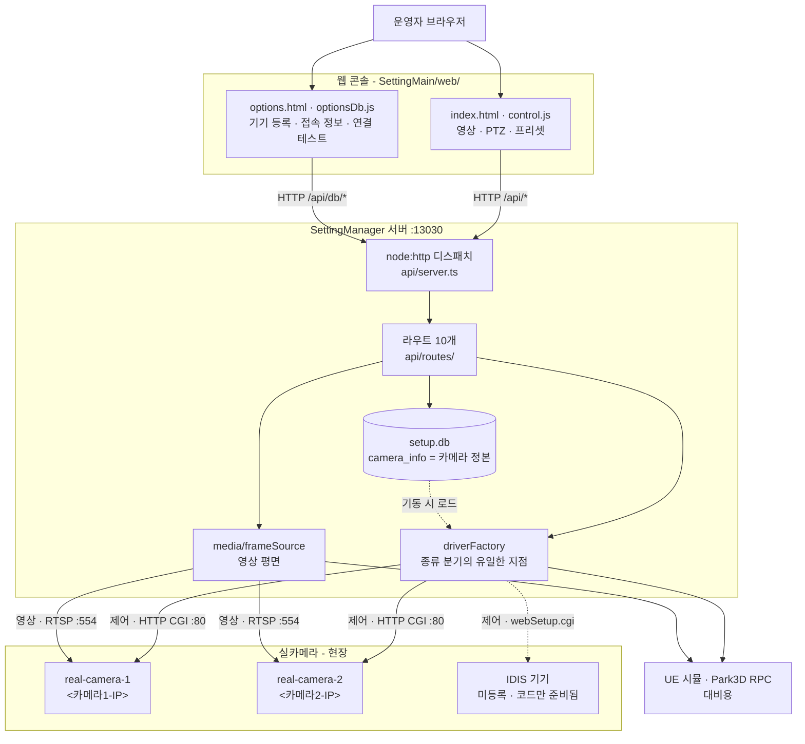
```mermaid
graph TB
    USER["운영자 브라우저"]

    subgraph WEB["웹 콘솔 - SettingMain/web/"]
        CTRL["index.html · control.js<br/>영상 · PTZ · 프리셋"]
        OPT["options.html · optionsDb.js<br/>기기 등록 · 접속 정보 · 연결 테스트"]
    end

    subgraph SM["SettingManager 서버 :13030"]
        HTTP["node:http 디스패치<br/>api/server.ts"]
        ROUTES["라우트 10개<br/>api/routes/"]
        FACT["driverFactory<br/>종류 분기의 유일한 지점"]
        MEDIA["media/frameSource<br/>영상 평면"]
        DB[("setup.db<br/>camera_info = 카메라 정본")]
    end

    subgraph REAL["실카메라 - 현장"]
        R1["real-camera-1<br/><카메라1-IP>"]
        R2["real-camera-2<br/><카메라2-IP>"]
        RI["IDIS 기기<br/>미등록 · 코드만 준비됨"]
    end

    SIM["UE 시뮬 · Park3D RPC<br/>대비용"]

    USER --> CTRL
    USER --> OPT
    CTRL -->|"HTTP /api/*"| HTTP
    OPT -->|"HTTP /api/db/*"| HTTP
    HTTP --> ROUTES
    ROUTES --> FACT
    ROUTES --> MEDIA
    ROUTES --> DB
    DB -.->|"기동 시 로드"| FACT

    FACT -->|"제어 · HTTP CGI :80"| R1
    FACT -->|"제어 · HTTP CGI :80"| R2
    FACT -.->|"제어 · webSetup.cgi"| RI
    FACT --> SIM
    MEDIA -->|"영상 · RTSP :554"| R1
    MEDIA -->|"영상 · RTSP :554"| R2
    MEDIA --> SIM
```

**그림이 말하는 것**: 브라우저는 카메라를 **직접 만지지 않는다.** 모든 제어·영상이 13030 을 통과하고, 그래서 카메라 계정·주소가 브라우저로 나가지 않는다. 서버는 `0.0.0.0:13030` 에 바인드된다 `[코드 config/config.json]` — **사내망의 누구나 이 카메라를 움직일 수 있다는 뜻이기도 하다**(인증 없음, §10).

### 4-2. 제어 평면과 영상 평면은 **별개의 길**이다

이 문서에서 두 번째로 중요한 그림이다.

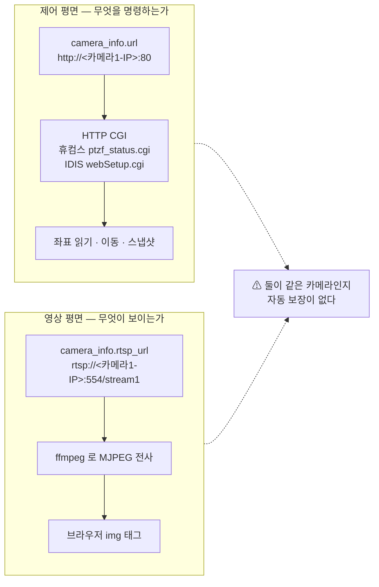
```mermaid
graph LR
    subgraph P1["제어 평면 — 무엇을 명령하는가"]
        C1["camera_info.url<br/>http://<카메라1-IP>:80"]
        C2["HTTP CGI<br/>휴컴스 ptzf_status.cgi<br/>IDIS webSetup.cgi"]
        C3["좌표 읽기 · 이동 · 스냅샷"]
        C1 --> C2 --> C3
    end

    subgraph P2["영상 평면 — 무엇이 보이는가"]
        S1["camera_info.rtsp_url<br/>rtsp://<카메라1-IP>:554/stream1"]
        S2["ffmpeg 로 MJPEG 전사"]
        S3["브라우저 img 태그"]
        S1 --> S2 --> S3
    end

    WARN["⚠ 둘이 같은 카메라인지<br/>자동 보장이 없다"]
    P1 -.-> WARN
    P2 -.-> WARN
```

**그림이 말하는 것**: 두 평면은 **주소도 포트도 프로토콜도 다르다.** 실카메라에서는 `:80`(HTTP CGI)과 `:554`(RTSP)이고, 서버가 둘을 잇는 유일한 근거는 `camera_info` 한 줄에 나란히 적혀 있다는 사실뿐이다.

**어긋나면 어떻게 보이는가**: PTZ 숫자는 정상적으로 바뀌는데 **그림이 절대 안 바뀐다.** 통신 로그에는 오류가 하나도 남지 않는다. 2026-07-31 에 시뮬에서 실제로 났던 사고이며 `[docs/20260731_200035 §3]`, **실카메라에서는 IP 를 잘못 짝지으면 같은 증상이 난다.**

> **IDIS 를 등록할 때 이 평면에서 걸리는 함정 셋** `[실측 DC-S6261XT 2026-07-29, cameras.md]`
>
> 1. **`trackID` 번호를 믿지 마라.** 매뉴얼의 "1=H.264, 2=MJPEG" 는 규약이 아니라 어느 기기의 프로파일 구성이었다 — **실측기는 정반대**로 `trackID=1` 이 MJPEG 1920×1080@15, `trackID=2` 가 H.264 640×360@15 였다(ffprobe 실측). **번호가 아니라 `ffprobe` 로 확인할 것.**
> 2. **IDIS 는 RTSP 실데이터 세션을 하나만 준다.** DESCRIBE(ffprobe)는 추가 세션에도 응답하지만 **데이터는 먼저 잡은 세션에만 온다** — 즉 `ffprobe` 로 확인하는 동안 스트림을 켜 두면 한쪽이 빈다.
> 3. **전송 스킴은 기기가 정한다.** 실측기는 **80 만 열고 443 은 무응답**이다. 거부가 아니라 **무응답**이라, 잘못 잡으면 실패가 빠르게 나지 않고 **타임아웃까지 매달린다** — §5-3 의 "명시적 `setTimeout`" 이 이것 때문에 필요하다.
>
> 이 서비스는 RTSP URL 을 **조립하지 않고** `rtsp_url` 에 적힌 전체 URL 을 그대로 쓴다 `[코드 media/rtspUrl.ts]`.

### 4-3. 계층 — 휴컴스와 IDIS 는 같은 인터페이스 뒤에 나란히 있다

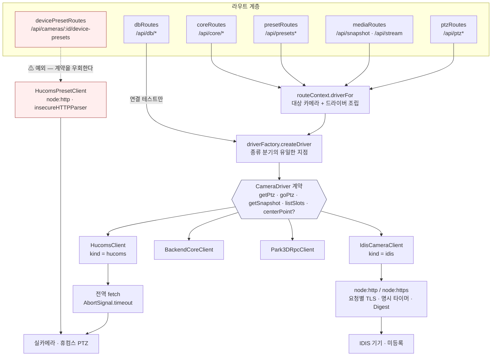
```mermaid
graph TB
    subgraph L1["라우트 계층"]
        RPTZ["ptzRoutes<br/>/api/ptz*"]
        RMED["mediaRoutes<br/>/api/snapshot · /api/stream"]
        RPRE["presetRoutes<br/>/api/presets*"]
        RCORE["coreRoutes<br/>/api/core/*"]
        RDB["dbRoutes<br/>/api/db/*"]
        RDEV["devicePresetRoutes<br/>/api/cameras/:id/device-presets"]
    end

    CTX["routeContext.driverFor<br/>대상 카메라 + 드라이버 조립"]
    FACT["driverFactory.createDriver<br/>종류 분기의 유일한 지점"]
    IFACE{{"CameraDriver 계약<br/>getPtz · goPtz · getSnapshot · listSlots · centerPoint?"}}

    HU["HucomsClient<br/>kind = hucoms"]
    ID["IdisCameraClient<br/>kind = idis"]
    BC["BackendCoreClient"]
    P3["Park3DRpcClient"]

    THU["전역 fetch<br/>AbortSignal.timeout"]
    TID["node:http / node:https<br/>요청별 TLS · 명시 타이머 · Digest"]

    DEVR["실카메라 · 휴컴스 PTZ"]
    DEVI["IDIS 기기 · 미등록"]

    HPC["HucomsPresetClient<br/>node:http · insecureHTTPParser"]

    RPTZ --> CTX
    RMED --> CTX
    RPRE --> CTX
    RCORE --> CTX
    CTX --> FACT
    FACT --> IFACE
    IFACE --> HU
    IFACE --> ID
    IFACE --> BC
    IFACE --> P3
    HU --> THU --> DEVR
    ID --> TID --> DEVI
    RDB -->|"연결 테스트만"| FACT

    RDEV -.->|"⚠ 예외 — 계약을 우회한다"| HPC
    HPC --> DEVR

    style IFACE fill:#eef,stroke:#446
    style RDEV fill:#fee,stroke:#a44
    style HPC fill:#fee,stroke:#a44
```

**그림이 말하는 것 — 그리고 그림의 붉은 부분**:

- 라우트는 벤더를 모른다. `CameraDriver` 계약 하나만 보고, 분기는 `driverFactory.createDriver()` **한 곳**에만 있다 `[코드 devices/driverFactory.ts:12~56]`.
- **단 하나의 예외가 장비 프리셋이다.** `devicePresetRoutes` 는 `CameraDriver` 를 거치지 않고 `HucomsPresetClient` 를 **직접** 만들어 부른다 `[코드 devicePresetRoutes.ts:93~100]`. 이유는 이 기능이 계약 밖(장비 내장 프리셋 번호 1~255)이고, 일부 장비가 LF-only 헤더를 보내 `insecureHTTPParser` 를 **이 클래스 요청에만** 한정해야 하기 때문이다 `[코드 hucomsPresetClient.ts:17~21]`.
- 그 예외의 대가: 이 라우트는 `camera.kind !== 'hucoms'` 이면 **501** 이다 `[코드 devicePresetRoutes.ts:23,34]`. **IDIS 는 드라이버에 `listPresets`·`gotoPreset`·`setPreset`·`removePreset` 이 전부 구현돼 있는데도 HTTP 로 닿을 수 없다**(§10-2).

> **장비 프리셋 번호의 상한이 근거마다 다르다.** 코드는 `1..255` 로 막고 `PresetSupported: Yes` 를 상한 미상으로 보아 255 를 쓴다 `[코드 hucomsPresetClient.ts:36,148~150]`. 그러나 상류 실측 표는 **휴컴스 프리셋을 `1~128`** 로 적는다 `[실측 cameras.md §역량 표]`. **충돌은 아니다** — 코드가 먼저 `capabilityptz.cgi` 로 기기에 물어보고, 기기가 숫자를 답하면 그 값이 이긴다. 다만 **`Yes` 만 답하는 기기에서는 129~255 가 실제로는 없을 수 있다** `[미확인]`.

### 4-4. 설정의 출처 — 카메라 정본은 DB 다

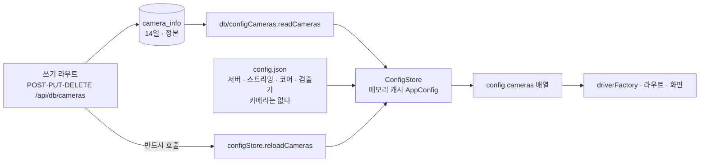
```mermaid
graph LR
    DB[("camera_info<br/>14열 · 정본")]
    CFG["config.json<br/>서버 · 스트리밍 · 코어 · 검출기<br/>카메라는 없다"]
    RC["db/configCameras.readCameras"]
    CS["ConfigStore<br/>메모리 캐시 AppConfig"]
    ARR["config.cameras 배열"]
    USE["driverFactory · 라우트 · 화면"]
    W["쓰기 라우트<br/>POST·PUT·DELETE /api/db/cameras"]

    DB --> RC --> CS
    CFG --> CS
    CS --> ARR --> USE
    W --> DB
    W -->|"반드시 호출"| RL["configStore.reloadCameras"]
    RL --> CS
```

**그림이 말하는 것**: `config.json` 에는 **더 이상 카메라가 없다** `[코드 configStore.ts:122~126]`. 접속 정보(IP·계정·비밀번호·타임아웃·RTSP)는 전부 `camera_info` 에 있다.

**이 설계의 유일한 함정**: DB 를 고쳐도 메모리의 `config.cameras` 는 옛 값이다. 그래서 카메라를 쓰기한 라우트는 **반드시 `configStore.reloadCameras()` 를 부른다** `[코드 dbRoutes.ts:92,127,138]`. 안 부르면 **방금 바꾼 IP 가 아니라 이전 주소로 다음 PTZ 명령이 나간다.**

| 어디에 사는가 | 무엇이 |
|---|---|
| `camera_info` (DB) | 카메라 전부 — id·이름·kind·제어 URL·계정·비밀번호·RTSP URL·타임아웃·장소·`insecure_tls`·`intrinsics` |
| `config.json` | 서버 host/port, 스트리밍(ffmpeg·fps·화질·기동 타임아웃), 코어 제공자, 검출기 URL, `activeCameraId` |
| `preset_info` (DB) | SettingManager 자체 프리셋(이름 + 좌표) |
| `config/device-preset-registry.json` | 장비 내장 프리셋의 **우리 쪽 이름·학습 좌표** — 장비가 이름을 주지 않기 때문 |

---

## 5. 흐름도 — 데이터와 제어가 어떻게 흐르는가

### 5-1. 기동 — DB 가 먼저 열린다

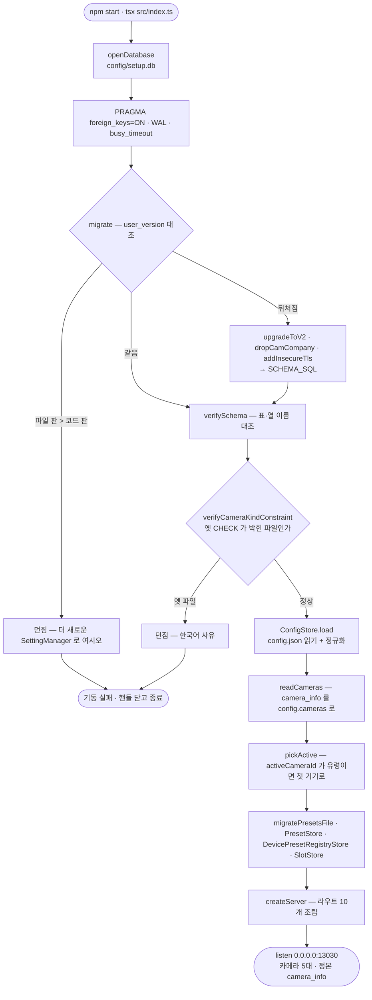
```mermaid
flowchart TD
    A(["npm start · tsx src/index.ts"]) --> B["openDatabase<br/>config/setup.db"]
    B --> C["PRAGMA foreign_keys=ON · WAL · busy_timeout"]
    C --> D{"migrate — user_version 대조"}
    D -->|"파일 판 > 코드 판"| DF["던짐 — 더 새로운 SettingManager 로 여시오"]
    D -->|"뒤처짐"| E["upgradeToV2 · dropCamCompany · addInsecureTls<br/>→ SCHEMA_SQL"]
    D -->|"같음"| F
    E --> F["verifySchema — 표·열 이름 대조"]
    F --> G{"verifyCameraKindConstraint<br/>옛 CHECK 가 박힌 파일인가"}
    G -->|"옛 파일"| GF["던짐 — 한국어 사유"]
    G -->|"정상"| H["ConfigStore.load<br/>config.json 읽기 + 정규화"]
    DF --> X(["기동 실패 · 핸들 닫고 종료"])
    GF --> X

    H --> I["readCameras — camera_info 를 config.cameras 로"]
    I --> J["pickActive — activeCameraId 가 유령이면 첫 기기로"]
    J --> K["migratePresetsFile · PresetStore · DevicePresetRegistryStore · SlotStore"]
    K --> L["createServer — 라우트 10개 조립"]
    L --> M(["listen 0.0.0.0:13030<br/>카메라 5대 · 정본 camera_info"])
```

**그림이 말하는 것**: **DB 를 가장 먼저 연다** — 카메라의 정본이 그 안에 있어 설정을 읽을 때 이미 붙어 있어야 하기 때문이다 `[코드 index.ts:11~15]`. 기동에서 카메라에 **말을 걸지 않는다.** 카메라가 다 꺼져 있어도 서버는 뜨고, 연결 실패는 첫 요청에서 드러난다.

> 여는 데 실패하면 **핸들을 닫고 나간다** `[코드 database.ts:46~55]`. Windows 에서 핸들이 남으면 그 DB 파일을 지우지도 옮기지도 못한다(EBUSY).

### 5-2. 요청 1건이 드라이버에 닿기까지

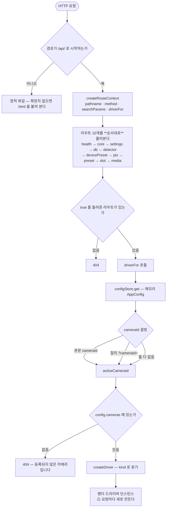
```mermaid
flowchart TD
    A(["HTTP 요청"]) --> B{"경로가 /api/ 로 시작하는가"}
    B -->|"아니오"| S["정적 파일 — 확장자 없으면 .html 을 붙여 본다"]
    B -->|"예"| C["createRouteContext<br/>pathname · method · searchParams · driverFor"]
    C --> D["라우트 10개를 **순서대로** 물어본다<br/>health → core → settings → db → detector<br/>→ devicePreset → ptz → preset → slot → media"]
    D --> E{"true 를 돌려준 라우트가 있는가"}
    E -->|"없음"| E404["404"]
    E -->|"있음"| F["driverFor 호출"]

    F --> G["configStore.get — 메모리 AppConfig"]
    G --> H{"cameraId 결정"}
    H -->|"본문 cameraId"| I
    H -->|"질의 ?cameraId="| I
    H -->|"둘 다 없음"| I["activeCameraId"]
    I --> J{"config.cameras 에 있는가"}
    J -->|"없음"| J404["404 — 등록되지 않은 카메라입니다"]
    J -->|"있음"| K["createDriver — kind 로 분기"]
    K --> L["벤더 드라이버 인스턴스<br/>⚠ 요청마다 새로 만든다"]
```

**그림이 말하는 것 — 그리고 비자명한 결과 하나**: `driverFor()` 는 **요청 1건마다 드라이버를 새로 만든다** `[코드 routeContext.ts:64~68]`. 드라이버에 세션·연결 풀이 없어 문제가 안 되지만, **IDIS 의 능력 프로브 결과(`pixelCentering` 메모이즈)는 요청 사이에 살아남지 않는다** — 자세한 것은 §7-6.

### 5-3. 벤더별 갈림길 — 같은 계약, 전혀 다른 왕복

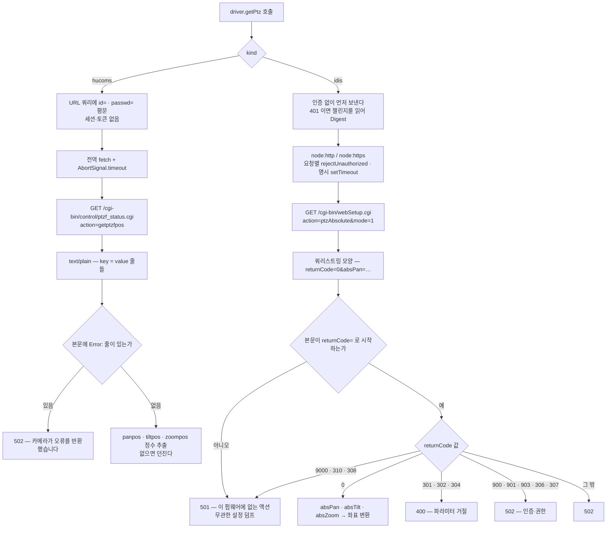
```mermaid
graph TB
    CALL["driver.getPtz 호출"] --> Q{"kind"}

    Q -->|"hucoms"| H1["URL 쿼리에 id= · passwd= 평문<br/>세션·토큰 없음"]
    H1 --> H2["전역 fetch + AbortSignal.timeout"]
    H2 --> H3["GET /cgi-bin/control/ptzf_status.cgi<br/>action=getptzfpos"]
    H3 --> H4["text/plain — key = value 줄들"]
    H4 --> H5{"본문에 Error: 줄이 있는가"}
    H5 -->|"있음"| HE["502 — 카메라가 오류를 반환했습니다"]
    H5 -->|"없음"| H6["panpos · tiltpos · zoompos 정수 추출<br/>없으면 던진다"]

    Q -->|"idis"| I1["인증 없이 먼저 보낸다<br/>401 이면 챌린지를 읽어 Digest"]
    I1 --> I2["node:http / node:https<br/>요청별 rejectUnauthorized · 명시 setTimeout"]
    I2 --> I3["GET /cgi-bin/webSetup.cgi<br/>action=ptzAbsolute&mode=1"]
    I3 --> I4["쿼리스트링 모양 — returnCode=0&absPan=…"]
    I4 --> I5{"본문이 returnCode= 로 시작하는가"}
    I5 -->|"아니오"| IE501["501 — 이 펌웨어에 없는 액션<br/>무관한 설정 덤프"]
    I5 -->|"예"| I6{"returnCode 값"}
    I6 -->|"0"| I7["absPan · absTilt · absZoom → 좌표 변환"]
    I6 -->|"9000 · 310 · 308"| IE501
    I6 -->|"301 · 302 · 304"| IE400["400 — 파라미터 거절"]
    I6 -->|"900 · 901 · 903 · 306 · 307"| IEA["502 — 인증·권한"]
    I6 -->|"그 밖"| IEE["502"]
```

**그림이 말하는 것 — 표로 못박으면**:

| 축 | 휴컴스 `[코드 hucomsClient.ts]` | IDIS `[코드 idisCamera.ts · idisTransport.ts]` |
|---|---|---|
| 엔드포인트 | 기능마다 CGI 가 다르다 (`ptzf_status.cgi`·`ptz_centering.cgi`·`image/jpeg.cgi`) | **CGI 하나**(`/cgi-bin/webSetup.cgi`)에 `action=` 으로 분기 `[매뉴얼 §2]` |
| 인증 | **쿼리스트링 평문** `?id=&passwd=` · 매 요청 · 세션 없음 | **HTTP Digest**(RFC2617). 401 챌린지를 읽어 방식을 고른다. **Basic 에는 401** `[실측 DC-S6261XT]` |
| 전송 | 전역 `fetch` + `AbortSignal.timeout` | `node:http`/`node:https` + **명시적 `setTimeout`** |
| 왜 다른가 | — | ① 요청별 TLS(`rejectUnauthorized`)를 `fetch` 가 못 받는다 ② `req.setTimeout` 은 소켓 **유휴** 타임아웃이라 **TCP 연결 수립 중에는 걸리지 않는다** `[실측]` |
| 쓰기 | GET (파라미터가 URL 에) | **POST 폼 본문** — 쓰기 파라미터가 URL 에 남으면 프록시·접속 로그에 그대로 적힌다 |
| 응답 | `key = value` 줄들의 text/plain | `returnCode=0&a=1&b=2` 쿼리스트링 모양, 값은 URI 인코딩 |
| 오류 판정 | **HTTP 200 인데 본문에 `Error: …`** — 200 을 성공으로 읽으면 조용히 틀린다 | **본문이 `returnCode=` 로 시작하는가가 유일한 신뢰 신호** — 같은 CGI 가 없는 액션에 200 + 무관한 설정 덤프를 준 적이 있다 `[실측 DC-S6286HRXLT]` |
| 비밀번호 마스킹 | 오류 문구에서 `password` 치환 | 원문 + `encodeURIComponent` 형태 둘 다 치환 |

### 5-4. 영상 경로 — **스킴이 경로를 가른다**

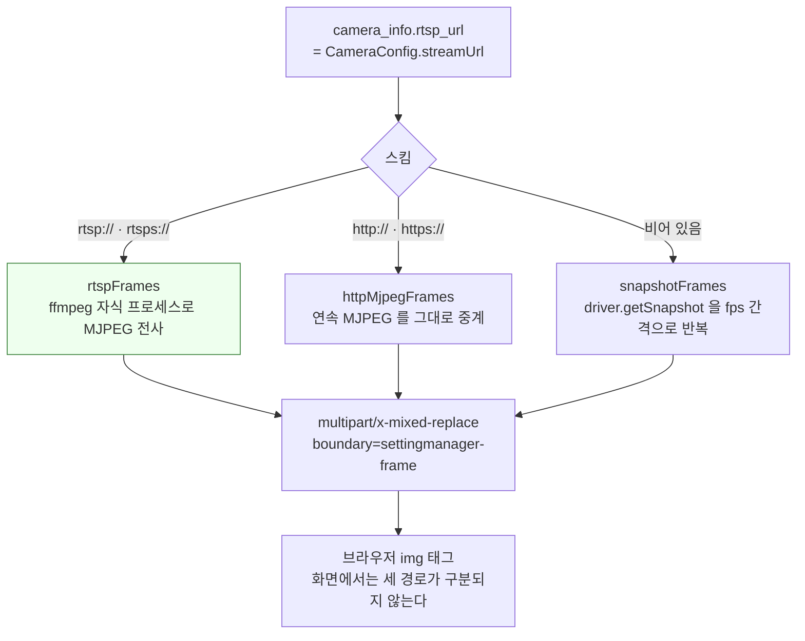
```mermaid
graph TB
    URL["camera_info.rtsp_url<br/>= CameraConfig.streamUrl"] --> Q{"스킴"}
    Q -->|"rtsp:// · rtsps://"| A["rtspFrames<br/>ffmpeg 자식 프로세스로 MJPEG 전사"]
    Q -->|"http:// · https://"| B["httpMjpegFrames<br/>연속 MJPEG 를 그대로 중계"]
    Q -->|"비어 있음"| C["snapshotFrames<br/>driver.getSnapshot 을 fps 간격으로 반복"]

    A --> OUT["multipart/x-mixed-replace<br/>boundary=settingmanager-frame"]
    B --> OUT
    C --> OUT
    OUT --> IMG["브라우저 img 태그<br/>화면에서는 세 경로가 구분되지 않는다"]

    style A fill:#efe,stroke:#484
```

| 경로 | 지금 이 경로를 쓰는 기기 | 특징 |
|---|---|---|
| **`rtsp-ffmpeg`** | **`real-camera-1` · `real-camera-2`** — 실카메라가 서는 자리다 | ffmpeg 실행 파일이 필요하다. URL 에 계정이 없으면 `camera_info` 계정을 주입한다. 카메라 타임스탬프를 믿지 않도록 `-use_wallclock_as_timestamps 1` + `-fps_mode vfr` 을 **짝으로** 넣는다 — 아래 실측 근거 참조 |
| `http-mjpeg` | 시뮬 3대 | ffmpeg 불필요. **multipart 헤더를 파싱하지 않고** JPEG SOI/EOI 로 끊어 boundary 이름과 무관하게 동작한다 |
| `snapshot-poll` | 지금은 없음 | 영상 URL 이 비어 있을 때의 정직한 폴백. 프레임률은 `streaming.fps`(현재 5) |

**그림이 말하는 것**: 실카메라의 영상은 **ffmpeg 를 반드시 거친다.** `ffmpeg` 를 PATH 에서 못 찾으면 스트림은 502 로 실패한다 — 그 사유가 문구에 그대로 실린다 `[코드 frameSource.ts:97~100]`.

**두 ffmpeg 플래그가 왜 짝인가 — 실카메라에서 잰 숫자** `[실측 baro_calory/docs/cameras.md §RTSP 타임스탬프는 믿지 않습니다, 2026-07-29]`:

> **휴컴스 실기(`153`)**: 시작 구간 채움으로 첫 프레임이 십수 회 반복되어 **표본 중복 64%**. 두 플래그를 넣은 뒤 **64% → 0%**.

RTP 타임스탬프가 실제 프레임률과 다르면 기본 CFR 동기화가 빈 자리를 **복제 프레임**으로 채운다 — 대역폭이 같은 그림에 쓰이고, 화면은 "움직이는데 안 움직이는 것처럼" 보인다.

**RTSP 경로 `stream1` 의 근거**: `stream1`/`stream2` 는 **휴컴스 계열에서 실측 검증된 경로**다 `[실측 cameras.md §RTSP 경로는 벤더 규약입니다]`. 다만 그 문서는 **포트를 적지 않는다** — 이 저장소의 `:554` 는 `camera_info` 에 등록된 값이다 `[DB]`. 그리고 **경로는 벤더 규약이지 범용 규약이 아니다**: 전역 `stream1` 을 모든 기기에 적용했다가 어긋난 사건이 상류에 있다.

---

## 6. 좌표 규약 — **여기를 빠뜨리면 조준이 수 배 어긋난다**

계약 좌표는 **Hucoms 논리 좌표계**다. 어느 벤더든 API 표면에서는 이 좌표만 쓰고, 변환은 드라이버 안에 갇혀 있다.

| 축 | 계약 (API 표면) | 단위 | 범위 밖 처리 |
|---|---|---|---|
| `pan` | `0 ~ 35999` | 0.01° | **감긴다**(원) — 36000 → 0 |
| `tilt` | `−2000 ~ 9000`, **+ 가 아래**, 0 = 수평 | 0.01° | 잘린다 + `limited[]` 로 보고 |
| `zoom` | `0 ~ 65535` | **불투명 raw** | 잘린다 + `limited[]` 로 보고 |

### 6-1. 휴컴스 ↔ IDIS — 같은 이름, 다른 뜻

**이 표가 이 문서에서 가장 중요하다.**

| 축 | 휴컴스 (= 계약과 동일) | IDIS 와이어 | 변환 `[코드 idisCoords.ts]` |
|---|---|---|---|
| **pan** | `panpos 0..35999` 무부호 | `absPan −18000..18000` `[매뉴얼 §56]` | 와이어→계약 `((absPan%36000)+36000)%36000` · 계약→와이어 감아서 `>18000` 이면 `−36000`. **자르지 않고 감는다** |
| **tilt** | `tiltpos −2000..9000` **+ 가 아래**, **0 = 수평** | `absTilt` **+ 가 위**, **0 = 수직 아래** `[실측 DC-S6261XT 2026-07-29]` | **`9000 − x`**(자기역함수). 보내기 전 `[0, 9000]` 로 자른다 |
| **zoom** | `zoompos 0..65535` **불투명 raw** — "0 = 광각" | `absZoom` = **배율 × 100** **"100 = 광각"** | 숫자는 항등 통과. 보내기 전 `[100, 1200]` 로 자른다 `[실측 — 이 모델의 광학 x12]` |
| **centerPoint** | 1920×1080 절대 픽셀 (펌웨어가 처리) | `pointPan`·`pointTilt` `0..100000` `[매뉴얼 §58]` | `round(x/1920 × 100000)` (쓰기 전용) |

**틸트는 부호도 원점도 반대다.** 다행히 두 범위가 정확히 겹쳐 `9000 − x` 한 식으로 양방향이 닫힌다.

> **독립 교차검증** `[실측]` — `absZoom=100` 에서 5°씩 움직여 상호상관으로 화면 이동을 재면 tilt 37.6 px/°, pan 29.6 px/° 다. 카메라가 수평에서 40° 내려가 있다면 팬의 화면 변위는 `cos40° = 0.766` 배라 38.6 px/° 가 되어 틸트와 **3% 안에서 일치**한다. **원점이 수평이었다면 이 일치가 나오지 않는다.**

**줌은 눈금의 뜻이 다르다.** 숫자 범위가 계약 안에 들어가므로 항등 통과가 계약 위반은 아니지만, 이 차이를 무시하고 Hucoms 기본 화각 곡선을 폴백으로 들면 **화각이 약 5배 틀린다** `[실측 사고]`. 그래서 IDIS 드라이버는 `intrinsics` 를 **절대 지어내지 않는다**.

### 6-2. 보내기 전에 자른다 — 기기는 성공이라 답하면서 다른 데로 간다

| 벤더 | 보낸 값 | 기기의 답 | 실제 결과 |
|---|---|---|---|
| 휴컴스 | 범위 밖 | **`[미확인]`** | **기록이 없다** — 아래 주 참조 |
| IDIS | `absTilt = 12000` | `returnCode=0` | 9000 에서 클램프 |
| IDIS | **`absTilt = −3000`** | **`returnCode=0`** | **오토플립 — 팬을 180° 돌려 해결한다** `[실측]` |
| IDIS | `absZoom = 3000` | `returnCode=0` | 1200 |
| IDIS | `absPan = −18000` | `returnCode=0` | 18000 (원이라 같은 방향) |

**오토플립이 특히 위험하다 — 성공 응답을 받고 정반대를 본다.** 계약이 허용하는 `tilt = −2000`(수평 위 20°)이 그대로 나가면 `absTilt = 11000` 이 되어 이 갈래에 빠지므로, `tiltToWire` 가 뒤집은 뒤 실측 도달 범위로 자른다. 참고로 **휴컴스는 `tiltpos = −2000`(수평 위 20°)에 실제로 도달할 수 있다** `[실측 baro_calory/docs/cameras.md §좌표 규약]`.

> **휴컴스 행을 `[미확인]` 으로 둔 이유 — 앞선 문서를 정정한다.** `docs/20260731_200035 §6` 은 "기기는 범위 밖 요청에 성공이라 답하며 조용히 다른 데로 간다(baro_calory 실측)"라고 적었으나, **`baro_calory/docs/cameras.md` 를 다시 읽어 보면 그 실측은 IDIS 절에만 있고 휴컴스에 대응하는 기록이 없다.** 같은 문서의 역량 표에서 휴컴스의 `미구현 액션의 응답` 칸은 `—`(미기록)다. **휴컴스도 그럴 것이라는 추정은 근거가 없으므로 여기서는 `[미확인]` 으로 둔다.** 다만 코드는 어느 쪽이든 안전하다 — `HucomsClient.goPtz` 가 보내기 전에 `clampPtz` 를 건다 `[코드 hucomsClient.ts:45~46]`.

### 6-3. ⚠ 알려진 구멍 — IDIS 에서는 `limited[]` 약속이 깨진다

`/api/ptz/absolute` 의 `limitedAxes()` 는 **계약 상수**(`0..65535`)로 판정한다 `[코드 domain/ptz.ts:61~69]`. 그래서 IDIS 기기에 `zoom: 3000` 을 보내면 **응답은 `limited: []`** 인데 드라이버는 1200 으로 자른다 — **"잘린 축은 숨기지 않는다"는 약속이 이 기기에서만 깨진다.** 기기별 도달범위 도입은 도메인·라우트·화면에 걸친 별건으로 미결이다 `[docs/20260806_222856 §4-4]`.

---

## 7. 순서도 — 시간 순 상호작용

### 7-1. 서버 기동 ~ 카메라 사용 준비

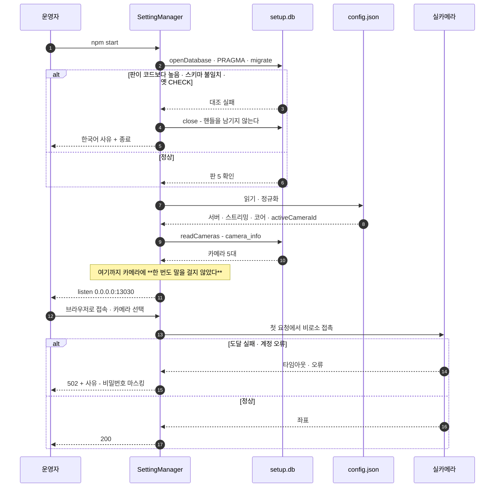
```mermaid
sequenceDiagram
    autonumber
    participant OP as 운영자
    participant SM as SettingManager
    participant DB as setup.db
    participant CFG as config.json
    participant CAM as 실카메라

    OP->>SM: npm start
    SM->>DB: openDatabase · PRAGMA · migrate
    alt 판이 코드보다 높음 · 스키마 불일치 · 옛 CHECK
        DB-->>SM: 대조 실패
        SM->>DB: close - 핸들을 남기지 않는다
        SM-->>OP: 한국어 사유 + 종료
    else 정상
        DB-->>SM: 판 5 확인
    end
    SM->>CFG: 읽기 · 정규화
    CFG-->>SM: 서버 · 스트리밍 · 코어 · activeCameraId
    SM->>DB: readCameras - camera_info
    DB-->>SM: 카메라 5대
    Note over SM: 여기까지 카메라에 **한 번도 말을 걸지 않았다**
    SM-->>OP: listen 0.0.0.0:13030

    OP->>SM: 브라우저로 접속 · 카메라 선택
    SM->>CAM: 첫 요청에서 비로소 접촉
    alt 도달 실패 · 계정 오류
        CAM-->>SM: 타임아웃 · 오류
        SM-->>OP: 502 + 사유 - 비밀번호 마스킹
    else 정상
        CAM-->>SM: 좌표
        SM-->>OP: 200
    end
```

**그림이 말하는 것**: 카메라가 전부 꺼져 있어도 서버는 뜬다. **연결 실패는 기동이 아니라 첫 요청에서 드러난다** — 그래서 "서버가 떴다"는 카메라가 살아 있다는 증거가 아니다.

### 7-2. PTZ 읽기 — `GET /api/ptz`

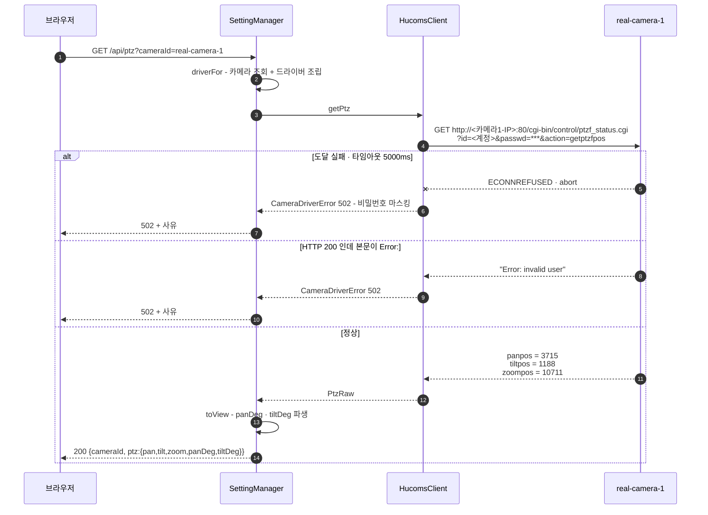
```mermaid
sequenceDiagram
    autonumber
    participant W as 브라우저
    participant SM as SettingManager
    participant D as HucomsClient
    participant CAM as real-camera-1

    W->>SM: GET /api/ptz?cameraId=real-camera-1
    SM->>SM: driverFor - 카메라 조회 + 드라이버 조립
    SM->>D: getPtz
    D->>CAM: GET http://<카메라1-IP>:80/cgi-bin/control/ptzf_status.cgi<br/>?id=<계정>&passwd=***&action=getptzfpos
    alt 도달 실패 · 타임아웃 5000ms
        CAM--xD: ECONNREFUSED · abort
        D-->>SM: CameraDriverError 502 - 비밀번호 마스킹
        SM-->>W: 502 + 사유
    else HTTP 200 인데 본문이 Error:
        CAM-->>D: "Error: invalid user"
        D-->>SM: CameraDriverError 502
        SM-->>W: 502 + 사유
    else 정상
        CAM-->>D: panpos = 3715<br/>tiltpos = 1188<br/>zoompos = 10711
        D-->>SM: PtzRaw
        SM->>SM: toView - panDeg · tiltDeg 파생
        SM-->>W: 200 {cameraId, ptz:{pan,tilt,zoom,panDeg,tiltDeg}}
    end
```

**그림이 말하는 것**: **HTTP 200 이 성공이 아니다.** 휴컴스는 인증 실패·잘못된 액션을 200 + `Error:` 본문으로 답한다 — 그 판정이 `parseHucomsText` 한 곳에 있다 `[코드 hucomsText.ts:7,23~26]`. 필드가 없으면 **0 으로 대체하지 않고 던진다** — 0 으로 채우면 다음 상대 이동이 카메라를 원점으로 보낸다 `[코드 hucomsText.ts:39~47]`.

### 7-3. PTZ 절대 이동 + **정착(settle) 대기**

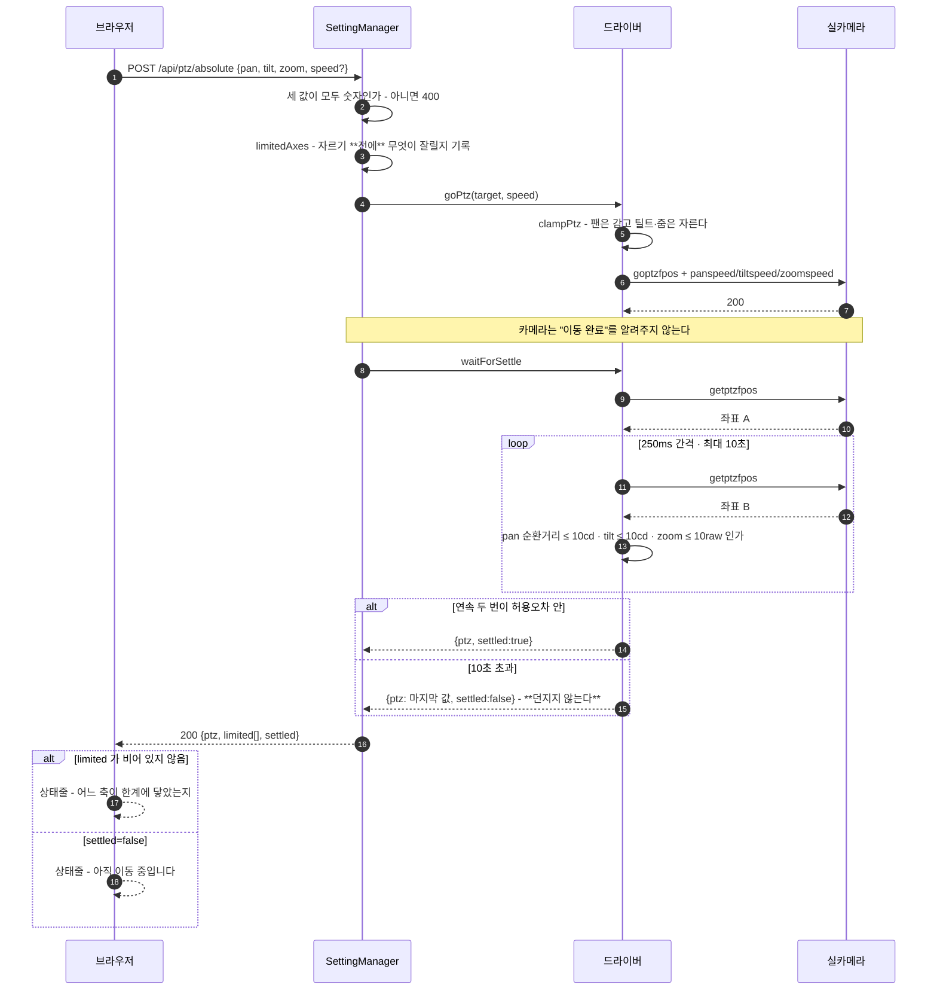
```mermaid
sequenceDiagram
    autonumber
    participant W as 브라우저
    participant SM as SettingManager
    participant D as 드라이버
    participant CAM as 실카메라

    W->>SM: POST /api/ptz/absolute {pan, tilt, zoom, speed?}
    SM->>SM: 세 값이 모두 숫자인가 - 아니면 400
    SM->>SM: limitedAxes - 자르기 **전에** 무엇이 잘릴지 기록
    SM->>D: goPtz(target, speed)
    D->>D: clampPtz - 팬은 감고 틸트·줌은 자른다
    D->>CAM: goptzfpos + panspeed/tiltspeed/zoomspeed
    CAM-->>D: 200

    Note over SM,CAM: 카메라는 "이동 완료"를 알려주지 않는다
    SM->>D: waitForSettle
    D->>CAM: getptzfpos
    CAM-->>D: 좌표 A
    loop 250ms 간격 · 최대 10초
        D->>CAM: getptzfpos
        CAM-->>D: 좌표 B
        D->>D: pan 순환거리 ≤ 10cd · tilt ≤ 10cd · zoom ≤ 10raw 인가
    end

    alt 연속 두 번이 허용오차 안
        D-->>SM: {ptz, settled:true}
    else 10초 초과
        D-->>SM: {ptz: 마지막 값, settled:false} - **던지지 않는다**
    end
    SM-->>W: 200 {ptz, limited[], settled}
    alt limited 가 비어 있지 않음
        W-->>W: 상태줄 - 어느 축이 한계에 닿았는지
    else settled=false
        W-->>W: 상태줄 - 아직 이동 중입니다
    end
```

**정착 판정 규칙** `[코드 waitForSettle.ts · domain/settle.ts]`

| 항목 | 값 | 왜 |
|---|---|---|
| 폴링 간격 | 250ms | — |
| 허용오차 | pan·tilt **10cd(0.1°)** · zoom **10 raw** | — |
| 판정 | **연속 두 번 읽은 값**이 허용오차 안 | 명령 직후 읽으면 이동 중간값이 잡힌다 (실측: 시뮬에서 pan 1296 → 목표 1496 인데 직후 읽기가 1446) |
| 팬 비교 | **순환 거리** `min(d, 36000−d)` | 없으면 0/36000 심 근처에서 영원히 안 멈춘다 |
| 상한 | 10초. 초과 시 **던지지 않고** `settled:false` | 마지막 좌표도 쓸모 있는 정보다. 던지면 화면이 "어디에 있는지조차" 못 보여준다 |

**실측 이동 시간** `[실측 DC-S6261XT 2026-07-29]`: 팬 5° 이동에 **약 400ms**(200ms 에는 미도달, 400ms 에 도달). 폴링 간격 250ms 는 이 규모의 이동을 최소 2회 안에 잡는다.

> ⚠ **줌에는 기기 자체의 스텝 그리드가 있다** `[실측]` — 명령값과 몇 단위 어긋난다(`499` 를 보내면 `490` 에 선다). 정착 판정의 zoom 허용오차가 **10 raw** 인 것이 이 어긋남을 흡수한다. **그리드 간격이 10 을 넘는 기기에서는 줌이 영원히 "정착하지 않은" 것으로 보일 수 있다** `[미확인]` — 그 경우 `settled:false` 로 나오지 마지막 좌표는 정상이다.

> **`nudge`(방향 버튼)는 정착을 두 번 기다린다** `[코드 ptzRoutes.ts:39~46]`. ① **기준 자세**도 멈춘 값이어야 하고 ② 착지도 멈춘 뒤에 읽는다. 기준을 안 기다리면 중간값에 델타를 더하게 되어 **목표가 매번 뒤로 밀린다** → "눌러도 안 움직인다".

### 7-4. 스냅샷 · 영상 스트림 시작 · 정지

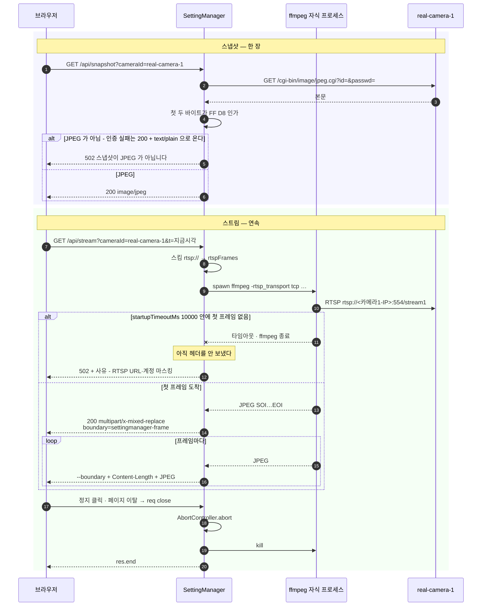
```mermaid
sequenceDiagram
    autonumber
    participant W as 브라우저
    participant SM as SettingManager
    participant FF as ffmpeg 자식 프로세스
    participant CAM as real-camera-1

    rect rgb(245,245,255)
    Note over W,CAM: 스냅샷 — 한 장
    W->>SM: GET /api/snapshot?cameraId=real-camera-1
    SM->>CAM: GET /cgi-bin/image/jpeg.cgi?id=&passwd=
    CAM-->>SM: 본문
    SM->>SM: 첫 두 바이트가 FF D8 인가
    alt JPEG 가 아님 - 인증 실패는 200 + text/plain 으로 온다
        SM-->>W: 502 스냅샷이 JPEG 가 아닙니다
    else JPEG
        SM-->>W: 200 image/jpeg
    end
    end

    rect rgb(245,255,245)
    Note over W,CAM: 스트림 — 연속
    W->>SM: GET /api/stream?cameraId=real-camera-1&t=지금시각
    SM->>SM: 스킴 rtsp:// → rtspFrames
    SM->>FF: spawn ffmpeg -rtsp_transport tcp …
    FF->>CAM: RTSP rtsp://<카메라1-IP>:554/stream1
    alt startupTimeoutMs 10000 안에 첫 프레임 없음
        FF--xSM: 타임아웃 · ffmpeg 종료
        Note over SM: 아직 헤더를 안 보냈다
        SM-->>W: 502 + 사유 - RTSP URL·계정 마스킹
    else 첫 프레임 도착
        FF-->>SM: JPEG SOI…EOI
        SM-->>W: 200 multipart/x-mixed-replace<br/>boundary=settingmanager-frame
        loop 프레임마다
            FF-->>SM: JPEG
            SM-->>W: --boundary + Content-Length + JPEG
        end
    end

    W->>SM: 정지 클릭 · 페이지 이탈 → req close
    SM->>SM: AbortController.abort
    SM->>FF: kill
    SM-->>W: res.end
    end
```

**그림이 말하는 것**: **첫 프레임 전 실패만 정직한 상태코드를 줄 수 있다**(아직 multipart 헤더를 안 보냈으므로 502 + 사유). 첫 프레임 이후에 끊기면 스트림을 닫는 것 말고 할 수 있는 게 없다 `[코드 mediaRoutes.ts:54~59]`.

**영상은 「시작」을 눌러야 시작한다.** 페이지를 여는 행위가 곧 카메라 점유가 되면 안 되기 때문이다.

### 7-5. 연결 테스트 — **저장하지 않고 지금 값으로 시험한다**

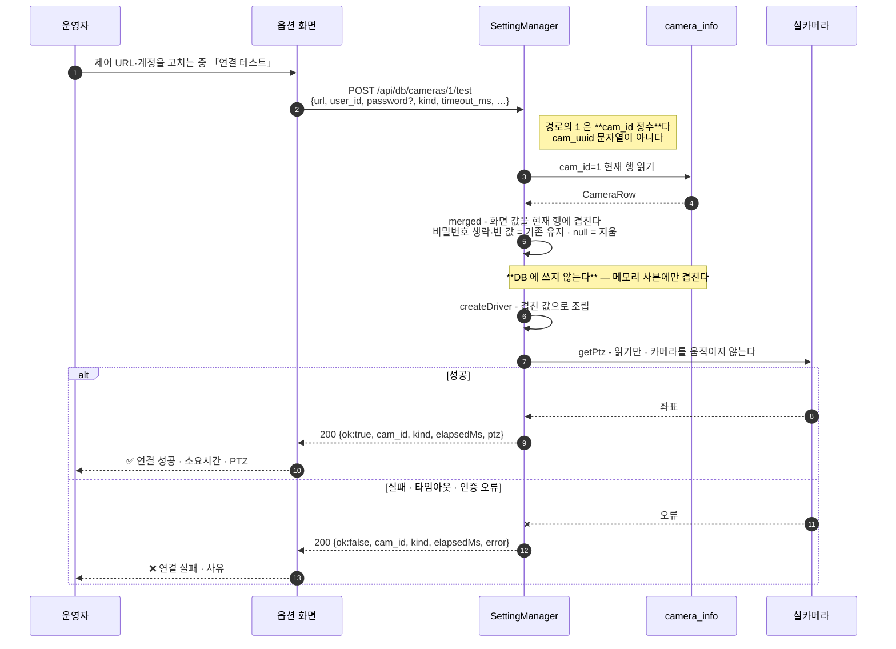
```mermaid
sequenceDiagram
    autonumber
    participant OP as 운영자
    participant O as 옵션 화면
    participant SM as SettingManager
    participant DB as camera_info
    participant CAM as 실카메라

    OP->>O: 제어 URL·계정을 고치는 중 「연결 테스트」
    O->>SM: POST /api/db/cameras/1/test<br/>{url, user_id, password?, kind, timeout_ms, …}
    Note right of SM: 경로의 1 은 **cam_id 정수**다<br/>cam_uuid 문자열이 아니다
    SM->>DB: cam_id=1 현재 행 읽기
    DB-->>SM: CameraRow
    SM->>SM: merged - 화면 값을 현재 행에 겹친다<br/>비밀번호 생략·빈 값 = 기존 유지 · null = 지움
    Note over SM,DB: **DB 에 쓰지 않는다** — 메모리 사본에만 겹친다
    SM->>SM: createDriver - 겹친 값으로 조립
    SM->>CAM: getPtz - 읽기만 · 카메라를 움직이지 않는다

    alt 성공
        CAM-->>SM: 좌표
        SM-->>O: 200 {ok:true, cam_id, kind, elapsedMs, ptz}
        O-->>OP: ✅ 연결 성공 · 소요시간 · PTZ
    else 실패 · 타임아웃 · 인증 오류
        CAM--xSM: 오류
        SM-->>O: 200 {ok:false, cam_id, kind, elapsedMs, error}
        O-->>OP: ❌ 연결 실패 · 사유
    end
```

**그림이 말하는 것**: **연결 실패는 요청의 오류가 아니라 시험의 결과다** — 그래서 HTTP 는 200 이고 `ok` 로 가른다 `[코드 dbRoutes.ts:104~122]`. 「적용」 전에 시험할 수 있어야 URL·계정을 고치는 중에도 쓸모가 있다.

> **경로는 `cam_id`(정수)다.** `POST /api/db/cameras/real-camera-1/test` 는 동작하지 않는다 — 라우트 정규식이 `(\d+)` 다 `[코드 dbRoutes.ts:98]`.

### 7-6. IDIS 능력 프로브 — **휴컴스에 없는 단계**

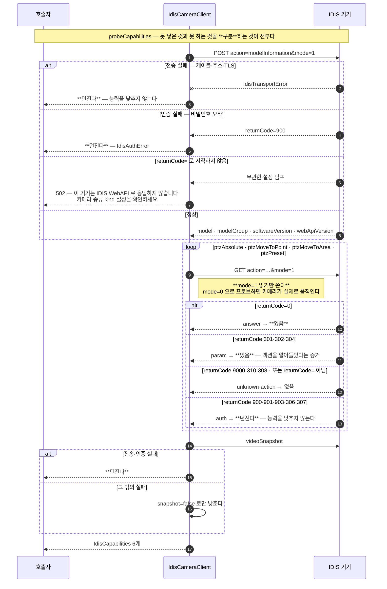
```mermaid
sequenceDiagram
    autonumber
    participant CALLER as 호출자
    participant D as IdisCameraClient
    participant CAM as IDIS 기기

    Note over CALLER,CAM: probeCapabilities — 못 닿은 것과 못 하는 것을 **구분**하는 것이 전부다

    D->>CAM: POST action=modelInformation&mode=1
    alt 전송 실패 — 케이블·주소·TLS
        CAM--xD: IdisTransportError
        D-->>CALLER: **던진다** — 능력을 낮추지 않는다
    else 인증 실패 — 비밀번호 오타
        CAM-->>D: returnCode=900
        D-->>CALLER: **던진다** — IdisAuthError
    else returnCode= 로 시작하지 않음
        CAM-->>D: 무관한 설정 덤프
        D-->>CALLER: 502 — 이 기기는 IDIS WebAPI 로 응답하지 않습니다<br/>카메라 종류 kind 설정을 확인하세요
    else 정상
        CAM-->>D: model · modelGroup · softwareVersion · webApiVersion
    end

    loop ptzAbsolute · ptzMoveToPoint · ptzMoveToArea · ptzPreset
        D->>CAM: GET action=…&mode=1
        Note right of D: **mode=1 읽기만 쓴다**<br/>mode=0 으로 프로브하면 카메라가 실제로 움직인다
        alt returnCode=0
            CAM-->>D: answer → **있음**
        else returnCode 301·302·304
            CAM-->>D: param → **있음** — 액션을 알아들었다는 증거
        else returnCode 9000·310·308 · 또는 returnCode= 아님
            CAM-->>D: unknown-action → 없음
        else returnCode 900·901·903·306·307
            CAM-->>D: auth → **던진다** — 능력을 낮추지 않는다
        end
    end

    D->>CAM: videoSnapshot
    alt 전송·인증 실패
        D-->>CALLER: **던진다**
    else 그 밖의 실패
        D->>D: snapshot=false 로만 낮춘다
    end
    D-->>CALLER: IdisCapabilities 6개
```

**그림이 말하는 것 — 세 가지**:

1. **전송 실패와 기능 부재를 구분하는 것이 이 함수의 존재 이유다.** 자체서명 인증서 하나 때문에 `snapshot:false`·`presets:false` 가 "실측 결과"로 저장돼 멀쩡한 카메라가 영구히 불구가 될 뻔한 사고가 실제로 있었다 `[실측]`. 케이블 하나 빠진 것이 "이 카메라는 아무것도 못 한다"로 기록되면 **고장난 카메라와 구분되지 않는다.**
2. **`param`(301·302·304)을 '있음'으로 읽는다.** §58·§59 는 Write 전용이라 지원 기기에서도 `mode=1` 프로브가 `returnCode=0` 이 아닐 수 있다. 다만 **어느 코드가 실제로 오는지는 `[미확인]`** 이라 나머지 갈래는 안전한 쪽('없음')에 둔다.
3. ⚠ **`MODE.SYSTEM_RESTART`(9000)와 `RETURN_CODE.UNKNOWN_API`(9000)는 다른 네임스페이스다.** 섞으면 "이 액션이 구현돼 있나"를 물어보려다 **카메라를 재부팅시킨다.** 그래서 `9000` 이라는 숫자 리터럴을 코드 어디에도 직접 적지 않는다 `[코드 idisConstants.ts:11~30]`.

#### ⚠ 이 프로브가 지금 **어디서도 호출되지 않는다**

`probeCapabilities()` 는 `IdisCameraClient` 의 공개 메서드이지만, **이 저장소의 어떤 라우트도 이것을 부르지 않는다** `[코드 — SettingMain/src 전수 검색 결과 호출부 0건]`. HTTP 로 도달하는 IDIS 프로브는 **`centerPoint` 의 지연 프로브 한 갈래뿐**이다:

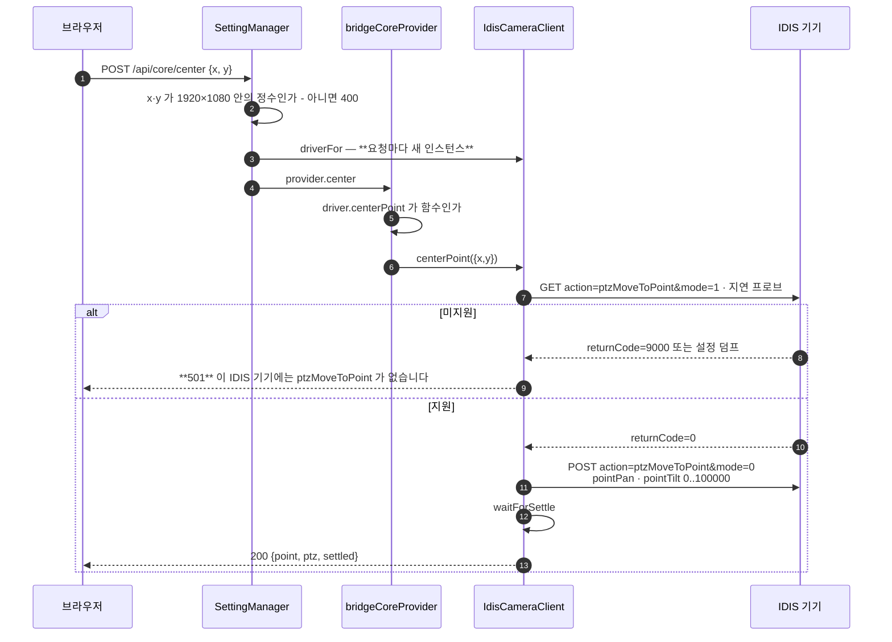
```mermaid
sequenceDiagram
    autonumber
    participant W as 브라우저
    participant SM as SettingManager
    participant BR as bridgeCoreProvider
    participant D as IdisCameraClient
    participant CAM as IDIS 기기

    W->>SM: POST /api/core/center {x, y}
    SM->>SM: x·y 가 1920×1080 안의 정수인가 - 아니면 400
    SM->>D: driverFor — **요청마다 새 인스턴스**
    SM->>BR: provider.center
    BR->>BR: driver.centerPoint 가 함수인가
    BR->>D: centerPoint({x,y})
    D->>CAM: GET action=ptzMoveToPoint&mode=1  · 지연 프로브
    alt 미지원
        CAM-->>D: returnCode=9000 또는 설정 덤프
        D-->>W: **501** 이 IDIS 기기에는 ptzMoveToPoint 가 없습니다
    else 지원
        CAM-->>D: returnCode=0
        D->>CAM: POST action=ptzMoveToPoint&mode=0<br/>pointPan · pointTilt 0..100000
        D->>D: waitForSettle
        D-->>W: 200 {point, ptz, settled}
    end
```

**비자명한 결과**: `driverFor()` 가 **요청 1건마다 드라이버를 새로 만들기** 때문에 `pixelCentering` 메모이즈는 **요청 사이에 살아남지 않는다** — IDIS 기기에 센터링을 부를 때마다 프로브 왕복이 한 번씩 더 붙는다 `[코드 routeContext.ts:64~68 · idisCamera.ts:113~116]`.

### 7-7. IDIS Digest 401 → 재시도 왕복

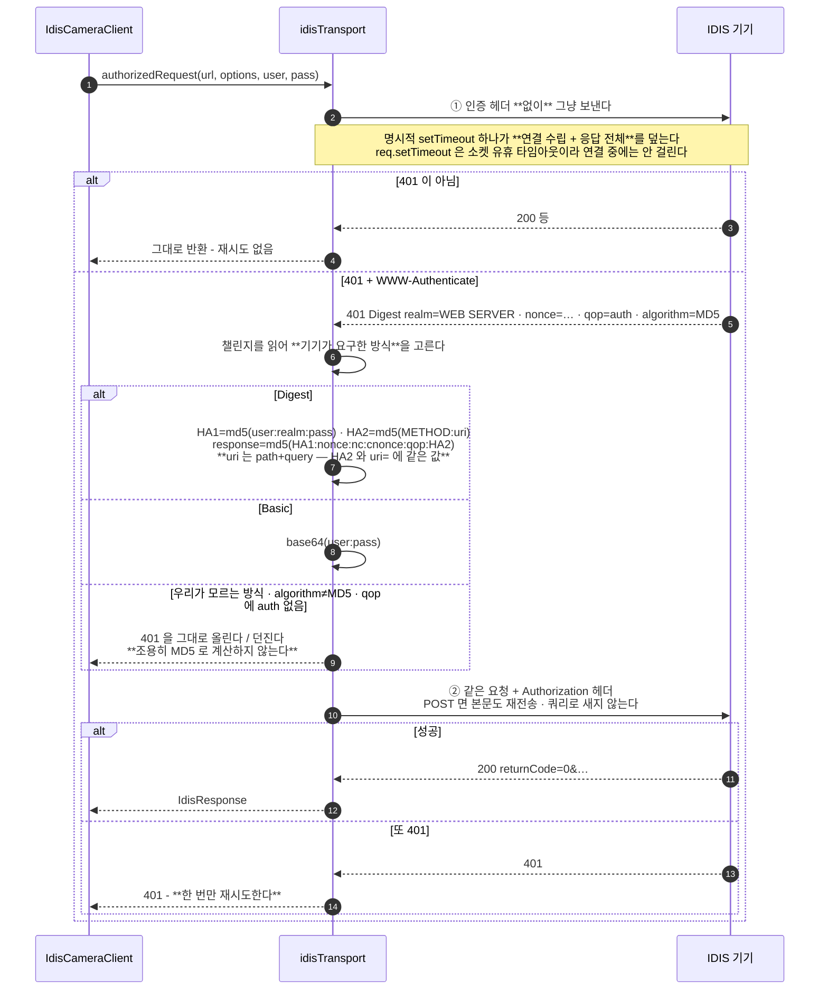
```mermaid
sequenceDiagram
    autonumber
    participant D as IdisCameraClient
    participant T as idisTransport
    participant CAM as IDIS 기기

    D->>T: authorizedRequest(url, options, user, pass)
    T->>CAM: ① 인증 헤더 **없이** 그냥 보낸다
    Note over T,CAM: 명시적 setTimeout 하나가 **연결 수립 + 응답 전체**를 덮는다<br/>req.setTimeout 은 소켓 유휴 타임아웃이라 연결 중에는 안 걸린다

    alt 401 이 아님
        CAM-->>T: 200 등
        T-->>D: 그대로 반환 - 재시도 없음
    else 401 + WWW-Authenticate
        CAM-->>T: 401 Digest realm=WEB SERVER · nonce=… · qop=auth · algorithm=MD5
        T->>T: 챌린지를 읽어 **기기가 요구한 방식**을 고른다
        alt Digest
            T->>T: HA1=md5(user:realm:pass) · HA2=md5(METHOD:uri)<br/>response=md5(HA1:nonce:nc:cnonce:qop:HA2)<br/>**uri 는 path+query — HA2 와 uri= 에 같은 값**
        else Basic
            T->>T: base64(user:pass)
        else 우리가 모르는 방식 · algorithm≠MD5 · qop 에 auth 없음
            T-->>D: 401 을 그대로 올린다 / 던진다<br/>**조용히 MD5 로 계산하지 않는다**
        end
        T->>CAM: ② 같은 요청 + Authorization 헤더<br/>POST 면 본문도 재전송 · 쿼리로 새지 않는다
        alt 성공
            CAM-->>T: 200 returnCode=0&…
            T-->>D: IdisResponse
        else 또 401
            CAM-->>T: 401
            T-->>D: 401 - **한 번만 재시도한다**
        end
    end
```

**그림이 말하는 것**: **인증 방식을 우리가 고르지 않는다.** 매뉴얼은 `RFC2617` 이라고만 적어 Basic 도 포함되지만 실측기는 **Basic 에 401** 이었다 `[실측 DC-S6261XT]`. 그래서 챌린지를 읽어 방식을 고르고, 모르는 방식이면 **임의로 Basic 을 시도하지 않는다.**

`MD5-sess`·`SHA-256` 은 `[미확인]` 이라 **조용히 MD5 로 계산하지 않고 던진다** — 잘못된 response 를 보내면 401 만 돌아와 원인이 인증 방식이라는 사실이 어디에도 드러나지 않는다 `[코드 digest.ts:50~70]`.

---

## 8. 오류·상태 처리 요약

| 상황 | 응답 | 어디서 결정되나 |
|---|---|---|
| 축 값 누락 · 알 수 없는 축 | `400` + 어느 축인지 | `ptzRoutes` · `httpUtil` |
| 등록되지 않은 카메라 | `404` | `findCamera` |
| 중복 기기 ID · 마지막 1대 삭제 · 프리셋 이름 중복 | `409` | `dbRoutes` · `presetStore` |
| 카메라 통신 실패 · 타임아웃 · 휴컴스 `Error:` 본문 | `502` + 사유(**비밀번호 마스킹**) | `CameraDriverError` |
| IDIS 인증·권한 거절 | `502` (**401 이 아니다**) | `IdisAuthError` — 401 을 그대로 내보내면 사용자 **자신의** 세션이 끊긴 것처럼 보인다 |
| 기기가 그 기능을 하지 않음 | `501` (확정 답 — 재시도 안 함) | `IdisUnknownActionError` · `devicePresetRoutes` · `CoreUnsupportedError` |
| 도달범위에서 잘림 | `200` + `limited[]` | `limitedAxes` (⚠ IDIS 에서는 §6-3) |
| 10초 안에 안 멈춤 | `200` + `settled:false` | `waitForSettle` |
| 연결 테스트 실패 | `200` + `ok:false` | `dbRoutes` |
| 스트림 첫 프레임 실패 | `502` + 사유 | `mediaRoutes` (헤더 전송 전에만 가능) |
| 그 밖 | `500` | `api/server.ts` `fail()` — 분류되지 않은 것만 |

**조용히 실패하는 경로는 없다.** 오류를 상태코드로 옮기는 지점이 `api/server.ts` `fail()` **한 곳**이다 `[코드 server.ts:70~84]`.

---

## 9. 실카메라와 시뮬 — 대비표 (시뮬은 여기까지만)

| 축 | **실카메라** (`real-camera-1/2`) | UE 시뮬 (`simulator-1`) | Park3D RPC 시뮬 (`simulator-2/3`) |
|---|---|---|---|
| `kind` | `hucoms` | **`hucoms`** ⚠ | `park3d-rpc` |
| 제어 | HTTP CGI `:80` | HTTP CGI `:8081` — Hucoms CGI 를 그대로 모사 | JSON-RPC `POST /rpc` |
| 영상 | **RTSP `:554`** → ffmpeg | HTTP 직결 `:8091` → 중계 | HTTP `:1360x/stream` → 중계 |
| 포트 규칙 | 없음 — IP 로 구분 | **영상 = 제어 + 10** | `camId` 로 구분 |
| ffmpeg | **필요** | 불필요 | 불필요 |
| 주차면 `listSlots` | `[]` — 답할 곳이 없어 `config/slots.json` 수동 등록본을 쓴다 | `[]` | 드라이버가 답할 수 있으면 `source: simulator` |

---

## 10. 아직 안 되는 것 · 하지 않는 것

### 10-1. IDIS — 코드는 완비, **실기 검증은 0**

실기가 확보되면 가장 먼저 확인할 것 `[devices/idis/README.md 「실기 미검증 목록」]`:

1. **틸트 원점과 부호** — 아래를 보라 했을 때 실제로 아래를 보는가 (지금 `9000 − x` 는 **DC-S6261XT 한 대의 실측**이다)
2. **줌 상한** — `absZoom` 최댓값은 **모델마다 다르다**(현재 1200 고정)
3. 분류표의 `[미확인]` 행 — 특히 `ptzMoveToPoint&mode=1` 이 정말 301/304 를 주는가
4. `videoSnapshot` 의 Content-Type — §25 는 `image/webp` 라 적혀 있다
5. `modelInformation` 이 정말 **POST** 로 동작하는가 — 목(mock)은 GET/POST 를 가리지 않아 **절대 드러나지 않는다**
6. RTSP `trackID=N` 의 실제 코덱 — 번호를 믿지 말고 `ffprobe` 로 확인

> ⚠ **같은 벤더라도 개체마다 다르다.** `DC-S6286HRXLT` 에는 **`ptzAbsolute` 가 아예 없다** — `supportPTZ=on` 이라고 답하는데도 그렇다 `[실측 2026-07-31]`. 그 기기를 등록하면 `GET /api/ptz` 가 **501** 로 떨어진다. **경계는 벤더가 아니라 개체(모델·펌웨어)다.**

### 10-2. 배선되지 않은 것

| 항목 | 현재 | 왜 |
|---|---|---|
| IDIS **장비 프리셋 HTTP 라우트** | **501** — 드라이버에는 4개 메서드가 다 있다 | 장비가 **이름을 주면** "장비 이름과 로컬 이름 중 어느 쪽이 정본인가"라는 새 질문이 생긴다. 타입만 넓히면 두 이름이 조용히 갈린다 — 드라이버 추가가 아니라 레지스트리 재설계다 |
| IDIS **능력 프로브 라우트** | **없음** — `probeCapabilities()` 호출부 0건 | 요청이 없었다 |
| IDIS `centerPoint` | **프로브 의존** — 미지원 기기는 501 | 광학을 모르는 채 소프트웨어 센터링을 하면 조준이 조용히 빗나간다 |
| `centerBox`(박스 줌) | 실측 `intrinsics` 표가 있는 기기만 | 내장 표는 cam-001(Hucoms) 한 대의 곡선이라 다른 렌즈에 쓰면 화각이 조용히 그 값으로 보고된다 |
| 카메라 **점유 lease** | 코어 경로에만 있다 | `/api/ptz*` 는 여러 탭이 동시에 움직이면 서로 덮어쓴다 |
| **인증** | 없음 | `0.0.0.0:13030` 바인드 — 사내망의 누구나 실카메라를 움직일 수 있다 |

### 10-3. 하지 않는 것 (설계 판단)

- 줌 raw → 배율·화각 환산. 기기별 실측 화각표가 필요하고 그건 캘리브레이션의 산출물이다.
- IDIS 의 `intrinsics` 폴백. 줌 눈금의 뜻이 달라 화각이 약 5배 틀린다 `[실측 사고]`.
- IDIS RTSP URL 조립. `trackID=N` 의 N 을 믿을 근거가 없다.
- 벤더 프로토콜을 화면에서 직접 호출. 드라이버 계층의 몫이다.

---

## 11. 이전 문서(2026-07-31)가 낡은 지점 — 각주

> [`docs/20260731_200035_카메라_사용_개념도_및_순서도.md`](20260731_200035_카메라_사용_개념도_및_순서도.md) 는 **고치지 않았다**(별건). 아래는 그 문서를 읽는 사람이 알아야 할 차이다.

| 그 문서의 서술 | 지금 사실 |
|---|---|
| 카메라 종류가 **2가지**(`hucoms`·`backend-core`) | **4가지** — `park3d-rpc`(2026-08-05)와 `idis`(2026-08-06)가 늘었다 |
| 드라이버가 `clients/` 에 있다 | `src/devices/` 로 옮겨졌고 벤더별 하위 폴더로 갈렸다 (`hucoms/`·`idis/`·`park3d/`·`backendCore/`) |
| 프레임 공급원이 `stream/` | `src/media/` |
| 카메라 정본이 `config.json` | **DB `camera_info`** 다. `config.json` 에는 카메라가 없다 |
| 프리셋 정본이 `config/presets.json` | **DB `preset_info`** 다 (2026-08-06 통합) |
| 연결 테스트가 `POST /api/cameras/:id/test` | **`POST /api/db/cameras/:cam_id/test`** — 경로도 **키(정수 cam_id)** 도 바뀌었다 |
| 좌표 규약이 한 벌 | **벤더마다 와이어 좌표가 다르다.** IDIS 는 틸트 부호·원점이 반대이고 줌 눈금의 뜻이 다르다 (§6) |
| "기기가 그 기능을 하지 않음 → 501" | 여전히 유효하되, IDIS 에서는 **기기에 물어본 뒤** 501 을 낸다 |

---

## 12. 한눈에 보는 규칙 8가지

1. **제어와 영상은 별개 평면이다.** 실카메라는 제어 `:80`, 영상 `:554` 이고 **같은 카메라인지 사람이 확인해야 한다.**
2. **`kind` 는 프로토콜이지 실물/시뮬 구분이 아니다.** `simulator-1` 이 `kind=hucoms` 인 것이 그 증거다.
3. **휴컴스와 IDIS 는 틸트의 부호·원점이 반대이고 줌 눈금의 뜻이 다르다.** 변환은 `idisCoords.ts` 한 곳에만 있다.
4. **HTTP 200 은 성공이 아니다.** 휴컴스는 본문 `Error:` 로, IDIS 는 `returnCode=` 로 시작하는지로 판정한다.
5. **카메라는 "이동 완료"를 알려주지 않는다.** 명령 직후 읽은 값은 중간값이다 — 반드시 정착을 기다린다.
6. **보내기 전에 자르고, 잘린 축은 알린다.** 기기는 범위 밖 요청에도 성공이라 답하고 조용히 다른 데로 간다(IDIS 는 **오토플립**).
7. **못 닿은 것과 못 하는 것을 구분한다.** 전송·인증 실패는 능력을 낮추지 않고 던진다.
8. **카메라 정본은 DB `camera_info` 다.** 쓰기한 라우트는 반드시 `configStore.reloadCameras()` 를 부른다.
